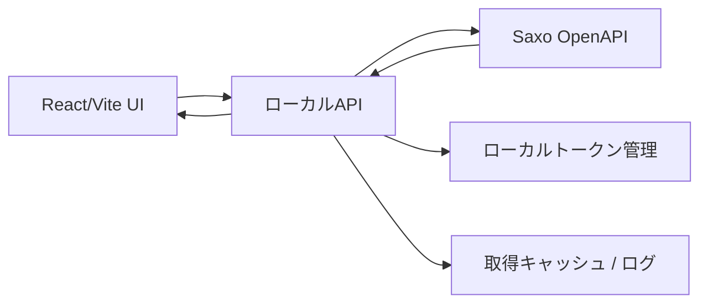

# Saxo API Read-only版 詳細設計書

作成日: 2026-06-08  
対象: 米国株オプション建玉管理・リスク確認アプリ  
前提: 手入力版MVP固定後の上位版  
初回実装対象: ローカルPC版

## 1. 目的

手入力版MVPでは、Saxo TraderGO画面を見ながら、口座残高、証拠金、建玉、決済実績、株価、為替、オプション価格を手入力している。

Saxo API Read-only版の目的は、これらのうちAPIで安全に取得できる数値を自動取得し、転記負担と入力ミスを減らすことである。

ただし、このアプリは引き続き **発注しない**。

ユーザーが最終判断し、発注・決済・注文変更はSaxo TraderGO画面で行う。

## 2. 非目標

実装しないこと:

- Saxoへの注文作成
- Saxoへの注文変更
- Saxoへの注文取消
- SaxoTraderGO画面の自動クリック
- 自動売買
- 条件一致による自動発注
- OAuthトークンのブラウザlocalStorage保存
- GitHub Pages公開版からSaxo APIへ直接接続する機能

APIで `POST` を使う場合でも、Options Chain subscription作成など市場データ購読目的に限る。注文作成系のPOSTは実装しない。

## 3. 公式ドキュメントで確認した前提

2026-06-08時点で、Saxo Developer Portalの公式ドキュメントに基づく前提は次の通り。

参照URL:

- OAuth PKCE: `https://www.developer.saxo/openapi/learn/oauth-authorization-code-grant-pkce`
- Client: `https://www.developer.saxo/openapi/referencedocs/port/v1/clients`
- Accounts: `https://www.developer.saxo/openapi/referencedocs/port/v1/accounts`
- Balances: `https://www.developer.saxo/openapi/referencedocs/port/v1/balances`
- Positions: `https://www.developer.saxo/openapi/referencedocs/port/v1/positions`
- Orders: `https://www.developer.saxo/openapi/referencedocs/port/v1/orders`
- Session Capabilities: `https://www.developer.saxo/openapi/learn/session-capabilities`
- Options Chain: `https://www.developer.saxo/openapi/learn/options-chain`
- Options Chain Reference: `https://www.developer.saxo/openapi/referencedocs/trade/v1/optionschain`

確認済みの要点:

- OAuthはAuthorization Code Grant with PKCEを使う
- `port/v1/clients/me` でログイン中クライアント情報を取得できる
- `port/v1/accounts` で口座一覧を取得できる
- `port/v1/balances` と `port/v1/balances/marginoverview` で残高・証拠金関連を取得できる
- `port/v1/positions` はread-onlyの建玉取得エンドポイントである
- `port/v1/orders` はread-onlyの未約定注文取得エンドポイントである
- Options Chainは古典的なオプションボード表示用のsubscriptionで、StockOption / StockIndexOption等を扱う
- Session CapabilitiesではTradeLevelやDataLevelを確認でき、TradeLevelが価格データに影響する可能性がある

注意:

- 取得できる項目は、Saxoの権限、Market Data契約、口座種別、sim/live環境で変わる可能性がある
- 返らない項目は空欄にせず、`未取得`、`権限不足`、`手動確認` として表示する
- 実装直前にも公式ドキュメントを再確認する

## 4. 基本アーキテクチャ

フロントエンドからSaxo OpenAPIへ直接接続しない。



理由:

- OAuthトークンをブラウザに置かない
- read-only制約をローカルAPI側で強制する
- Saxoレスポンスをアプリの型へ正規化する
- 取得時刻、取得失敗、権限不足、キャッシュを管理する
- 将来も発注機能を混入させない

## 5. 実装配置

推奨は、手入力MVPを壊さないために明確な境界を作ること。

候補:

```text
apps/us-options-risk-planner/                 # 手入力MVP / 既存UI
apps/us-options-risk-planner-api-readonly/    # API版候補
```

ただし、既存アプリ内で進める場合は、最低限次を分離する。

```text
src/broker/
src/types/broker.ts
src/server/
src/features/saxo/
```

既存の `BrokerAdapter` 境界は活かす。

現状のstub:

```text
src/broker/BrokerAdapter.ts
src/broker/ManualBrokerAdapter.ts
src/broker/SaxoBrokerAdapter.stub.ts
```

API版では `SaxoBrokerAdapter` がSaxoへ直接行かず、ローカルAPIを呼ぶ。

## 6. セキュリティ設計

### 6.1 OAuth

- Authorization Code Grant with PKCE
- `code_verifier` はローカルAPI側で生成
- `code_challenge_method` は `S256`
- `state` を必ず検証
- callbackはローカルAPIで受ける
- token exchange / refresh はローカルAPIで行う

### 6.2 トークン保存

初期実装:

- アクセストークン、リフレッシュトークンはメモリ保持のみ
- アプリ終了後は再ログイン
- ブラウザlocalStorageには保存しない

後続実装:

- OSキーチェーンまたは暗号化ローカルファイル
- 保存場所は `~/.us-options-risk-planner/` 配下など
- ログにトークンを出さない

### 6.3 ローカルAPI制限

- listenは `127.0.0.1` のみ
- CORSはローカルUIのoriginだけ許可
- 外部ネットワークからアクセスできるbindにしない
- 注文系APIは実装しない
- trade order endpointへのproxyを作らない
- rawレスポンス保存はdebug時だけ

## 7. ローカルAPI設計

### 7.1 接続・認証

```text
GET  /api/saxo/status
GET  /api/saxo/auth/start
GET  /api/saxo/auth/callback
POST /api/saxo/logout
GET  /api/saxo/session/capabilities
```

役割:

- 接続状態
- sim/live
- token有効期限
- session capabilities
- 発注機能なし表示

### 7.2 口座・残高

```text
GET /api/saxo/client
GET /api/saxo/accounts
GET /api/saxo/accounts/:accountKey/balance
GET /api/saxo/accounts/:accountKey/margin
GET /api/saxo/accounts/snapshot
```

`accounts/snapshot` はフロント向け集約APIとする。

内部取得候補:

- `GET /port/v1/clients/me`
- `GET /port/v1/accounts?ClientKey=...&IncludeSubAccounts=true`
- `GET /port/v1/balances?AccountKey=...`
- `GET /port/v1/balances/marginoverview?AccountKey=...`

### 7.3 建玉・未約定注文

```text
GET /api/saxo/positions
GET /api/saxo/accounts/:accountKey/positions
GET /api/saxo/orders
GET /api/saxo/accounts/:accountKey/orders
```

内部取得候補:

- `GET /port/v1/positions?AccountKey=...`
- `GET /port/v1/orders?AccountKey=...`

### 7.4 決済済み・取引履歴

初期実装では探索フェーズとする。

```text
GET /api/saxo/history/discovery
GET /api/saxo/history/option-closes?from=YYYY-MM-DD&to=YYYY-MM-DD
```

候補:

- ClosedPositions
- Account History Transactions
- Client Reporting / Trades Executed
- Portfolio Report / Trade Details

目的:

- P口座の `Saxo実現損益 JPY`
- 記帳額 JPY
- 取引費用 JPY
- 為替レート
- N口座の USD実現損益

決済履歴は、APIレスポンスを確認してから確定設計する。初期実装で推測変換を作り込まない。

### 7.5 オプションチェーン・価格

```text
GET /api/saxo/options-chain?symbol=NVDA&minDte=30&maxDte=60
GET /api/saxo/option-price?uic=...&assetType=...
```

Options Chainはsubscription作成を伴う可能性があるが、発注ではないため許可する。

制約:

- 同時subscription数を制限
- 取得後にsubscription削除
- 失敗時も削除を試みる
- 取得時刻とstale判定を返す

## 8. P/N口座マッピング

Saxo APIのAccountIdや口座名からP/Nを完全自動判定できるとは限らない。

初回同期時は、取得した口座一覧を表示し、ユーザーに次を選ばせる。

```text
この口座をP口座として使う
この口座をN口座として使う
使わない
```

保存するマッピング:

```ts
type SaxoAccountMapping = {
  workspace: "demo" | "real";
  accountKey: string;
  accountId?: string;
  displayName?: string;
  currency: "JPY" | "USD" | string;
  mappedCode: "P" | "N" | "ignore";
  environment: "sim" | "live";
  confirmedByUser: boolean;
  confirmedAt: string;
};
```

ルール:

- P/N口座は合算しない
- DEMO口座を本番N口座相当として扱わない
- P口座はJPY決済、N口座はUSD決済として扱う
- 口座マッピングはユーザー確認を必須にする
- 口座Keyはトークンではないが、公開共有しない

## 9. フロントUI設計

### 9.1 ヘッダー

追加:

- `Saxo接続` ボタン
- 接続状態バッジ
- `発注機能なし` 表示
- 最終同期時刻

例:

```text
Saxo未接続
Saxo接続中 SIM / 発注機能なし
Saxo接続中 LIVE / 発注機能なし
```

REAL接続時は赤系で強調する。

### 9.2 Saxo接続画面

表示:

- 接続状態
- sim/live
- ClientKey
- 取得可能口座
- P/Nマッピング
- session capabilities
- 最終同期
- 権限不足

操作:

- 接続開始
- 接続解除
- 口座一覧取得
- P/N割当
- 残高取得テスト

### 9.3 同期プレビュー

API取得値を即座に既存入力へ上書きしない。

まず差分プレビューを出す。

```text
Saxo取得値
現在の手入力値
差分
反映する / 反映しない
```

対象:

- 現金残高
- 口座純資産
- 必要証拠金余力
- 証拠金使用率
- 現在株価
- 建玉現在値
- 未約定注文

### 9.4 建玉照合

Saxo建玉とアプリ建玉を照合する。

照合キー候補:

- symbol
- option type
- strike
- expiry
- quantity
- accountCode
- positionId / netPositionId

照合結果:

```text
一致
候補一致
Saxoにあるがアプリにない
アプリにあるがSaxoにない
差分あり
```

自動更新ではなく、ユーザー確認後に反映する。

### 9.5 決済履歴照合

決済済み履歴は、手入力版で最も誤入力が起きやすいので、API版では下書き作成に使う。

方針:

- Saxo履歴から決済実績下書きを作成
- P口座はSaxo実現損益JPYを優先
- N口座はUSD実績を優先
- 下書きは `未確認`
- ユーザーが確認済みにして初めて履歴集計へ反映

## 10. データモデル追加

### 10.1 同期メタ情報

```ts
type SaxoSyncMeta = {
  source: "saxo_api";
  environment: "sim" | "live";
  fetchedAt: string;
  endpoint: string;
  accountKey?: string;
  clientKey?: string;
  permissions: string[];
  dataFreshness: "fresh" | "stale" | "unknown";
  missingFields: string[];
  warnings: string[];
};
```

### 10.2 API取得値の信頼度

```ts
type SyncConfidence =
  | "exact"
  | "derived"
  | "estimated"
  | "missing"
  | "manual_required";
```

例:

- 口座残高: exact
- 証拠金使用率: exactまたはderived
- P口座実現損益JPY: exact
- オプションDelta: missingの場合あり
- Option Volume / Open Interest: missingの場合あり

### 10.3 建玉照合結果

```ts
type PositionReconciliation = {
  id: string;
  saxoPositionId?: string;
  saxoNetPositionId?: string;
  simulationId?: string;
  matchStatus:
    | "matched"
    | "candidate_match"
    | "saxo_only"
    | "app_only"
    | "conflict";
  differences: Array<{
    field: string;
    appValue: unknown;
    saxoValue: unknown;
  }>;
  createdAt: string;
};
```

## 11. 取得値の反映ルール

### 11.1 口座残高

API取得値は、手入力欄へ即時上書きしない。

手順:

1. API取得
2. 差分表示
3. ユーザーが `Saxo値を反映` を押す
4. 反映履歴を保存

理由:

- 手入力の残高スナップショットとAPI取得タイミングがずれる可能性がある
- 決済実績の現金反映と二重計上を避ける

### 11.2 現在建玉

Saxoにある建玉を自動でアプリ建玉へ追加しない。

まず `Saxoにある未登録建玉` として表示し、ユーザーが `建玉として取り込む` を押した場合だけ追加する。

### 11.3 決済履歴

Saxo履歴から作る決済実績は下書きにする。

`confirmed: false` で作成し、ユーザー確認後に `confirmed: true` にする。

### 11.4 オプションチェーン

オプションチェーン取得値は、建玉案の作成に使う。

ユーザーが建玉案を採用するまでは、正式な建玉にはしない。

## 12. エラー・権限不足表示

表示例:

```text
Saxoに接続できませんでした。再ログインしてください。
Market Data権限が不足しているため、オプションチェーンの一部項目を取得できません。
P口座 / N口座の判定ができません。口座一覧から手動で割り当ててください。
取得値が10分以上前です。更新してから判断してください。
この項目はSaxo APIから取得できませんでした。Saxo画面で確認してください。
```

API取得失敗時も、手入力版として継続できる。

## 13. 実装工程

工程1、工程2は手入力MVP固定と3版同期として完了済み前提。

### 工程3: API版作業ブランチ / ディレクトリ作成

目的:

手入力MVPを壊さず、API版の作業場を作る。

作業:

- 新規ブランチまたは新規ディレクトリ作成
- 既存手入力版をコピーまたは機能境界化
- `Saxo API Read-only版` と画面上に明示
- `発注機能なし` を表示
- READMEに開発対象を明記

完了条件:

- 手入力MVPが壊れていない
- API版の作業場所が明確
- `npm test` と `npm run build` が通る

### 工程4: ローカルAPI骨格

目的:

フロントからSaxoへ直接接続しない土台を作る。

作業:

- `server/` または `src/server/` を追加
- ローカルAPIを `127.0.0.1` bindで起動
- `/api/saxo/status`
- `/api/saxo/logout`
- Vite dev proxy設定
- 注文系APIが存在しないことをテスト

完了条件:

- UIから `/api/saxo/status` を呼べる
- まだSaxo未接続でも画面が壊れない
- 注文系endpointがない

### 工程5: OAuth PKCE接続

目的:

Saxoへread-only取得できる接続を確立する。

作業:

- `auth/start`
- `auth/callback`
- PKCE verifier/challenge
- state検証
- token exchange
- refresh
- logout
- session capabilities取得
- トークンはブラウザに保存しない

完了条件:

- sim環境で接続状態が取れる
- `Saxo接続中 SIM / 発注機能なし` が表示される
- トークンがlocalStorageに保存されていない
- 再ログイン、logoutが動く

### 工程6: 口座一覧・P/Nマッピング

目的:

P口座 / N口座の土台をAPI取得へ接続する。

作業:

- `/api/saxo/client`
- `/api/saxo/accounts`
- 口座一覧表示
- P/N割当UI
- AccountKey保存
- sim/live表示
- 不明口座は `未割当` と表示

完了条件:

- Saxo口座一覧が見える
- ユーザーがP口座/N口座を割り当てられる
- 割当なしでは残高反映へ進まない

### 工程7: 口座残高・証拠金取得

目的:

最初の実用価値として、口座全体カードの手入力負担を減らす。

作業:

- balances取得
- margin overview取得
- P/N別正規化
- 現金残高
- 口座純資産
- 必要証拠金余力
- 証拠金使用率
- 差分プレビュー
- `Saxo値を反映`

完了条件:

- P口座、N口座を合算しない
- API取得値と現在入力値の差分が見える
- ユーザー操作で反映できる
- 反映履歴が残る
- API取得失敗時も手入力できる

### 工程8: 現在建玉・未約定注文取得

目的:

Saxo上の現在建玉とアプリ建玉の照合を始める。

作業:

- positions取得
- orders取得
- オプション建玉の正規化
- 株式建玉の正規化
- 既存アプリ建玉との照合
- 未登録建玉を取り込み候補表示
- 出口注文の有無を出口ルールへ表示

完了条件:

- Saxoにある建玉が一覧で見える
- 既存建玉との一致/差分が見える
- ユーザー確認後に建玉へ取り込める
- 注文前/建玉中/決済済みの状態を勝手に変更しない

### 工程9: 決済履歴取得の実証

目的:

決済実績の自動下書き化に必要なSaxo APIを確定する。

作業:

- ClosedPositions / Transactions / Trades Executed 等の候補確認
- P口座で実現損益JPY、記帳額JPY、取引費用JPY、為替レートが取れるか実測
- N口座でUSD実現損益が取れるか実測
- 取得できない項目の代替設計
- 決済実績下書き作成

完了条件:

- 決済実績取得に使うAPIが確定している
- P口座JPY実績優先ロジックに接続できる
- 取得できない項目は手入力へフォールバックできる

### 工程10: オプションチェーン・現在プレミアム取得

目的:

反対売買判断と候補作成で使う現在プレミアムを取得する。

作業:

- Options Chain subscription
- subscription削除
- symbolからSaxo instrument解決
- Bid / Ask / Mid
- Delta / IV / OI / Volume の取得可否確認
- 反対売買判断へ現在買戻し価格を反映

完了条件:

- 取得時刻付きで現在プレミアムが表示される
- 取得できないGreeks等は未取得表示になる
- 反対売買判断へユーザー操作で反映できる
- subscriptionが残り続けない

### 工程11: 候補選定アプリ連携

目的:

TradingView候補からSaxoオプションチェーンを使って建玉案を作る。

作業:

- 候補JSON/CSV取り込み
- Saxoチェーン取得
- フィルタ
- 建玉案作成
- リスク確認へ接続

完了条件:

- 候補から注文前建玉案を作れる
- 発注はしない

## 14. 初回実装担当への最小スコープ

最初に実装担当へ依頼する範囲は、工程3から工程7までに限定する。

理由:

- OAuthと口座・残高がAPI版の土台である
- 建玉同期や決済履歴は、口座マッピングが固まってからでよい
- Options Chainはsubscription管理が必要で、初回範囲に入れるとリスクが高い

初回スコープ:

```text
工程3: API版作業ブランチ / ディレクトリ作成
工程4: ローカルAPI骨格
工程5: OAuth PKCE接続
工程6: 口座一覧・P/Nマッピング
工程7: 口座残高・証拠金取得
```

## 15. 受け入れテスト

### セキュリティ

- ブラウザlocalStorageにaccess_token / refresh_tokenが存在しない
- 注文系endpointが存在しない
- ローカルAPIが外部IPへbindされていない
- logoutでメモリ上のtokenが破棄される

### 口座

- P/N口座を合算しない
- AccountKeyをユーザーが確認してP/Nへ割り当てられる
- 口座未割当では反映できない

### 残高

- API取得値と手入力値の差分が表示される
- 反映ボタンを押すまで既存値を上書きしない
- 反映履歴が残る
- 取得失敗時に手入力へ戻れる

### 表示

- `Saxo接続中 SIM / 発注機能なし`
- `Saxo接続中 LIVE / 発注機能なし`
- 最終同期時刻
- 取得失敗理由

## 16. 実装時の禁止事項

- `trade/v2/orders` など注文作成系APIを呼ばない
- 注文変更、注文取消、ポジション更新、exerciseを実装しない
- OAuthトークンをlocalStorageへ保存しない
- API取得値で既存入力値を即時上書きしない
- P/N口座を合算しない
- DEMO口座を本番N口座の検証済み代替として扱わない
- 決済履歴をユーザー確認なしで確定履歴へ入れない
- APIで未取得の項目を0として扱わない

## 17. 今回の実装依頼範囲

2026-06-08時点で、手入力版MVP固定と3版差分同期は完了済みとする。

次に実装担当へ依頼する範囲は、API版の初期基盤だけに限定する。

対象工程:

1. 工程3: API版作業ブランチ / ディレクトリ作成
2. 工程4: ローカルAPI骨格
3. 工程5: OAuth PKCE接続
4. 工程6: 口座一覧・P/Nマッピング
5. 工程7: 口座残高・証拠金取得

今回まだ実装しないもの:

- 現在建玉取得
- 未約定注文取得
- 決済済み・取引履歴取得
- Options Chain / 現在プレミアム取得
- TradingView候補連携
- Saxoへの発注、注文変更、注文取消

理由:

- OAuth、ローカルAPI、P/N口座マッピングが固まらないまま建玉や履歴を取り込むと、P口座JPY決済とN口座USD決済の扱いを後から大きく修正することになる
- まずは口座一覧、残高、必要証拠金余力、証拠金使用率をread-onlyで取得し、既存の「口座全体の余力・証拠金」カードへ差分プレビュー付きで接続する

## 18. 初回API実装の完了条件

### API基盤

- ローカルAPIが `127.0.0.1` のみにbindされる
- Vite側から `/api/saxo/status` を呼べる
- Saxo未接続でもUIが壊れない
- 注文系endpointが存在しない
- 発注機能なしの表示が画面上に出る

### OAuth

- Authorization Code Grant with PKCEを使う
- `state` を検証する
- token exchange / refresh はローカルAPI側で行う
- access token / refresh token をブラウザlocalStorageへ保存しない
- logoutで接続状態とメモリ上のtokenが破棄される

### 口座マッピング

- Saxo口座一覧を取得できる
- ユーザーが取得口座を `P口座` / `N口座` / `使わない` に割り当てられる
- P/N割当が未確定の場合は、残高反映へ進ませない
- DEMO口座は `DEMO_JPY_BASE` として扱い、本番N口座の検証済み代替にしない

### 残高・証拠金

- P口座とN口座を合算しない
- 取得値と現在の手入力値の差分を表示する
- ユーザーが `Saxo値を反映` を押すまで既存入力値を上書きしない
- 反映履歴を残し、二重反映を避ける
- 取得できない値は `0` ではなく `未取得` / `手動確認` と表示する
- API取得に失敗しても手入力版として継続できる

### 検証

- `npm test` が通る
- `npm run build` が通る

## 48. Saxo接続保持ボタンの導線修正

### 48.1 背景

Saxo OAuthログイン後、ユーザーはアプリへ戻って `接続をこのMacに保持` を有効化する必要がある。

しかし現在のUIでは、このボタンが `設定・診断` の中に埋もれており、ログイン後にユーザーが「どこを押せばよいか」迷いやすい。

接続保持は通常の取引入力ではなく、Saxo API利用開始時の初期設定に近い操作であるため、ログイン直後に明確な次アクションとして表示する。

### 48.2 設計方針

`接続をこのMacに保持` は、以下の条件を満たす場合に、Saxo APIパネル上部の目立つ場所へ表示する。

- Saxo接続中である
- Keychain接続保持が未保存、または無効である
- ローカルAPIがmacOS Keychain保存に対応している

表示場所は `設定・診断` の内部だけにしない。

Saxo接続成功後の緑色ステータス領域、またはその直下に、次アクションとして表示する。

### 48.3 表示文言

未保存時:

```text
Saxo接続中です。次回以降の再ログインを減らすには、このMacに接続保持を保存できます。
```

ボタン:

```text
接続をこのMacに保持
```

保存済み時:

```text
接続保持: 有効 / 保存先: macOS Keychain
```

保存できない時:

```text
この環境では接続保持を保存できません。期限切れ時は再ログインが必要です。
```

### 48.4 操作後の表示

`接続をこのMacに保持` を押して保存に成功した場合:

- ボタンを非表示または無効化する
- ステータスに `接続保持: 有効 / macOS Keychain` を表示する
- 一時メッセージで `このMacに接続保持を保存しました` と表示する

失敗した場合:

- エラー理由を表示する
- `設定・診断を開く` から詳細を確認できるようにする

### 48.5 設定・診断内の扱い

`設定・診断` 内にも従来どおり接続保持の情報を残す。

ただし、通常ユーザーが最初に探す場所ではなく、詳細確認用とする。

表示する項目:

- 接続保持: 有効 / 無効
- 保存先: macOS Keychain / 未保存
- access token期限
- refresh token期限
- `接続保持を解除`

### 48.6 完了条件

- Saxoログイン後、ユーザーが `設定・診断` を探さなくても `接続をこのMacに保持` を押せる
- 保存済みの場合は、同じボタンを繰り返し押す必要がない状態表示になる
- 保存できない場合は、原因と次アクションが分かる
- Saxo Account ID、password、2FAコードは保存しない説明を残す
- `npm test` が通る
- `npm run build` が通る

## 49. 3-A建玉開始確認のSaxo履歴補完で空欄が残る場合の扱い

### 49.1 背景

Saxo現在建玉候補から `3-A. 建玉開始の約定確認` を作成した後、P口座で必要な次の項目が空欄になる場合がある。

- 記帳額 JPY
- プレミアム JPY
- 取引費用 JPY

この状態で `履歴補完: 対象外` と表示されると、ユーザーは「APIでは取得できないのか」「手入力が必要なのか」「機能が壊れているのか」を判断できない。

### 49.2 設計方針

Saxo現在建玉候補から作成された3-A下書きは、履歴補完の対象である。

したがって、`履歴補完: 対象外` と表示してはいけない。

表示状態は以下のいずれかに限定する。

- `未照合`: まだSaxo取引履歴と照合していない
- `補完済み`: Saxo取引履歴から必要項目を補完できた
- `要選択`: 複数の履歴候補があり、ユーザー選択が必要
- `要手入力`: Saxo取引履歴を取得・照合しても、必要項目がAPIレスポンスに存在しない

### 49.3 APIで取得できるかの切り分け

アプリは、Saxo取引履歴APIのレスポンスに次の項目が含まれるかを確認する。

候補フィールド:

- 記帳額: `BookedAmount`, `NetAmount`, `SettlementAmount`, `Amount`
- プレミアム: `Premium`, `PremiumAmount`, `GrossAmount`, `TradeAmount`
- 取引費用: `TransactionCost`, `Costs`, `Cost`, `Commission`, `Commissions`
- 為替レート: `ExchangeRate`, `FxRate`, `ConversionRate`

ただし、Saxo APIのレスポンス項目名は口座種別・商品・地域・endpointにより異なる可能性がある。

そのため、補完できない場合は「取得不能」と断定せず、次を表示する。

```text
Saxo取引履歴からこの項目を自動補完できませんでした。
Saxo画面の取引履歴に表示されている値を手入力してください。
```

### 49.4 UI表示

3-Aの下書きカードでは、補完状況をユーザーに明示する。

例:

```text
入力元: Saxo現在建玉
履歴補完: 要手入力
不足項目: 記帳額JPY、プレミアムJPY、取引費用JPY
```

`Saxo取引履歴から補完` を押した結果、補完できなかった場合は、空欄の各入力欄の近くに次の短い補足を出す。

```text
Saxo APIから自動補完できませんでした。Saxo取引履歴の表示値を入力してください。
```

### 49.5 デバッグ表示

開発・診断用として、補完できなかった場合は `設定・診断` または候補詳細に以下を表示できるようにする。

- 使用したSaxo endpoint
- 取得できたraw項目名の一覧
- 補完対象として探した項目名
- 一致しなかった理由

通常表示ではraw JSONを見せない。

### 49.6 完了条件

- Saxo現在建玉から作成した3-A下書きで `履歴補完: 対象外` が出ない
- `Saxo取引履歴から補完` を押した結果が、補完済み / 要選択 / 要手入力 のいずれかで明確に分かる
- APIレスポンスから取得できる項目は自動入力される
- APIレスポンスに存在しない項目は、どの値を手入力すべきか明示される
- P口座ではJPY項目を優先する
- N口座ではUSD項目を優先する
- `npm test` が通る
- `npm run build` が通る
- tokenがlocalStorageに保存されていないことを確認するテストまたは手順を残す
- 注文系APIが実装されていないことを確認するテストまたは手順を残す

## 50. 反映待ちサマリーと建玉候補詳細の導線整理

### 50.1 背景

`反映待ちがあります` のサマリーに `建玉候補 新規1件` と表示されても、ユーザーはその候補の中身をすぐ確認できない。

また、サマリー側に `建玉入力へ下書き反映` のような実行ボタンがあると、候補内容を確認する前に下書き作成を促しているように見える。

一方、下部の `建玉候補` 詳細では候補内容を確認できるが、候補を確認した後に `建玉入力へ下書き反映` する主要ボタンが見当たらない場合がある。

そのため、ユーザー導線が以下のように分断されている。

1. 上部サマリーで候補件数を知る
2. どこに候補があるか分からない
3. スクロールして候補を見つける
4. 候補詳細を確認しても、次に下書きへ進むボタンが見当たらない

### 50.2 設計方針

反映待ちサマリーは、直接保存・直接下書き作成の場所にしない。

サマリーは `確認場所へ移動する入口` として使う。

正式な操作は、候補詳細カード側で行う。

### 50.3 反映待ちサマリーの表示

サマリー行の文言を以下のように変更する。

```text
建玉候補
新規1件 / 既存候補0件 / 要確認0件
```

ボタン:

```text
候補を確認
```

`候補を確認` を押したら、下部の `建玉候補` セクションへ自動スクロールし、該当候補をハイライトする。

サマリー側に `建玉入力へ下書き反映` は置かない。

### 50.4 建玉候補詳細側の操作

`建玉候補` セクションの各候補カードには、状態に応じて主要操作ボタンを必ず表示する。

新規候補:

- `詳細を見る`
- `建玉入力へ下書き反映`
- `今回は無視`

既存候補あり:

- `詳細を見る`
- `既存建玉に紐づける`
- `新規建玉として下書き作成`
- `今回は無視`

要確認候補:

- `詳細を見る`
- `候補を選んで紐づける`
- `新規建玉として下書き作成`
- `今回は無視`

`詳細を見る` を開いた状態でも、主要操作ボタンをカード上部または詳細下部に表示し続ける。

### 50.5 下書き反映後の移動

候補詳細側の `建玉入力へ下書き反映` を押した場合:

1. 建玉入力パネルを開く
2. `3-A. 建玉開始の約定確認` へ自動スクロールする
3. 作成された下書きをハイライトする
4. 上部に次アクションを表示する

表示例:

```text
Saxo建玉候補から3-Aの下書きを作成しました。
約定履歴で補完できる項目を確認し、最後に「確認して正式保存する」を押してください。
```

### 50.6 ボタン名の整理

ユーザーが誤解しないよう、ボタン名を以下に統一する。

- 候補へ移動するだけ: `候補を確認`
- 3-A下書きを作る: `建玉入力へ下書き反映`
- 既存の手入力建玉と結びつける: `既存建玉に紐づける`
- 今回処理しない: `今回は無視`

`建玉入力へ下書き反映` は、候補詳細カード側にのみ表示する。

### 50.7 完了条件

- `反映待ちがあります` サマリーから `建玉候補` セクションへ1クリックで移動できる
- サマリー側に、候補確認前の `建玉入力へ下書き反映` が表示されない
- 建玉候補カード側に `建玉入力へ下書き反映` または `既存建玉に紐づける` が必ず表示される
- 詳細を開いた後も、次アクションボタンが見える
- 下書き反映後は `3-A. 建玉開始の約定確認` へ自動スクロールする
- `npm test` が通る
- `npm run build` が通る

## 51. 既存紐づけ済み建玉候補の次アクション明確化

### 51.1 背景

Saxo建玉候補が、既にアプリ側の手入力建玉と紐づけ済みになる場合がある。

この状態では、同じ建玉を新規下書きとして再作成してはいけない。

しかし現在のUIでは `既存紐づけ済みです。新規下書きとして二重反映できません。` と表示されるだけで、ユーザーが次に何をすべきか分かりにくい。

### 51.2 設計方針

既存紐づけ済みの候補では、次アクションを以下のどちらかに明確化する。

1. 紐づけ済みの既存建玉を開く
2. 建玉開始の約定確認 `3-A` を確認・補完する

新規下書き作成ボタンは出さない。

### 51.3 表示文言

既存紐づけ済み候補には、次のように表示する。

```text
このSaxo建玉は、既存の建玉に紐づけ済みです。
重複作成せず、既存建玉の入力画面で約定確認を確認してください。
```

主要ボタン:

- `紐づけ済み建玉を開く`
- `3-A約定確認へ進む`
- `今回は無視`

`既存紐づけ済み` の無効ボタンだけを表示する状態は禁止する。

### 51.4 クリック時の動作

`紐づけ済み建玉を開く`:

- 建玉入力パネルを開く
- 対象の既存建玉を選択状態にする
- `1. 銘柄・価格` 付近へスクロールする

`3-A約定確認へ進む`:

- 建玉入力パネルを開く
- 対象既存建玉の `3-A. 建玉開始の約定確認` へスクロールする
- 未確認または不足項目がある場合は該当箇所をハイライトする

### 51.5 3-Aの状態に応じた案内

3-Aが未確認の場合:

```text
この建玉はSaxo建玉と紐づけ済みです。Saxo取引履歴で記帳額・プレミアム・取引費用を確認し、約定確認を完了してください。
```

3-Aが確認済みの場合:

```text
この建玉はSaxo建玉と紐づけ済みで、建玉開始の約定確認も完了しています。
次は反対売買判断、または満期・決済時の実績入力です。
```

### 51.6 完了条件

- 既存紐づけ済み候補に、次アクションが必ず表示される
- `既存紐づけ済み` の無効ボタンだけでユーザーを止めない
- `紐づけ済み建玉を開く` で対象建玉へ移動できる
- `3-A約定確認へ進む` で対象建玉の3-Aへ移動できる
- 既存紐づけ済み建玉を新規下書きとして二重作成できない
- `npm test` が通る
- `npm run build` が通る

## 52. 建玉候補の「紐づけ済みだが進めない」状態の禁止

### 52.1 背景

Saxo APIから現在建玉を取得した後、建玉候補に次のような表示が出る場合がある。

```text
このSaxo建玉は、既存の建玉に紐づけ済みです。
重複作成せず、既存建玉の入力画面で約定確認を確認してください。
```

この判定自体は正しい。すでに手入力済みの建玉とSaxo建玉が同じものだと判断できているため、同じ建玉を新規下書きとして二重作成してはいけない。

しかし、画面上に `詳細を見る` と `今回は無視` しか表示されず、既存建玉の入力画面や `3-A. 建玉開始の約定確認` へ移動できない場合がある。これはユーザーを止めるUIであり、修正対象とする。

### 52.2 設計方針

建玉候補は、状態ごとに必ず「次に進むボタン」を持つ。

特に `既存建玉へ紐づけ済み` の候補では、以下の2ボタンを必ず表示する。

- `紐づけ済み建玉を開く`
- `3-A約定確認へ進む`

`既存紐づけ済み` のような無効ボタンだけを表示して、ユーザーを止めてはいけない。

### 52.3 クリック時の挙動

`紐づけ済み建玉を開く`:

1. 建玉入力パネルを開く
2. 紐づけ済みの既存建玉を選択状態にする
3. `1. 銘柄・価格` 付近へスクロールする
4. 対象カードを数秒ハイライトする

`3-A約定確認へ進む`:

1. 建玉入力パネルを開く
2. 紐づけ済みの既存建玉を選択状態にする
3. `3-A. 建玉開始の約定確認` へスクロールする
4. 未確認または不足項目がある場合は、該当入力欄をハイライトする

### 52.4 API現在建玉で取得できる項目と取得できない項目

Saxoの現在建玉APIだけで、建玉入力に必要な全項目が常に取れるとは限らない。

現在建玉APIで期待できる項目:

- P/N口座の割り当て
- 数量
- 売買方向
- プット/コール
- 権利行使価格
- 満期日
- 建て価格
- Position ID
- Account Key

現在建玉APIで未取得になり得る項目:

- 銘柄ティッカー
- 現在オプション価格
- 評価損益
- Market value
- Contract size
- Instrument詳細
- 記帳額JPY
- プレミアムJPY
- 取引費用JPY

そのため、建玉開始時の実績確認に必要な `記帳額JPY`、`プレミアムJPY`、`取引費用JPY` は、現在建玉APIではなく、Saxo取引履歴APIとの照合で補完する。

取引履歴APIでも取得できない場合は、空欄のままにせず、`要手入力` と表示し、Saxo画面のどの値を入力すべきかを示す。

### 52.5 未取得表示の扱い

`現在値 未取得`、`評価損益 未取得`、`Contract size 未取得` などは、次のように表示する。

```text
Saxo現在建玉APIでは未取得です。
建玉入力に最低限必要な項目ではありません。
反対売買判断や評価損益確認には、別途価格取得またはSaxo画面確認が必要です。
```

未取得項目を0として扱ってはいけない。

また、未取得項目が多い場合でも、建玉入力に必要な最低限の項目が揃っている場合は、ユーザーに以下を明示する。

```text
建玉入力に使える最低限の情報は取得済みです。
約定実績の金額はSaxo取引履歴で補完するか、手入力してください。
```

### 52.6 建玉候補カードの表示ルール

建玉候補カードでは、次の3つを分けて表示する。

1. `Saxo現在建玉から取得できた情報`
2. `建玉入力に使う情報`
3. `取引履歴または手入力が必要な情報`

表示例:

```text
取得済み:
P口座 / 数量 -1 / Put / 権利行使価格 207.5 / 満期 2026-06-12 / 建て価格 1.21

未取得:
現在オプション価格 / 評価損益 / Contract size

次にやること:
この建玉は既存建玉に紐づけ済みです。3-A約定確認へ進み、Saxo取引履歴または手入力で記帳額・プレミアム・取引費用を確認してください。
```

### 52.7 完了条件

- 既存紐づけ済み候補で `詳細を見る` と `今回は無視` だけになる状態がない
- 既存紐づけ済み候補に `紐づけ済み建玉を開く` と `3-A約定確認へ進む` が表示される
- `3-A約定確認へ進む` で対象建玉の3-Aへ実際に移動する
- 未取得項目の意味がカード上で分かる
- 建玉入力に使える項目と、履歴または手入力が必要な項目が分かれている
- 未取得項目を0扱いしない
- `npm test` が通る
- `npm run build` が通る

## 53. `3-A約定確認へ進む` ボタンの実動保証

### 53.1 背景

Saxo現在建玉候補のカードで、次の状態になる場合がある。

```text
このSaxo建玉は、既存の建玉に紐づけ済みです。
重複作成せず、既存建玉の入力画面で約定確認を確認してください。
```

この状態で `3-A約定確認へ進む` ボタンが表示されても、クリックして画面が何も変わらない場合がある。

これはユーザーにとって「ボタンが壊れている」状態であり、Saxo API側の取得不足ではなく、アプリ内のナビゲーション不具合として扱う。

### 53.2 設計方針

`3-A約定確認へ進む` は、単なるスクロール補助ではなく、次の一連の操作を必ず実行する導線とする。

1. Saxo建玉候補に紐づく既存建玉IDを解決する
2. その建玉を選択状態にする
3. 建玉入力パネルを開く
4. `3-A. 建玉開始の約定確認` セクションへスクロールする
5. 対象の約定確認カードをハイライトする
6. 不足入力がある場合は、最初の不足項目にフォーカスする
7. 画面上部または3-A付近に、次に何を入力すべきかを表示する

このどれかが実行できない場合でも、無反応にしてはいけない。

### 53.3 紐づけ先IDの解決ルール

クリック時は、以下の順に既存建玉IDを解決する。

1. `row.simulation.id`
2. `linkedPositionTargets[position.id]`
3. 既存建玉との照合結果に含まれる候補ID

いずれも見つからない場合は、ボタンを押しても黙って失敗させず、次のように表示する。

```text
紐づけ済み建玉を特定できません。候補を確認し直すか、既存建玉に紐づけてください。
```

この場合、画面には以下の操作を出す。

- `既存建玉候補を確認`
- `候補を選んで紐づける`
- `今回は無視`

### 53.4 3-Aセクションが存在しない場合

対象建玉に `3-A. 建玉開始の約定確認` がまだ作られていない場合は、クリック時に空振りさせない。

以下のどちらかを行う。

- 建玉開始確認の下書きを自動作成して3-Aへ移動する
- 自動作成できない場合、3-A付近へ移動し、`約定確認を追加` を強調表示する

表示例:

```text
この建玉には建玉開始の約定確認がまだありません。
Saxo取引履歴を補完するか、約定確認を追加してください。
```

### 53.5 未取得項目との関係

現在建玉APIで `現在値`、`評価損益`、`Contract size`、`Instrument` などが未取得でも、`3-A約定確認へ進む` を止めてはいけない。

3-Aに必要な実績項目は主に以下であり、これは現在建玉APIではなく取引履歴APIまたは手入力で補完する。

P口座:

- 記帳額 JPY
- プレミアム JPY
- 取引費用 JPY
- 為替レート

N口座:

- プレミアム USD
- 取引費用 USD
- USD実績損益

取得できない項目は `未取得` または `要手入力` として表示し、0扱いしない。

### 53.6 実装上の必須挙動

実装では、以下を満たすこと。

- `3-A約定確認へ進む` のクリックイベントが必ず発火する
- 発火時に、対象Saxo position id、解決したsimulation id、anchor idを一時ログまたは状態メッセージで確認できる
- `onOpenLinkedSimulation(simulationId, "option-entry-executions")` の後、対象セクションが描画されてからスクロールする
- すでに同じ建玉が選択中でも、再クリックで再スクロールする
- 建玉入力パネルが閉じている場合は開く
- 建玉入力パネルが開いていても、対象が違う場合は選択建玉を切り替える
- 失敗時は必ずユーザー向けメッセージを出す

### 53.7 完了条件

- `3-A約定確認へ進む` を押すと、対象建玉の建玉入力パネルが開く
- 対象建玉の `3-A. 建玉開始の約定確認` まで実際にスクロールする
- 対象カードまたは3-Aセクションがハイライトされる
- 不足項目がある場合、最初の不足入力欄へフォーカスする
- 対象建玉IDを解決できない場合、無反応ではなくエラーと次アクションを表示する
- 3-Aが未作成の場合、下書き作成または `約定確認を追加` への誘導が表示される
- 既存の `紐づけ済み建玉を開く` は1番セクションへ移動し、`3-A約定確認へ進む` は3-Aへ移動する
- `npm test` が通る
- `npm run build` が通る

## 54. 紐づけ済み建玉ボタンの表示条件と不整合修復

### 54.1 背景

`3-A約定確認へ進む` が画面に表示されているにもかかわらず、クリックしても何も起きないケースが残っている。

原因は、候補行の表示が `linkedPositionIds` のような「紐づけ済みフラグ」だけを見ており、実際に開くべき既存建玉 `simulationId` を解決できるかを保証していないためである。

この状態はユーザーにとって故障に見えるため、Saxo APIの取得不足ではなく、アプリ内リンク状態の不整合として扱う。

### 54.2 不変条件

以下をアプリの不変条件とする。

```text
`3-A約定確認へ進む` を表示するなら、クリック前の時点で有効な既存建玉IDを解決できなければならない。
```

有効な既存建玉IDとは、次をすべて満たすものをいう。

- Saxo position id から対象 `simulationId` が取得できる
- その `simulationId` が現在の `simulations` 配列内に存在する
- 対象建玉が削除済み、履歴非表示のみ、または別ワークスペースのデータではない
- 建玉入力パネルでその建玉を選択できる

### 54.3 ボタン表示ルール

候補行では、次の状態を分けて表示する。

#### A. 正常な紐づけ済み

条件:

- Saxo position id がある
- `linkedPositionTargets[position.id]` がある
- 対象 `simulationId` が存在する

表示:

- `紐づけ済み建玉を開く`
- `3-A約定確認へ進む`

#### B. 紐づけフラグだけ残っている不整合

条件:

- `linkedPositionIds` には含まれる
- しかし `linkedPositionTargets[position.id]` がない、または対象 `simulationId` が見つからない

表示してはいけない:

- `3-A約定確認へ進む`
- `紐づけ済み建玉を開く`

代わりに表示する:

```text
紐づけ先が見つかりません。既存建玉を選び直してください。
```

操作:

- `既存建玉候補を確認`
- `紐づけをやり直す`
- `今回は無視`

#### C. 既存候補はあるが未紐づけ

条件:

- Saxo建玉と似た既存建玉候補はある
- まだ正式に紐づけていない

表示:

- `既存候補を確認`
- `この建玉に紐づける`
- `今回は無視`

`3-A約定確認へ進む` は、紐づけ確定後にだけ表示する。

### 54.4 クリック時の必須挙動

`3-A約定確認へ進む` のクリック時は、以下を必ず行う。

1. position id を取得する
2. `linkedPositionTargets[position.id]` から `simulationId` を解決する
3. 2で解決できない場合だけ、`row.simulation.id` を補助的に使う
4. 対象建玉が存在しない場合は、候補行の中にエラーを表示する
5. 対象建玉が存在する場合は、`onOpenLinkedSimulation(simulationId, "option-entry-executions")` を呼ぶ
6. 建玉入力パネルを開き、該当建玉を選択し、`3-A. 建玉開始の約定確認` へスクロールする

失敗メッセージはSaxoパネル上部だけでなく、対象候補行の近くにも表示する。

### 54.5 `linkedPositionIds` の扱い

`linkedPositionIds` 単体を、UI上の `紐づけ済み` 判定に使ってはいけない。

`linkedPositionIds` は過去互換または二重反映防止用の補助情報に留める。

画面表示の主判定は、次のような関数で一元化する。

```ts
function resolveLinkedSimulation(positionId: string): {
  status: "linked" | "broken" | "unlinked";
  simulation?: TradeSimulation;
  reason?: string;
}
```

この関数を、表示、クリック、メッセージ、テストで共通利用する。

### 54.6 完了条件

- 紐づけ先 `simulationId` が解決できない行に `3-A約定確認へ進む` が出ない
- 紐づけ先が壊れている場合、候補行内に `紐づけをやり直す` が出る
- `3-A約定確認へ進む` を押したとき、対象建玉の3-Aへ必ず移動する
- 同じ建玉がすでに開いていても、再クリックで3-Aへ再スクロールする
- クリック失敗時に無反応にならない
- `linkedPositionIds` だけ残って `linkedPositionTargets` が欠落したテストデータで、壊れた紐づけとして表示される
- `npm test` が通る
- `npm run build` が通る

## 55. 壊れた紐づけ状態の次アクションUX

### 55.1 背景

`linkedPositionIds` にはSaxo position idが残っているが、`linkedPositionTargets` に既存建玉IDが保存されていない場合、画面には次のような注意が出る。

```text
紐づけ先が見つかりません。既存建玉を選び直してください。
linkedPositionIdsにはありますが、紐づけ先の建玉IDが保存されていません。

紐づけ候補の既存建玉がありません。
候補詳細を確認し、新規下書きか今回は無視を選んでください。
```

この説明だけでは、ユーザーは「どこにいて」「次に何を押せばよいか」が分からない。

壊れた紐づけ状態では、警告を出すだけでなく、その場で次の操作を選べるようにする。

### 55.2 UX方針

候補行は、状態ごとに次のアクションを1つ以上必ず表示する。

ただし、表示するボタンは現在の状態で実行可能なものだけに限定する。

実行不能なボタンを薄く表示して放置するのではなく、なぜ実行できないか、代わりに何をすべきかを同じ候補行内に出す。

### 55.3 壊れた紐づけ状態の表示

状態:

- `linkedPositionIds` にSaxo position idがある
- `linkedPositionTargets[position.id]` がない
- または保存されている `simulationId` が現在の建玉一覧に存在しない

表示ラベル:

```text
紐づけ未修復
```

説明文:

```text
以前このSaxo建玉を既存建玉に紐づけた記録がありますが、紐づけ先の建玉が見つかりません。
既存建玉を選び直すか、新規下書きとして作成するか、今回は無視してください。
```

### 55.4 表示する操作

壊れた紐づけ状態では、以下の操作を必ず候補行内に表示する。

1. `既存建玉を選び直す`
2. `新規下書きとして作成`
3. `壊れた紐づけを解除`
4. `今回は無視`

#### 既存建玉を選び直す

押すと、既存建玉の選択UIを候補行内またはモーダルで開く。

選択肢には、現在のワークスペース内の建玉を表示する。

候補の絞り込み条件:

- 同じ銘柄ティッカー
- 同じPut/Call
- 同じ権利行使価格
- 同じ満期日
- 同じ売買方向

完全一致候補がある場合は上位に表示する。

ユーザーが既存建玉を選択して `この建玉に紐づける` を押すと、以下を保存する。

- `linkedPositionIds` に position id を保持
- `linkedPositionTargets[position.id] = selectedSimulationId`

保存後は、同じ候補行に `3-A約定確認へ進む` を表示する。

#### 新規下書きとして作成

押すと、壊れた紐づけを解除したうえで、Saxo現在建玉から新規の建玉入力下書きを作る。

ただし、既存建玉と重複する可能性があるため、押す前に確認を出す。

```text
既存の手入力建玉と重複する可能性があります。
新規下書きとして作成しますか？
```

作成後は建玉入力パネルを開き、新規下書きの3-Aへ移動する。

#### 壊れた紐づけを解除

押すと、該当 position id を `linkedPositionIds` と `linkedPositionTargets` から削除する。

解除後は候補状態を通常の `新規候補` または `既存候補あり` に戻す。

#### 今回は無視

今回のAPI取得結果では処理しない。

次回取得時に再表示される可能性があることを明記する。

### 55.5 既存候補が本当にない場合

既存候補が0件の場合でも、操作は以下を出す。

- `新規下書きとして作成`
- `今回は無視`
- `候補条件を確認`

`候補条件を確認` では、なぜ既存建玉候補が見つからないかを表示する。

例:

```text
既存建玉候補なし
照合条件: NVDA / Put / 207.5 / 2026-06-12 / short
同じ条件の建玉がアプリ内に見つかりません。
```

### 55.6 ボタン配置

警告文の近くに操作ボタンを置く。

ユーザーが候補詳細を開いた状態では、候補行の上部と下部に同じ主要アクションを表示してよい。

ただし、主要ボタンは次の順に並べる。

1. 既存建玉を選び直す
2. 新規下書きとして作成
3. 壊れた紐づけを解除
4. 今回は無視

`3-A約定確認へ進む` は、紐づけ先が正常に解決できる状態だけに表示する。

### 55.7 文言と操作ボタンの一致

警告文・助言文に書いた選択肢は、同じ表示領域内に同じ意味のボタンとして必ず出す。

禁止例:

```text
新規下書きか今回は無視を選んでください。
```

と表示しているのに、見える範囲に `新規下書きとして作成` ボタンがない状態。

この状態は未完成UIとして扱う。

壊れた紐づけ状態で既存候補がない場合、候補行の警告直下に次の2つを大きめの主要ボタンとして表示する。

1. `新規下書きとして作成して3-Aへ進む`
2. `今回は無視`

この2つは、候補詳細をさらにスクロールしなくても見える位置に置く。

`新規下書きとして作成して3-Aへ進む` を押した場合は、次を一連の処理として行う。

1. 壊れた紐づけを解除する
2. Saxo現在建玉から建玉入力下書きを作成する
3. 建玉入力・編集カードを開く
4. 作成した建玉を選択する
5. `3-A. 建玉開始の約定確認` へスクロールする
6. 3-Aの未入力欄をハイライトする

処理後、Saxo候補カード側には次の文言を表示する。

```text
新規下書きを作成しました。建玉入力の3-Aで約定確認を完了してください。
```

建玉入力・編集カードが折りたたまれている場合は、必ず開く。

建玉入力・編集カードが画面外にある場合は、必ずスクロールする。

### 55.8 Saxo現在建玉の銘柄未取得時の扱い

Saxo現在建玉APIでは、オプション建玉の `symbol` / `currentPrice` / `contractSize` などが未取得になる場合がある。

このうち、建玉入力下書きの作成に必要な最低限の情報は次の通り。

1. P/N口座区分
2. Put/Call
3. 売買方向
4. 権利行使価格
5. 満期日
6. 数量

`銘柄ティッカー` は重要項目だが、Saxo現在建玉APIから未取得でも下書き作成を止めてはいけない。

銘柄は次の順で補完する。

1. Saxo現在建玉の `symbol`
2. `instrumentCode` / `underlyingName` / `displayName` から推定できる代表ティッカー
3. Saxo取引履歴候補が1件に絞れる場合の履歴側 `symbol`
4. 既存の手入力建玉と、口座・Put/Call・売買方向・権利行使価格・満期日・数量が一意に一致する場合のアプリ側銘柄
5. それでも未取得なら空欄のまま下書き作成し、建玉入力の `1. 銘柄・価格` で銘柄入力を促す

禁止する挙動:

```text
新規下書きを作成できませんでした。必須項目が不足しています。銘柄を確認してください。
```

銘柄だけが未取得の場合はこのエラーを出さない。

代わりに次のように案内する。

```text
Saxo建玉候補から3-Aの下書きを作成しました。銘柄は未取得のため、建玉入力の1.銘柄・価格で銘柄ティッカーを入力し、3-Aで約定確認を完了してください。
```

ただし、Put/Call・売買方向・権利行使価格・満期日・数量・P/N口座区分が不足している場合は、下書き作成を止めてよい。

作成できない場合は、無反応にせず、理由と次の操作を表示する。

例:

```text
新規下書きを作成できませんでした。Saxo建玉候補の必須項目が不足しています。
不足項目: 銘柄、満期日、権利行使価格
```

### 55.8 完了条件

- 壊れた紐づけ状態で、警告だけが表示される状態がない
- すべての候補行に次の行動ボタンがある
- `紐づけ先が見つかりません` の状態から、既存建玉の選び直しができる
- `新規下書きとして作成` が押せる
- `壊れた紐づけを解除` が押せる
- `新規下書きか今回は無視を選んでください` と表示する場合、同じ視界内に `新規下書きとして作成して3-Aへ進む` と `今回は無視` がある
- `新規下書きとして作成して3-Aへ進む` を押すと、建玉入力・編集カードが開き、3-Aへ移動する
- 解除後、候補行が通常状態に戻る
- `3-A約定確認へ進む` は、正常な紐づけ先がある場合だけ表示される
- `npm test` が通る
- `npm run build` が通る

## 56. SaxoローカルAPI未起動時のユーザー向け起動導線

### 56.1 背景

Saxo API Read-onlyパネルでローカルAPIが未起動の場合、`SaxoローカルAPI未起動 / 発注機能なし` のような状態表示だけでは、利用者が次に何をすればよいか分かりにくい。

未起動時はSaxo公式ログインへ進む段階ではないため、診断情報やOAuth設定よりも先に、ローカルAPIを起動するための行動を明示する。

### 56.2 折りたたみヘッダー

折りたたみ状態でも、ステータス横または右側に次アクションを表示する。

表示例:

```text
API未起動: 起動コマンドをコピーしてターミナルで実行
```

補助ボタン:

```text
起動手順
```

`起動手順` を押すとパネルを開き、起動手順カードを表示する。

### 56.3 開いた画面の最上部

ローカルAPI未起動時は、赤い診断情報やOAuth詳細を先に出さない。

最上部にユーザー向けの次アクションカードを表示する。

文言例:

```text
Saxo APIを使うには、先にこのMacでローカルAPIを起動します。
```

手順:

1. `起動コマンドをコピー` を押す
2. Macのターミナルを開いて貼り付け、Enter
3. この画面に戻って `起動できたか確認` を押す

### 56.4 主ボタン

未起動時の主ボタンは、最も目立つボタンとして次を表示する。

```text
起動コマンドをコピー
```

コピーする初期表示コマンドは推奨コマンドだけにする。

```bash
cd /Users/motomichi/Documents/30_ファイナンス（作業中）/apps/us-options-risk-planner
npm run dev:all
```

`npm run dev:saxo-api` は、フロントエンドが既に起動済みの場合の詳細手順として `詳しい設定を見る` の中に隠す。

### 56.5 再確認ボタン

未起動時の再確認ボタン名は、開発者向けの `接続状態を再確認` ではなく次にする。

```text
起動できたか確認
```

押下後は必ず結果メッセージを表示する。

未起動のまま:

```text
まだ起動していません。コピーしたコマンドをターミナルで実行してください。
```

起動済み・Saxo未接続:

```text
ローカルAPIは起動しました。次はSaxo接続を押してください。
```

Saxo接続済み:

```text
接続済みです。まとめて取得へ進めます。
```

### 56.6 設定・診断の扱い

ローカルAPI未起動時に、OAuth設定、redirect URI、token期限などの診断情報を常時表示しない。

これらは `詳しい設定を見る` を押した時だけ表示する。

### 56.7 完了条件

- ユーザーが最初に見るべき主操作が `起動コマンドをコピー` だと分かる
- `接続状態を再確認` が未起動時の主ボタンとして表示されない
- `起動できたか確認` を押した後、未起動・起動済み・接続済みの結果が文言で分かる
- 未起動時にSaxoログインを試そうとして迷わない
- OAuth設定やredirect URIは `詳しい設定を見る` の中に畳まれている
- `npm run build` が通る

## 57. Saxo建玉候補の既存候補あり・紐づけ済み状態のUX

### 57.1 背景

Saxo建玉候補で `既存候補あり` かつ既存建玉へ紐づけ済みの場合、これは新規作成する状態ではない。

利用者にとって次の推奨行動は、既存建玉の `3-A. 建玉開始の約定確認` を確認・完了することである。

黄色の `既存候補あり` 説明と緑の `紐づけ済み` 説明を別々に並べると、ユーザーは新規作成すべきか、既存建玉を開くべきか迷う。したがって、この状態では1つの案内カードに統合する。

### 57.2 文言

Saxo API由来の建玉候補は、すべて `Saxo建玉` に統一して表記する。

既存候補あり + 紐づけ済み状態では、次の案内カードを表示する。

見出し:

```text
既存建玉と一致しています
```

本文:

```text
このSaxo建玉は、すでにアプリ内の建玉に紐づいています。新規作成は不要です。次に、既存建玉の約定確認を完了してください。
```

3-Aが確認済みの場合は、重複して確認を促さず、次の趣旨に変える。

```text
このSaxo建玉は、すでにアプリ内の建玉に紐づいています。新規作成は不要です。建玉開始の約定確認は完了済みです。
```

### 57.3 ボタン優先順位

この状態では、主操作を3-Aへ進む導線にする。

未確認の場合:

```text
既存建玉の3-A約定確認へ進む（推奨）
```

確認済みの場合:

```text
確認済みの3-Aを開く
```

ボタン優先順位:

1. 主: `既存建玉の3-A約定確認へ進む（推奨）` または `確認済みの3-Aを開く`
2. 補助: `詳細を見る`
3. 補助: `今回は無視`

`紐づけ済み建玉を開く` は、3-Aへ進む導線と役割が重複するため、標準操作からは外す。

### 57.4 クリック時の挙動

主ボタンを押したら、以下を必ず行う。

1. 建玉入力カードを開く
2. 対象の既存建玉を選択状態にする
3. `3-A. 建玉開始の約定確認` へスクロールする
4. 未確認の約定確認カードを開く
5. 入力が必要な最初の項目へフォーカスする
6. 画面上部または3-Aカード内に次を表示する

```text
このSaxo建玉は既存建玉と一致しています。約定確認を完了してください。
```

3-Aが確認済みの場合は、確認を促しすぎず、確認済みの3-Aを開いたことを表示する。

### 57.5 完了条件

- ユーザーが次に押すべきボタンを迷わない
- 既存建玉と一致している場合、新規作成を促さない
- 主ボタンから確実に3-Aへ移動できる
- `紐づけ済み建玉を開く` が標準操作として3-A導線と競合しない
- `npm run build` が通る

## 19. 実装担当への指示テンプレート

以下を実装担当へそのまま渡す。

```text
対象アプリ:
/Users/motomichi/Documents/30_ファイナンス（作業中）/apps/us-options-risk-planner

参照設計書:
/Users/motomichi/Documents/30_ファイナンス（作業中）/apps/us-options-risk-planner/docs/saxo-pn-wheel-upgrade-design-v2.md
/Users/motomichi/Documents/30_ファイナンス（作業中）/apps/us-options-risk-planner/docs/saxo-api-readonly-detailed-design-2026-06-08.md

前提:
工程1「手入力版MVP固定」と工程2「3版差分確認と同期」は完了済みです。
今回から、Saxo API read-only版の初期実装に入ってください。

今回の実装範囲:
- 工程3: API版作業ブランチ / ディレクトリ作成
- 工程4: ローカルAPI骨格
- 工程5: OAuth PKCE接続
- 工程6: 口座一覧・P/Nマッピング
- 工程7: 口座残高・証拠金取得

今回まだ実装しないこと:
- 現在建玉取得
- 未約定注文取得
- 決済済み・取引履歴取得
- Options Chain / 現在プレミアム取得
- TradingView候補連携
- Saxoへの発注、注文変更、注文取消

必須設計原則:
- フロントエンドからSaxo OpenAPIへ直接接続しないでください。
- ローカルAPIを挟んでください。
- ローカルAPIは 127.0.0.1 のみにbindしてください。
- OAuthはAuthorization Code Grant with PKCEを使ってください。
- access token / refresh token をブラウザlocalStorageに保存しないでください。
- 注文系API endpointを作らないでください。
- 画面には「Saxo API Read-only版」「発注機能なし」が分かる表示を出してください。
- P口座とN口座の残高・証拠金は合算しないでください。
- Saxo取得値は即時上書きせず、差分プレビューとユーザー確認を挟んでください。
- APIで未取得の項目を0として扱わず、未取得 / 手動確認として表示してください。

実装してほしいUI:
1. Saxo接続状態カード
   - 未接続 / 接続中 SIM / 接続中 LIVE
   - 発注機能なし
   - 最終同期時刻
   - logout

2. P/N口座マッピング画面
   - Saxoから取得した口座一覧
   - 各口座を P口座 / N口座 / 使わない に割り当てるUI
   - 未割当の場合は残高反映不可

3. 口座残高・証拠金の同期プレビュー
   - Saxo取得値
   - 現在の手入力値
   - 差分
   - Saxo値を反映ボタン
   - 反映履歴

ローカルAPI候補:
- GET  /api/saxo/status
- GET  /api/saxo/auth/start
- GET  /api/saxo/auth/callback
- POST /api/saxo/logout
- GET  /api/saxo/session/capabilities
- GET  /api/saxo/client
- GET  /api/saxo/accounts
- GET  /api/saxo/accounts/:accountKey/balance
- GET  /api/saxo/accounts/:accountKey/margin
- GET  /api/saxo/accounts/snapshot

完了条件:
- npm test が通る
- npm run build が通る
- Saxo未接続でもUIが壊れない
- OAuth tokenがlocalStorageに保存されていない
- 注文系endpointが存在しない
- P/N口座を合算しない
- 口座残高・証拠金のAPI取得値を差分プレビューで確認できる
- ユーザー操作なしに既存入力値を上書きしない
```

## 20. 検証責任とローカルAPI未起動時の扱い

### 20.1 検証責任

実装担当が責任を持つ検証:

- `npm test`
- `npm run build`
- ローカルAPIが `127.0.0.1:18787` で起動すること
- `GET /api/saxo/status` が未接続状態でも正常にJSONを返すこと
- フロント画面から `状態更新` を押して `Failed to fetch` にならないこと
- `SAXO_CLIENT_ID` 未設定時に、ユーザーに分かるエラーが表示されること
- `SAXO_CLIENT_ID` 設定時に、`Saxo接続` ボタンからSaxo認証画面へ遷移できること
- tokenがブラウザlocalStorageに保存されていないこと
- 注文系endpointが存在しないこと

ユーザーが確認する検証:

- 実際のSaxoログイン画面に進めること
- 口座一覧に、想定するDEMO / P口座 / N口座が見えること
- 取得された口座をP/Nへ正しく割り当てられること
- Saxo画面に表示される残高・必要証拠金余力・証拠金使用率と、アプリの差分プレビューが一致していること

つまり、ローカルAPIの起動、接続状態、基本endpointの動作は実装担当の検証範囲である。ユーザーに最初から `curl` や `lsof` を要求しない。

### 20.2 ローカルAPI未起動時のUI

`Saxo接続` を押したときにブラウザが `http://127.0.0.1:18787/api/saxo/auth/start` へ移動し、Chromeの `ERR_CONNECTION_REFUSED` 画面になる状態は、ユーザー体験として不適切である。

実装では、接続ボタンを押す前に必ず `GET /api/saxo/status` を確認する。

ステータス取得が失敗した場合:

- ブラウザを `auth/start` に遷移させない
- アプリ画面内に次のような案内を表示する

```text
SaxoローカルAPIが起動していません。
別ターミナルで npm run dev:saxo-api を起動してください。
```

開発者向けには、現在の起動コマンドも表示する。

```bash
cd "/Users/motomichi/Documents/30_ファイナンス（作業中）/apps/us-options-risk-planner"
SAXO_CLIENT_ID=... SAXO_ENVIRONMENT=sim npm run dev:saxo-api
```

### 20.3 起動導線

初期API版では、フロントとローカルAPIを別プロセスで起動する設計でよい。ただし、実装担当はユーザーが迷わないように以下のいずれかを用意する。

優先:

- READMEに加えて、アプリ画面内にローカルAPI起動手順を表示する
- `Saxo接続` 前にAPI未起動を検出する

可能であれば:

- `npm run dev:all` のように、フロントとローカルAPIを同時起動する開発用scriptを追加する

ただし、token管理とローカルAPIのbind制約は維持する。

### 20.4 追加完了条件

- ローカルAPI未起動時に、Chromeの接続拒否画面へ遷移しない
- アプリ画面内で「ローカルAPI未起動」と分かる
- 実装担当の報告に、次の確認結果を含める
  - `curl http://127.0.0.1:18787/api/saxo/status`
  - `lsof -nP -iTCP:18787 -sTCP:LISTEN`
  - `SAXO_CLIENT_ID` 未設定時の表示
  - `SAXO_CLIENT_ID` 設定時のSaxo認証画面遷移

## 21. 2026-06-08 実装報告レビュー

参照報告書:

```text
docs/saxo-api-readonly-implementation-report-2026-06-08.md
```

報告内容の評価:

- 工程3から工程7の初期骨格は概ね実装済み
- ローカルAPIは `127.0.0.1:18787` bind方針に沿っている
- OAuth PKCE、state検証、tokenのサーバーメモリ保持、localStorage非保存方針は設計に沿っている
- 口座一覧、P/Nマッピング、残高・証拠金差分プレビューのUIは初期実装済み
- `dev:all` が追加され、フロントとローカルAPIの同時起動導線は改善された
- 注文系endpointを作っていない点は設計に合っている

未完了・次の確認事項:

- 実Saxo Client IDでのOAuth接続は未検証
- 実Saxo口座一覧レスポンスの形は未検証
- P口座 / N口座マッピングの実データ検証は未完了
- Balances / MarginOverviewの実レスポンスを、アプリ項目へ正しく対応させる検証が未完了
- 口座残高・証拠金の `Saxo値を反映` 履歴の見え方は改善余地がある
- 既存の株価・為替更新が、現在のローカルAPI構成では安定していない

結論:

現在建玉取得、未約定注文取得、決済履歴取得、Options Chain取得へ進む前に、次の2つを先に実装・検証する。

1. 工程7-A: 実Saxo Client IDによるOAuth・口座一覧・残高実レスポンス検証
2. 工程7-B: 株価・為替更新のローカル市場データプロキシ修正

## 22. 株価・為替更新の修正設計

### 22.1 現状の問題

ローカル版の株価・為替更新で、次のエラーが出ている。

```text
株価を0/1銘柄に反映しました。1銘柄は取得できませんでした。
為替を取得できませんでした: HTTP 502
```

問題点:

- ユーザーには、どの銘柄が、どの取得元で、なぜ失敗したか分からない
- `0/1銘柄に反映` という表現は、実質的には全失敗なのに成功したようにも読める
- ローカル版の `fetchStooqQuote` は `/api/quote`、為替は `/api/fx` を呼ぶが、現在のローカルAPI設計ではSaxo系endpointだけが明示されている
- Stooq等の外部サービスは、JSチャレンジ、リダイレクト、レート制限、CORS、HTTP 502により不安定になる可能性がある
- 為替はリダイレクト追従で取得できる場合があるため、ブラウザ直取得ではなくローカルAPI側で吸収した方が安定する

### 22.2 修正方針

株価・為替更新は、Saxo API連携とは別の `Market Data read-only` として扱う。

ローカル版では、フロントが外部サービスへ直接アクセスせず、ローカルAPIを通す。

追加するローカルAPI:

```text
GET /api/market/quote?symbol=NVDA
GET /api/market/fx/usdjpy
```

既存互換として、当面は次も残す。

```text
GET /api/quote?symbol=NVDA
GET /api/fx
```

Vite proxy:

```text
/api/saxo   -> http://127.0.0.1:18787
/api/market -> http://127.0.0.1:18787
/api/quote  -> http://127.0.0.1:18787
/api/fx     -> http://127.0.0.1:18787
```

### 22.3 取得元の優先順位

初期修正では、Saxo market dataはまだ使わない。Saxoの現在プレミアム・Options Chain取得は後続工程に残す。

株価:

1. ローカルAPI経由の公開クオート取得
2. 取得失敗時は既存値を維持
3. ユーザーに手入力を促す

為替:

1. ローカルAPI経由のUSD/JPY取得
2. リダイレクトはローカルAPI側で追従
3. 取得失敗時は既存値を維持
4. ユーザーに手入力を促す

### 22.4 エラー表示

株価更新の表示を次のように変える。

全成功:

```text
株価を1/1銘柄に反映しました。NVDA 211.15 USD 2026-06-08 取得元: ...
```

一部失敗:

```text
株価を2/3銘柄に反映しました。未取得: AMZN。理由: 取得元がHTTP 502を返しました。
```

全失敗:

```text
株価を取得できませんでした。未取得: NVDA。理由: 取得元がHTTP 502を返しました。既存値は変更していません。
```

為替失敗:

```text
USD/JPYを取得できませんでした。理由: HTTP 502。既存の為替レートは変更していません。
```

禁止:

- `株価を0/1銘柄に反映しました` とだけ表示する
- 取得失敗時に現在株価や為替を0へ更新する
- 取得元の失敗をユーザー入力ミスのように表示する

### 22.5 レスポンス仕様

株価:

```ts
type MarketQuoteResponse = {
  symbol: string;
  normalizedSymbol: string;
  price?: number;
  currency: "USD";
  date?: string;
  time?: string;
  source: string;
  fetchedAt: string;
  ok: boolean;
  error?: {
    code: string;
    message: string;
    providerStatus?: number;
  };
};
```

為替:

```ts
type MarketFxResponse = {
  pair: "USDJPY";
  rate?: number;
  date?: string;
  time?: string;
  source: string;
  fetchedAt: string;
  ok: boolean;
  error?: {
    code: string;
    message: string;
    providerStatus?: number;
  };
};
```

### 22.6 完了条件

- ローカル版で `株価` ボタンを押しても、取得失敗時に0へ更新されない
- ローカル版で `為替` ボタンを押しても、HTTP 502だけで終わらず、理由と既存値維持が表示される
- 取得失敗銘柄名が表示される
- `/api/quote` `/api/fx` の既存呼び出しが壊れない
- `/api/market/quote` `/api/market/fx/usdjpy` が使える
- `npm test` が通る
- `npm run build` が通る

## 23. 次回実装担当への指示

次回は、建玉取得へ進む前に以下を実装・検証する。

```text
1. 工程7-A: 実Saxo Client IDによるOAuth・口座一覧・残高実レスポンス検証
2. 工程7-B: 株価・為替更新のローカル市場データプロキシ修正
```

工程7-Aの完了条件:

- 実Saxo Client IDで `Saxo接続` が認証画面へ進む
- 認証後、`/api/saxo/status` が接続中を返す
- 口座一覧取得で実レスポンスを確認できる
- P口座 / N口座へ割当できる
- Balances / MarginOverviewの実レスポンスを、アプリの現金残高、口座純資産、必要証拠金余力、証拠金使用率へ正しく対応できる
- 未取得項目は `未取得` として残る
- 反映前に差分プレビューが出る

工程7-Bの完了条件:

- `/api/market/quote?symbol=NVDA`
- `/api/market/fx/usdjpy`
- `/api/quote?symbol=NVDA`
- `/api/fx`

上記がローカルAPIで動く。

また、株価・為替取得失敗時は、Chromeのエラーや一行のHTTP 502だけでなく、アプリ内で未取得対象と理由を表示する。

## 24. 2026-06-08 実装報告レビュー後の次工程

実装報告 `saxo-api-readonly-implementation-report-2026-06-08.md` を確認した結果、工程7-Bは完了扱いとする。

完了扱いにする範囲:

- `/api/market/quote?symbol=...`
- `/api/market/fx/usdjpy`
- 既存互換 `/api/quote`
- 既存互換 `/api/fx`
- Vite proxyの `/api/saxo` `/api/market` `/api/quote` `/api/fx`
- 株価・為替取得失敗時に既存値を0へ上書きしない挙動
- 取得失敗時に銘柄、取得元、理由を表示する挙動

未完了扱いにする範囲:

- 実Saxo Client IDによるOAuthログイン
- 認証後の `/api/saxo/status` 実接続確認
- 実口座一覧レスポンス確認
- 実P/N口座マッピング確認
- 実Balances / MarginOverviewレスポンス確認
- Saxo画面表示項目とAPIレスポンス項目の対応表確定

したがって、次工程は現在建玉、未約定注文、決済履歴、Options Chainへ進まない。先に `工程7-C: 実Saxo接続検証・口座/残高フィールド確定` を行う。

### 24.1 検証責任の分担

実装担当の役割:

- 実Client IDを使える起動手順を整える
- OAuth開始、callback、status、accounts、balance、marginの技術検証を行う
- レスポンスの項目名、単位、通貨、欠損項目を整理する
- 個人情報やtokenを残さない形で検証結果を報告する

ユーザーの役割:

- 必要に応じてSaxo Developer Portal側のClient IDを用意する
- SaxoログインやOAuth同意など、本人認証が必要な操作を行う
- SaxoTraderGO画面の表示値とアプリ側取得値が一致しているか確認する

設計担当の役割:

- 実レスポンスで想定外の項目名、通貨、欠損が出た場合に設計を更新する
- P口座 / N口座 / DEMO_JPY_BASE の扱いが崩れていないか確認する
- 次に建玉取得へ進めるか判断する

### 24.2 工程7-C 完了条件

- `SAXO_CLIENT_ID=... SAXO_ENVIRONMENT=sim npm run dev:all` で起動できる
- redirect URIが `http://127.0.0.1:18787/api/saxo/auth/callback` として使える
- `Saxo接続` からOAuthログインが開始できる
- 認証後、`/api/saxo/status` が接続中を返す
- `/api/saxo/client` が実レスポンスを返す
- `/api/saxo/accounts` が実口座一覧を返す
- P口座 / N口座 / 使わない の割当UIが実口座で機能する
- `/api/saxo/accounts/:accountKey/balance` が実レスポンスを返す
- `/api/saxo/accounts/:accountKey/margin` が実レスポンスを返す
- 以下のSaxo画面項目との対応表を作る
  - 現金残高
  - 買付可能額
  - 口座純資産
  - 必要証拠金余力
  - 証拠金使用率
  - 口座通貨
- APIから取得できない項目は、無理に0扱いせず `未取得` として残す
- `Saxo値を反映` 前に差分プレビューが出る
- `Saxo値を反映` 後に反映履歴が残り、二重反映しない
- `npm test` が通る
- `npm run build` が通る

### 24.3 工程7-Cで禁止すること

- 発注、注文変更、注文取消endpointを追加しない
- tokenをブラウザ `localStorage` に保存しない
- token、ClientKey、AccountKey、口座番号、氏名などを未マスクで報告書に貼らない
- P口座とN口座の残高・証拠金を合算しない
- 実レスポンス検証前に現在建玉取得へ進まない
- 実レスポンス検証前にOptions Chain取得へ進まない

### 24.4 次工程へ進む判断

工程7-Cが完了したら、次は `工程8: 現在建玉取得 read-only` に進む。

ただし、Balances / MarginOverviewの実レスポンスで、Saxo画面の `必要証拠金余力` や `証拠金使用率` と直接対応しない項目が出た場合は、工程8へ進まず、先に口座残高・証拠金カードの設計を修正する。

## 25. 2026-06-08 工程7-C報告レビューと次の打ち手

実装報告 `saxo-api-readonly-implementation-report-2026-06-08.md` の `工程7-C 実Saxo接続検証・口座/残高フィールド確定 報告` を確認した。

結論:

- 工程7-Cの安全対策・UI保護は進んでいる
- ただし実Saxo Client IDが環境に存在しないため、工程7-Cの本丸である実OAuthログイン、実口座一覧、実Balances / MarginOverviewレスポンス確認は未完了
- したがって工程7-Cは `完了` ではなく `実Client ID待ちで保留` と扱う
- 現在建玉取得、未約定注文取得、決済履歴取得、Options Chain取得にはまだ進まない

完了扱いにできる追加実装:

- AccountKey / AccountId のマスク表示
- 同一Saxo snapshotの二重反映防止
- 反映履歴件数の表示
- tokenをブラウザlocalStorageへ保存しない再確認
- 注文系endpointが存在しない再確認
- API未起動時にChromeの `ERR_CONNECTION_REFUSED` へ飛ばない再確認
- 株価・為替ボタンの継続動作確認

未完了のまま残す検証:

- 実Saxo OAuthログイン
- 認証後の `/api/saxo/status` 接続中確認
- `/api/saxo/client` 実レスポンス確認
- `/api/saxo/accounts` 実レスポンス確認
- `/api/saxo/accounts/:accountKey/balance` 実レスポンス確認
- `/api/saxo/accounts/:accountKey/margin` 実レスポンス確認
- 実口座でのP/Nマッピング確認
- 実残高・証拠金差分プレビュー確認
- Saxo画面項目とAPIフィールド対応表の確定

### 25.1 次工程の名称

次は工程番号を分けて、ユーザー準備と実装担当検証を混同しない。

```text
工程7-D: Saxo接続準備とClient ID設定確認
工程7-E: ユーザー同席の実OAuth・口座・残高検証
```

### 25.2 工程7-D: Saxo接続準備とClient ID設定確認

目的:

- 実Saxo接続に必要なClient ID、redirect URI、起動方法、未設定時表示を整える
- Client IDをリポジトリへ誤コミットしない
- ユーザーが次に何を準備すればよいか画面とREADMEで分かるようにする

作業:

- `.gitignore` で `.env.local` や実Client ID入りファイルが除外されていることを確認する
- `README.md` またはAPI設計メモに、実Client ID設定手順を追記する
- 画面のSaxo APIパネルに、Client ID未設定時の次アクションを明記する
- `SAXO_CLIENT_ID` 未設定、`SAXO_ENVIRONMENT` 未設定、ローカルAPI未起動を別々に表示する
- 実Client ID未設定の状態で `Saxo接続` を押しても、外部認証画面へ進まない
- 実Client ID設定済みなら、認証開始前に `環境: sim/live` と `redirect URI` を確認表示する

Client IDの扱い:

- `SAXO_CLIENT_ID` は環境変数で渡す
- `.env.local` を使う場合も、Git管理に入れない
- 報告書やスクリーンショットにClient IDを未マスクで貼らない
- token、ClientKey、AccountKey、口座番号、氏名は引き続き未マスクで扱わない

完了条件:

- `SAXO_CLIENT_ID` 未設定時に、ユーザーが次に何をすればよいか分かる
- `SAXO_CLIENT_ID` 設定済み時に、`/api/saxo/status` が `oauthConfigured:true` を返す
- `redirect_uri=http://127.0.0.1:18787/api/saxo/auth/callback` が画面またはログで確認できる
- `npm test` が通る
- `npm run build` が通る

### 25.3 工程7-E: ユーザー同席の実OAuth・口座・残高検証

目的:

- 実Saxoログイン後のレスポンスで、P口座 / N口座 / DEMO_JPY_BASEの設計が成立するか確認する
- Saxo画面項目とAPIレスポンス項目の対応を確定する

起動:

```bash
SAXO_CLIENT_ID=... SAXO_ENVIRONMENT=sim npm run dev:all
```

検証する順番:

1. `Saxo接続` からOAuthログインを開始する
2. Saxo側ログイン・同意はユーザー本人が行う
3. callback後、アプリ画面へ戻る
4. `/api/saxo/status` が接続中を返す
5. `/api/saxo/client` の実レスポンスを確認する
6. `/api/saxo/accounts` の実レスポンスを確認する
7. P口座 / N口座 / 使わない を割り当てる
8. P口座のbalance / marginを取得する
9. N口座のbalance / marginを取得する
10. Saxo画面の以下の表示値とAPI取得値を照合する
    - 現金残高
    - 買付可能額
    - 口座純資産
    - 必要証拠金余力
    - 証拠金使用率
    - 口座通貨
11. 差分プレビューから `Saxo値を反映` する前後の挙動を確認する
12. 反映履歴と二重反映防止を確認する

報告書に残す内容:

- Saxo画面項目とAPIフィールドの対応表
- APIから取得できない項目
- API項目の通貨・単位
- P口座 / N口座の判定で迷う点
- 差分プレビューで不自然だった点
- ただしtoken、ClientKey、AccountKey、口座番号、氏名、rawレスポンス全文は貼らない

工程7-Eの完了条件:

- 実Saxo OAuthログインが成功する
- 実口座一覧を取得できる
- 実P/N割当ができる
- 実Balances / MarginOverviewを取得できる
- Saxo画面表示値との対応表が確定する
- 取得できない項目を0扱いしない
- `Saxo値を反映` 前に差分プレビューが出る
- `Saxo値を反映` 後に反映履歴が残る
- 同一取得結果を二重反映できない
- `npm test` が通る
- `npm run build` が通る

### 25.4 工程8へ進む条件

工程8の `現在建玉取得 read-only` へ進める条件:

- 工程7-Eが完了している
- P口座 / N口座の実マッピングがUI上で成立している
- 口座残高・証拠金のAPI取得値を手入力値へ反映できる
- Saxo画面項目とAPIフィールド対応に重大な未確定が残っていない

進んではいけない条件:

- 実Client ID未設定のまま
- 実OAuthログイン未実施のまま
- 口座一覧が未取得のまま
- balance / marginの実レスポンスが未確認のまま
- `必要証拠金余力` または `証拠金使用率` の対応が未確定のまま

## 26. 2026-06-09 工程7-D報告レビューと次工程

実装報告 `saxo-api-readonly-implementation-report-2026-06-08.md` の `工程7-D Saxo接続準備とClient ID設定確認 報告` を確認した。

結論:

- 工程7-Dは完了扱いとする
- Saxo接続前の準備状態、Client ID未設定、Environment未設定、ローカルAPI未起動の表示は整備済み
- redirect URIは `http://127.0.0.1:18787/api/saxo/auth/callback` で確定
- tokenをブラウザlocalStorageへ保存しない設計、注文系endpointなしの設計は維持されている
- 次は `工程7-E: ユーザー同席の実OAuth・口座・残高検証` を実施する

工程7-Dで完了扱いにする内容:

- `.env.local` のGit管理外化
- ローカルAPI起動時の `.env.local` 読み込み
- `/api/saxo/status` への設定状態追加
  - `environmentConfigured`
  - `environmentRaw`
  - `clientIdConfigured`
  - `redirectUri`
  - `expectedRedirectUri`
  - `configurationWarnings`
- `SAXO_CLIENT_ID` 未設定時にOAuthへ進まない
- `SAXO_ENVIRONMENT` 未設定時にOAuthへ進まない
- redirect URIの画面・README表示
- 起動コマンド `SAXO_CLIENT_ID=... SAXO_ENVIRONMENT=sim npm run dev:all` の統一
- `npm test` 通過
- `npm run build` 通過

### 26.1 次にユーザーが準備するもの

工程7-Eへ進む前に、ユーザーへ「先回りしてClient IDを取得してください」と求める運用にはしない。

実装担当がまず現在の環境を確認し、必要になった時点でだけユーザーへ依頼する。

ユーザーに依頼してよい場面:

1. SaxoのOAuthログイン画面が開いた時に、Saxo Account ID / passwordでログインしてもらう
2. `SAXO_CLIENT_ID` が未設定または無効で、実装担当側では先へ進めない時
3. Saxo Developer Portalでredirect URI登録が必要で、ユーザー本人のアカウント操作が必要な時
4. OAuth同意、二要素認証、本人確認など、ユーザー本人でなければできない操作が出た時

ユーザーへ依頼する前に実装担当が確認すること:

- 現在の `.env.local` または環境変数に `SAXO_CLIENT_ID` が設定されているか
- `/api/saxo/status` で `clientIdConfigured` と `environmentConfigured` が true か
- `Saxo接続` で認証画面へ進めるか
- 認証画面へ進める場合、その画面で求められているのはClient IDではなくSaxo Account IDであることをユーザーへ説明する

redirect URIは以下を使う。

```text
http://127.0.0.1:18787/api/saxo/auth/callback
```

検証環境は原則としてSIMから始める。

```text
SAXO_ENVIRONMENT=sim
```

Client IDの扱い:

- 実装担当は、ユーザーにClient ID取得を先回りで求めない
- 必要になった場合だけ、Saxo Developer Portalのどの画面で何を確認するかを案内する
- Client IDを実装担当へチャットで平文送信させない
- 設定が必要な場合は、ユーザー本人の端末で `.env.local` または一時環境変数に入れる

`.env.local` を使う場合の例:

```text
SAXO_CLIENT_ID=xxxxxxxx
SAXO_ENVIRONMENT=sim
```

注意:

- `.env.local` はGitへ入れない
- Client IDは秘密鍵ほどの機密ではないが、公開リポジトリや報告書には貼らない
- Client Secretを使う設計にはしない。今回のローカルread-only版はPKCE前提とする

### 26.2 工程7-Eの進め方

工程7-Eは、実装担当とユーザー同席で進める。

起動:

```bash
cd "/Users/motomichi/Documents/30_ファイナンス（作業中）/apps/us-options-risk-planner"
SAXO_CLIENT_ID=... SAXO_ENVIRONMENT=sim npm run dev:all
```

画面:

```text
http://127.0.0.1:5173/
```

実施順:

1. Saxo API Read-onlyパネルで `SAXO_CLIENT_ID設定済み`、`SAXO_ENVIRONMENT=sim`、redirect URIを確認する
2. `Saxo接続` を押す
3. SaxoのOAuthログイン・同意はユーザー本人が行う
4. callback後にアプリへ戻る
5. `/api/saxo/status` が接続中であることを確認する
6. `/api/saxo/client` を取得する
7. `/api/saxo/accounts` を取得する
8. P口座 / N口座 / 使わない を割り当てる
9. P口座のbalance / marginを取得する
10. N口座のbalance / marginを取得する
11. SaxoTraderGO画面の数値とAPI取得値を照合する
12. 差分プレビューと `Saxo値を反映` の挙動を確認する
13. 反映履歴と二重反映防止を確認する

### 26.3 工程7-Eの報告形式

実装担当は、rawレスポンス全文ではなく、次の形式で報告する。

```text
Saxo画面項目 | APIフィールド | 値の通貨 | 単位 | 採用可否 | 備考
現金残高 | ... | JPY/USD | 金額 | 採用/未採用 | ...
買付可能額 | ... | JPY/USD | 金額 | 採用/未採用 | ...
口座純資産 | ... | JPY/USD | 金額 | 採用/未採用 | ...
必要証拠金余力 | ... | JPY/USD | 金額 | 採用/未採用 | ...
証拠金使用率 | ... | % | percent | 採用/未採用 | ...
```

報告に含めないもの:

- access token
- refresh token
- ClientKey
- AccountKeyの全文
- 口座番号
- 氏名
- rawレスポンス全文

AccountKeyやAccountIdを示す必要がある場合は、マスク済みの末尾4桁程度にする。

### 26.4 工程7-Eの合格条件

- 実OAuthログインが成功する
- 実口座一覧を取得できる
- P口座 / N口座の候補を画面上で識別できる
- P口座 / N口座 / 使わない の割当が保存される
- balance / marginの実レスポンスを取得できる
- Saxo画面の `現金残高` `買付可能額` `口座純資産` `必要証拠金余力` `証拠金使用率` との対応表が作成される
- 未取得項目が0扱いされない
- 差分プレビューが反映前に表示される
- `Saxo値を反映` 後に反映履歴が残る
- 同一取得結果を二重反映できない
- `npm test` が通る
- `npm run build` が通る

### 26.5 工程8へ進む判断

工程7-E合格後、次は `工程8: 現在建玉取得 read-only` へ進む。

ただし、以下のいずれかが残る場合は工程8へ進まない。

- P口座 / N口座の実割当が曖昧
- `必要証拠金余力` のAPI対応が不明
- `証拠金使用率` のAPI対応が不明
- API取得値の通貨がSaxo画面と一致しない
- 差分プレビューが手入力値を誤って上書きする可能性がある

## 27. 2026-06-09 工程7-E事前設定確認後の次工程

実装報告 `saxo-api-readonly-implementation-report-2026-06-08.md` の `工程7-E 事前設定確認 2026-06-09` を確認した。

結論:

- 現在の環境には `.env.local` が存在しない
- `SAXO_CLIENT_ID` / `SAXO_APP_KEY` / `SAXO_ENVIRONMENT` が未設定
- `/api/saxo/status` は `missing_client_id` と `missing_environment` を返している
- `/api/saxo/auth/start` は400で停止し、Saxo認証画面へ進まない
- 現時点では実OAuthログインへ進めない

この状態でユーザーへ「Client IDを探してください」とだけ返すと、何をどこですればよいか分からなくなる。したがって、次工程は `実OAuth検証` そのものではなく、まず `工程7-F: Saxo接続セットアップ導線` とする。

### 27.1 工程7-F: Saxo接続セットアップ導線

目的:

- ユーザーがClient ID / AppKey、SAXO_ENVIRONMENT、redirect URIの意味を理解していなくても、アプリ画面上で次に必要な操作が分かるようにする
- 実装担当がユーザーにClient IDの平文送信を求めず、ユーザー本人の端末内だけで設定できるようにする
- 設定が完了したら、工程7-Eの実OAuthログインへ自然に進めるようにする

### 27.2 UI設計

Saxo API Read-onlyパネルに `接続セットアップ` セクションを追加する。

表示条件:

- `clientIdConfigured:false`
- または `environmentConfigured:false`
- または `configurationWarnings` が空でない

表示する内容:

```text
Saxo接続の準備が未完了です

この画面では、Saxoの取引用ログインIDではなく、アプリ用のClient ID / AppKeyを設定します。
Client IDをチャットで送る必要はありません。この端末内だけに保存します。

必要な設定:
- Client ID / AppKey
- 環境: SIM または LIVE
- redirect URI: http://127.0.0.1:18787/api/saxo/auth/callback
```

ボタン:

```text
[ローカル設定を入力する]
[Developer Portalで確認する手順を見る]
[状態を再確認]
```

`ローカル設定を入力する` で開くフォーム:

```text
Client ID / AppKey
環境: SIM / LIVE
redirect URI（表示のみ・コピー可能）
[この端末に保存]
```

保存先:

- 原則として `.env.local` またはローカルAPI専用のgitignore済み設定ファイルに保存する
- どちらを採用してもよいが、Git管理に入れない
- 保存後、サーバーの再起動が必要なら画面で明示する
- 再起動不要でメモリ設定を更新できるなら、そのまま `/api/saxo/status` を再確認する

表示上の注意:

- 保存済みClient IDは全文表示しない
- `abcd...1234` のようにマスク表示する
- Client Secret入力欄は作らない
- Saxo Account ID / password入力欄は作らない
- Saxoログイン情報はアプリに保存しない

### 27.3 ローカルAPI設計

実装担当は、次のどちらかの方式を採用する。

方式A: `.env.local` をユーザーに手で作成してもらう

- 実装は最小
- ただしユーザーがファイル編集を理解する必要がある
- 今回の利用者体験としてはやや弱い

方式B: ローカルAPI経由で設定ファイルへ保存する

- 推奨
- 127.0.0.1 bind限定
- 保存対象はClient ID / AppKeyとSAXO_ENVIRONMENTのみ
- tokenやSaxo Account ID / passwordは保存しない

推奨endpoint:

```text
GET  /api/saxo/config/status
POST /api/saxo/config/local
```

`GET /api/saxo/config/status`:

- `clientIdConfigured`
- `clientIdMasked`
- `environmentConfigured`
- `environment`
- `redirectUri`
- `configFileExists`
- `requiresRestart`

`POST /api/saxo/config/local`:

入力:

```json
{
  "clientId": "string",
  "environment": "sim"
}
```

制約:

- `environment` は `sim` または `live`
- `clientId` は空不可
- Client IDをレスポンスに全文で返さない
- ログにClient ID全文を出さない
- 127.0.0.1以外から受け付けない

レスポンス例:

```json
{
  "ok": true,
  "clientIdConfigured": true,
  "clientIdMasked": "abcd...1234",
  "environment": "sim",
  "redirectUri": "http://127.0.0.1:18787/api/saxo/auth/callback",
  "requiresRestart": false
}
```

### 27.4 ユーザーへの説明設計

アプリ上の説明は次の理解に絞る。

```text
Saxo Account ID:
Saxoのログイン画面で入力する通常のログインIDです。

Client ID / AppKey:
このアプリがSaxo APIを使うためのアプリ識別子です。
取引用ログインIDとは別物です。

このアプリにSaxo Account IDやパスワードは保存しません。
ログインが必要になったら、Saxo公式のログイン画面で入力します。
```

ユーザーに先回り作業を求めない。必要になった場合だけ、画面で次のように依頼する。

```text
Client ID / AppKey が未設定です。
Saxo Developer Portalでアプリ用のClient ID / AppKeyを確認し、この端末内に入力してください。
チャットで送る必要はありません。
```

### 27.5 工程7-Fの完了条件

- `SAXO_CLIENT_ID` 未設定時、ユーザーが何をすればよいか画面上で分かる
- `SAXO_ENVIRONMENT` 未設定時、SIM/LIVEの選択が画面上で分かる
- redirect URIをコピーできる
- Client ID / AppKeyをチャットで送らず、端末内に設定できる
- 設定済みClient IDはマスク表示される
- Client Secret、Saxo Account ID、passwordの入力欄がない
- 設定後 `/api/saxo/status` が `clientIdConfigured:true` `environmentConfigured:true` を返す
- `Saxo接続` がOAuth開始へ進める
- tokenは引き続きlocalStorageへ保存されない
- 注文系endpointは引き続き存在しない
- `npm test` が通る
- `npm run build` が通る

### 27.6 工程7-F後の次工程

工程7-F完了後、工程7-Eを再開する。

工程7-E再開時に行うこと:

1. ユーザー同席で `Saxo接続` を押す
2. Saxo公式ログイン画面でユーザーがSaxo Account ID / passwordを入力する
3. OAuth同意を完了する
4. callback後、実口座一覧を取得する
5. P口座 / N口座を割り当てる
6. balance / margin実レスポンスを確認する
7. Saxo画面項目とAPIフィールド対応表を確定する

工程7-Fが終わるまで、工程8の現在建玉取得へ進まない。

## 28. 2026-06-09 工程7-F完了後のAPI利用可能化

実装報告 `saxo-api-readonly-implementation-report-2026-06-08.md` の `工程7-F Saxo接続セットアップ導線 報告` を確認した。

工程7-Fは完了扱いとする。これにより、Client ID / AppKey と `SAXO_ENVIRONMENT` をユーザーがチャットで送らず、この端末内だけに保存できる導線は整った。

ここから先は、説明UIや設定確認を増やす工程ではなく、実際にSaxo APIを使える状態へ通す工程に切り替える。

### 28.1 現在の到達点

完了済み:

- ローカルAPI `127.0.0.1:18787`
- OAuth PKCE骨格
- tokenのサーバーメモリ保持
- tokenのブラウザlocalStorage非保存
- 注文系endpoint非実装
- `GET /api/saxo/config/status`
- `POST /api/saxo/config/local`
- Client ID / AppKey と SIM/LIVE環境の端末内保存
- Client ID全文を画面・ログ・レスポンスへ出さない保護
- 株価・為替のローカル市場データプロキシ

未完了:

- 実Saxo OAuthログイン
- 実口座一覧取得
- 実balance / margin取得
- P口座 / N口座割当
- Saxo画面項目とAPIフィールドの実レスポンス照合

したがって、API版は「入口の準備は進んだが、まだSaxo実データ取得は未完了」の状態である。

### 28.2 API利用可能の定義

このプロジェクトで「APIが使える」と呼べる最低条件は次の4つ。

1. `Saxo接続` からSaxo公式ログイン画面へ進める
2. ユーザー本人がSaxo Account ID / password / 2FA等でログインできる
3. callback後に `/api/saxo/status` が `connected:true` を返す
4. `/api/saxo/accounts` と、最低1口座の `balance` / `margin` が取得できる

これを満たすまでは、現在建玉、注文履歴、Options Chain、現在プレミアム取得へ進まない。

### 28.3 次工程

次工程は次に固定する。

```text
工程7-G: Saxo OAuth実接続と口座・残高取得の通し検証
```

工程7-Gでは、追加説明UIの実装ではなく、実際にSaxo認証を通して口座・残高を取得する。

### 28.4 工程7-Gで実装担当が行うこと

1. ローカルAPIとフロントエンドを起動する。
2. `/api/saxo/config/status` を確認し、`clientIdConfigured:true`、`environmentConfigured:true` か確認する。
3. 未設定なら、画面の接続セットアップからユーザー本人の端末内で Client ID / AppKey と SIM/LIVE を保存してもらう。
4. `Saxo接続` を押し、Saxo公式ログイン画面へ進む。
5. Saxoログイン、同意、二要素認証、本人確認はユーザー本人が行う。
6. callback後に `/api/saxo/status`、`/api/saxo/client`、`/api/saxo/accounts` を確認する。
7. 取得できた各口座について `balance` / `margin` を取得する。
8. P口座 / N口座 / 使わない の候補を画面に出し、ユーザーが割り当てる。
9. API値は既存入力値へ即時上書きせず、差分プレビューに留める。
10. 取得成功・失敗を、マスク済みの報告書として残す。

### 28.5 ユーザー本人に依頼する場面

ユーザーに依頼するのは次の場合だけ。

- Saxo公式ログイン画面で Saxo Account ID / password を入力する時
- OAuth同意、二要素認証、本人確認が出た時
- Client ID / AppKey が未設定で、端末内のセットアップ欄に入力してもらう時
- `redirect_uri_mismatch` が出て、Saxo Developer Portalへ redirect URI を登録する必要がある時

ユーザーにClient IDをチャットで送らせない。Saxo Account ID、password、2FAコードもチャット・報告書へ記録しない。

### 28.6 失敗時の分類

工程7-Gでは、失敗をまとめて `Failed to fetch` と扱わず、次の分類で表示・報告する。

- ローカルAPI未起動
- Client ID / AppKey未設定
- SIM/LIVE環境未設定
- Saxo認証画面へ遷移できない
- `invalid_client`
- `redirect_uri_mismatch`
- `invalid_grant`
- callback未到達
- token交換失敗
- accounts取得失敗
- balance取得失敗
- margin取得失敗

各失敗には「次に誰が何をするか」を1行で添える。

### 28.7 工程7-Gの完了条件

- 実OAuthログインが成功する
- `/api/saxo/status` が `connected:true` を返す
- `/api/saxo/accounts` が実口座一覧を返す
- P/N候補口座が画面に表示される
- 少なくとも1口座のbalance / marginが取得できる
- 取得値を既存入力へ反映する前に差分プレビューが出る
- 注文系endpointは引き続き存在しない
- tokenは引き続きブラウザlocalStorageへ保存されない
- 報告書にClient ID全文、token、ClientKey、AccountKey、口座番号、氏名、Saxo Account ID、passwordを未マスクで記載しない

工程7-Gが完了した後に、工程8「現在建玉取得 read-only」へ進む。

## 29. 2026-06-09 工程7-Gのユーザーナビゲーション設計

工程7-Gでユーザーが迷っているため、実装担当の役割を明確化する。

この工程では、ユーザーに「Saxo Developer PortalでClient ID / AppKeyを探してください」と丸投げしない。実装担当がChromeを使って、できるところまで画面操作・確認・案内を行う。

### 29.1 基本方針

- 実装担当はChromeを使って、Saxo Developer Portal、Saxo公式ログイン、ローカルアプリ画面を確認・案内する。
- ユーザーが行うのは、本人しかできない入力・承認に限定する。
- Saxo Account ID、password、2FAコードはユーザー本人だけが入力する。
- Client ID / AppKeyはチャットに貼らせない。必要ならユーザー本人の端末画面上で、ローカルアプリの設定欄へ入力または貼り付けてもらう。
- 実装担当がChrome操作でClient ID / AppKeyの場所まで案内できる場合は案内する。ただし報告書やチャットに全文を記録しない。
- 実装担当が画面操作できる範囲は行い、ユーザーに「どこを見ればよいか」を探させない。

### 29.2 実装担当がChromeで行うこと

1. `http://127.0.0.1:5173/` を開き、Saxo API Read-onlyパネルの状態を確認する。
2. `Client ID / AppKey` 未設定なら、画面上の接続セットアップ欄をユーザーに示す。
3. redirect URI `http://127.0.0.1:18787/api/saxo/auth/callback` をコピーできることを確認する。
4. ChromeでSaxo Developer Portalを開く。
5. ログイン画面が出たら、ユーザー本人にログインしてもらう。
6. ログイン後、OpenAPIアプリ、App、Application、OAuth、Keys等の画面を探し、Client ID / AppKeyが表示されている場所まで案内する。
7. redirect URI登録欄がある場合は、登録済みか確認する。未登録なら、ユーザー確認のうえ `http://127.0.0.1:18787/api/saxo/auth/callback` を登録する。
8. Client ID / AppKeyを、チャットや報告書に出さず、ローカルアプリの `Client ID / AppKey` 欄へ入力するようユーザーに案内する。
9. 環境は、デモ検証なら `SIM`、本番検証なら `LIVE` を選ぶ。最初は原則 `SIM`。
10. `ローカル設定を保存` を押し、`/api/saxo/status` が `clientIdConfigured:true`、`environmentConfigured:true` になることを確認する。
11. `Saxo接続` を押し、Saxo公式OAuthログイン画面へ進む。
12. Saxo Account ID / password / 2FA / 同意操作はユーザー本人が行う。
13. callback後、`connected:true`、accounts、balance、marginの取得を確認する。

### 29.3 ユーザーに求める操作

ユーザーに求める操作は次だけ。

- Saxo Developer PortalまたはSaxoログイン画面で、Saxo Account ID / passwordを入力する。
- 2FA、本人確認、OAuth同意を行う。
- 実装担当が示したClient ID / AppKeyを、チャットではなく端末内のアプリ設定欄へ入力する。
- redirect URI登録が必要な場合、登録操作を承認する。

### 29.4 報告書に残すべきこと

報告書には次だけ残す。

- Client ID / AppKeyが設定済みかどうか
- 環境が `SIM` か `LIVE` か
- redirect URIが登録済みかどうか
- OAuthログインが成功したか
- accounts / balance / marginが取得できたか
- 失敗した場合のエラー分類

報告書に残してはいけないもの:

- Client ID / AppKey全文
- Saxo Account ID
- password
- 2FAコード
- token
- ClientKey
- AccountKey
- 口座番号
- 氏名

### 29.5 完了条件

- ユーザーが「次に何をすればよいか分からない」状態で放置されていない
- 実装担当がChromeで行える確認と案内をすべて行っている
- ユーザー本人が必要な秘密情報だけを入力している
- `Saxo接続` からOAuthログインへ進める、または進めない理由が具体的に分類されている

## 30. 2026-06-09 Saxoログイン保持・個人情報保存・友人テスター向け設計

工程7-G報告により、Saxo OAuth実接続、実口座一覧取得、balance / margin取得、P/N割当候補、差分プレビューまでは完了した。

この時点で「残高・証拠金をSaxo APIから読む」範囲は完成に近い。ただし、実利用・友人テストへ出すには、ログイン保持と個人情報保存のルールを明確にする必要がある。

### 30.1 完成までの距離

現在の到達点:

- 実Saxo OAuthログイン成功
- `connected:true` 確認
- `/api/saxo/client` 取得成功
- `/api/saxo/accounts` 取得成功
- balance / margin取得成功
- API値の差分プレビュー表示
- 注文系endpointなし

この範囲では「Saxo API read-only残高・証拠金版」はほぼ完成に近い。

まだ未完成の範囲:

- 現在建玉取得
- 未約定注文取得
- 決済履歴取得
- Options Chain / 現在プレミアム取得
- 既存手入力建玉との照合
- API値の安全な反映履歴
- 友人テスター向けの導入手順

したがって、完成度は次のように扱う。

```text
口座残高・証拠金 read-only: ほぼ完成。セッションUX確認後に仮完成。
建玉・履歴・プレミアム read-only: これから工程8以降で実装。
発注・注文変更・注文取消: 対象外。実装しない。
```

### 30.2 保存してよいもの / 保存してはいけないもの

保存してよいもの:

- Client ID / AppKey
- SIM / LIVE環境
- redirect URI
- ユーザーが明示的に割り当てた P口座 / N口座 / 使わない の分類
- API取得値の反映履歴

保存してはいけないもの:

- Saxo Account ID
- Saxo password
- 2FAコード
- OAuth access token
- OAuth refresh token
- ClientKey
- AccountKey
- 口座番号
- 氏名

例外:

- `ClientKey` / `AccountKey` はAPI呼び出しに必要な内部値だが、永続保存しない。接続中メモリまたは一時キャッシュに限定し、画面・報告書ではマスクする。

### 30.3 現在のtoken保持方針

現在の実装は次の方針に合っている。

- access token / refresh token はローカルAPIサーバーのメモリで保持する
- ブラウザ `localStorage` には保存しない
- アプリ画面にはtokenを出さない
- 報告書にtokenを出さない
- `logout` でメモリ上のtokenを破棄する
- ローカルAPIプロセスを終了・再起動するとtokenは消える

このため、同じローカルAPI起動中であれば、Saxo API呼び出しのたびにログインを求めない。access tokenが期限切れになっても、refresh tokenが有効な範囲ではローカルAPIが更新を試みる。

一方、PC再起動、ローカルAPI再起動、refresh token期限切れ、Saxo側セッション失効、ユーザーのlogout後は再ログインが必要になる。

### 30.4 IDとパスワードの扱い

このアプリは、Saxo Account IDとpasswordを保存しない。

ログインが必要な時は、Saxo公式OAuthログイン画面へ遷移し、ユーザー本人がSaxo画面に入力する。アプリ側にID・パスワード入力欄を作らない。

友人テスター向けにも同じ説明にする。

```text
このアプリにSaxoログインID・パスワードは保存されません。
Saxo接続時はSaxo公式ログイン画面で本人がログインします。
接続中のAPIトークンはこの端末上のローカルAPIメモリにのみ保持され、ブラウザ保存はしません。
```

### 30.5 「毎回ログインさせない」の設計範囲

目標:

- 同じアプリ起動中に、残高取得や証拠金取得のたびにSaxoログインを求めない
- token更新が可能なら裏側でrefreshする
- token期限切れ時だけ、画面上に「Saxo再接続が必要」と出す

非目標:

- Saxo Account ID / passwordを保存して自動ログインすること
- tokenをブラウザlocalStorageへ保存して永続ログインすること
- GitHub Pages公開版だけでSaxo API接続を完結させること

将来オプション:

- 「この端末で接続を保持」機能を作る場合は、refresh tokenをブラウザlocalStorageではなくOS Keychain等の安全な保管先に置く設計が必要。
- 現時点のパイロットでは採用しない。安全優先で、ローカルAPIメモリ保持に留める。

### 30.6 UIに必要な表示

Saxo APIパネルには次を表示する。

- 接続状態
  - 未接続
  - 接続中
  - 再接続が必要
- 環境
  - SIM
  - LIVE
- 発注機能
  - なし / read-only
- token期限
  - 表示する場合は「接続期限」などのユーザー向け表現にする
- 再接続ボタン
- logoutボタン
- 保存される情報 / 保存されない情報の短い説明

表示文案:

```text
Saxo接続中です。この画面で残高・証拠金を取得できます。
ログインID・パスワードはこのアプリに保存されません。
接続期限が切れた場合だけ、Saxo公式画面で再ログインが必要です。
```

期限切れ文案:

```text
Saxo接続の期限が切れました。
ID・パスワードは保存していないため、Saxo公式ログイン画面で再接続してください。
```

### 30.7 友人テスター向けの注意

友人がAPI自動取得を使うには、GitHub PagesのURLを開くだけでは足りない。

理由:

- Saxo API tokenをブラウザに保存しない設計だから
- Saxo API呼び出しは `127.0.0.1` のローカルAPI経由に限定しているから
- 発注系APIを作らず、read-only境界を守るため

友人テスターに提供する場合は、次のどちらかに分ける。

#### A. 公開版・手入力モード

- GitHub Pagesで利用
- 株価・為替など公開情報取得は利用可能
- Saxo API連携なし
- Saxo ID/password不要

#### B. ローカルAPI read-onlyモード

- 友人本人のPCでローカルAPIを起動
- 友人本人のSaxo Developer Portal AppKeyを設定
- 友人本人がSaxo公式画面でログイン
- ID/passwordは保存しない
- tokenはその端末のローカルAPIメモリ保持
- 発注機能なし

友人にAPI版を試してもらう場合は、別途「ローカルAPI版セットアップ手順書」が必要。

### 30.8 次工程

次工程は次の順にする。

```text
工程7-H: Saxo接続状態・再ログインUX・友人テスター向け説明の整備
工程8: 現在建玉取得 read-only
```

工程7-Hでやること:

1. token期限とrefresh token期限を、ユーザー向けに「接続期限」として表示する。
2. access token期限切れ時にrefreshが成功するか検証する。
3. refresh失敗時に「再接続が必要」と出す。
4. Saxo Account ID / passwordを保存していない旨を画面に明記する。
5. localStorageにaccess token / refresh tokenがないことをテストまたは検証手順で残す。
6. logoutで接続状態が消えることを確認する。
7. ローカルAPI再起動後は再ログインが必要になることを画面・READMEに明記する。
8. 友人テスター向けに「公開版」と「ローカルAPI read-only版」の違いをREADMEまたはマニュアルに追記する。

工程7-H完了後、工程8の現在建玉取得へ進む。

## 31. 2026-06-09 工程7-H報告レビューと工程8-A設計

実装報告 `saxo-api-readonly-implementation-report-2026-06-08.md` の `工程7-H: Saxo接続状態・再ログインUX・友人テスター向け説明` を確認した。

工程7-Hは完了扱いとする。

完了扱いにする理由:

- `connectionState` が追加された
- 接続期限、access token期限、再接続状態が画面表示される
- access token期限切れ時にrefreshを試みる実装がある
- refresh失敗時は `reconnect_required` へ落とす
- Saxo Account ID / password / 2FA / OAuth tokenを保存しない説明が画面に出る
- tokenはブラウザlocalStorageへ保存されない
- logoutでtokenが破棄される
- READMEに公開版・ローカルAPI read-only版の違いが追記された
- 注文系endpointは引き続き未実装

工程7-Hで残る制約:

- 実Saxo tokenの期限到達を待つ長時間refresh検証は未実施
- ローカルAPI再起動後は再ログインが必要
- 友人がAPI版を使うには、友人本人のPCでローカルAPIを起動し、本人のSaxoログインが必要

上記はパイロット版では許容する。次は工程8へ進む。

### 31.1 工程8の切り方

既存設計では `現在建玉・未約定注文取得` としてまとめていたが、次工程では範囲を絞る。

```text
工程8-A: 現在建玉取得 read-only
```

未約定注文取得は工程8-Aには含めない。工程8-A完了後、必要に応じて工程8-Bで扱う。

理由:

- 現在建玉だけでも、オプション脚、株式建玉、P/N口座、既存手入力建玉との照合が必要
- 未約定注文を同時に入れると、出口注文、IFD/OCO、注文状態の解釈が混ざる
- まずSaxoの「現在持っている建玉」とアプリの「建玉管理」を正しく照合することが先

### 31.2 工程8-Aの目的

Saxo APIから現在建玉をread-onlyで取得し、アプリ上の建玉と照合する。

工程8-Aでは、Saxo建玉を自動で正式建玉へ追加しない。まず候補として表示し、ユーザーが確認して取り込む。

### 31.3 ローカルAPI設計

追加するローカルAPI:

```text
GET /api/saxo/positions
GET /api/saxo/accounts/:accountKey/positions
GET /api/saxo/positions/snapshot
```

内部取得候補:

```text
GET /port/v1/positions?ClientKey=...&AccountKey=...
```

実レスポンスで必要に応じて `ClientKey` を付与する。balance / marginで確認済みの通り、Saxo APIは一部endpointで `ClientKey` を要求する。

注文系endpointではないためread-only範囲に含める。ただし、発注・注文変更・注文取消は引き続き実装しない。

### 31.4 正規化する建玉項目

Saxoから取得した現在建玉を、最低限次の形へ正規化する。

共通:

- `source: "saxo"`
- `accountKeyMasked`
- `accountAssignment`: `P` / `N` / `unassigned`
- `symbol`
- `underlyingName`
- `assetType`
- `quantity`
- `openDate`
- `currentPrice`
- `unrealizedPnL`
- `unrealizedPnLCurrency`
- `marketValue`
- `marketValueCurrency`

オプション建玉:

- `optionType`: `call` / `put`
- `side`: `short` / `long`
- `strike`
- `expiry`
- `contractSize`
- `premiumOpenPrice`
- `currentOptionPrice`
- `instrumentCode`

株式建玉:

- `shareQuantity`
- `averageOpenPrice`
- `currentStockPrice`

未取得項目は0扱いしない。`unknown` または未表示にする。

### 31.5 既存建玉との照合

照合キー候補:

- 口座割当
- 銘柄ティッカー
- オプション種別
- 権利行使価格
- 満期日
- 売買方向
- 数量

完全一致しない場合でも、近い候補として表示する。

照合結果:

- `一致`
- `数量差あり`
- `価格差あり`
- `アプリ未登録`
- `Saxo側に見つからない`
- `判定不可`

### 31.6 UI設計

Saxo API Read-onlyパネルに `現在建玉取得` セクションを追加する。

表示:

- 取得対象口座
- 最終取得時刻
- 取得件数
- P口座 / N口座 / 未割当ごとの件数
- 照合結果一覧

一覧の行:

- 口座
- 銘柄
- 種別
- 権利行使価格
- 満期日
- 数量
- Saxo現在値
- Saxo評価損益
- アプリ建玉との照合状態
- 次の操作

次の操作:

- `既存建玉に紐づける`
- `建玉として取り込む`
- `今回は無視`
- `詳細を見る`

### 31.7 取り込みルール

`建玉として取り込む` を押した場合でも、すぐに正式保存しない。

まず下書きとして建玉入力カードへ反映する。

下書きでユーザーが確認する項目:

- 口座
- 戦略
- 建玉状態
- 銘柄
- 権利行使価格
- 満期日
- 数量
- 建玉日
- 約定価格
- 手数料
- P売り方針 / C売り方針

ユーザーが `建玉として保存` を押して初めて正式登録する。

### 31.8 P/N口座別の扱い

P口座:

- JPY決済として扱う
- 残高・証拠金カードはJPYベース
- USD表示のオプション価格は参考値、損益はSaxoのJPY表示を優先

N口座:

- USD決済として扱う
- 残高・証拠金カードはUSDベース
- JPY換算は参考表示

DEMO:

- `DEMO_JPY_BASE` として扱う
- N口座USD管理の検証完了扱いにしない

### 31.9 禁止事項

工程8-Aでは次を禁止する。

- Saxo取得建玉の自動保存
- 既存建玉の自動上書き
- 注文系API endpointの追加
- 未約定注文取得
- 決済履歴取得
- Options Chain取得
- 現在プレミアム取得
- P/N未割当口座の値をP/N口座へ反映
- 未取得項目の0扱い

### 31.10 工程8-Aの完了条件

- `/api/saxo/positions` または口座別positionsが取得できる
- 取得失敗時に原因分類が出る
- P/N割当済み口座だけが照合対象になる
- 取得建玉が正規化される
- 既存建玉との照合結果が表示される
- Saxo側にある未登録建玉が候補として表示される
- ユーザー操作なしに正式建玉へ追加されない
- `建玉として取り込む` は下書き作成に留まる
- token、ClientKey、AccountKey、口座番号、氏名は未マスク表示されない
- 注文系endpointは引き続き404
- `npm test` が通る
- `npm run build` が通る

工程8-Aが完了したら、次に工程8-B「未約定注文・出口注文取得 read-only」を設計する。

## 32. 2026-06-09 工程8-A報告レビューと連続実装方針

実装報告 `saxo-api-readonly-implementation-report-2026-06-08.md` の `工程8-A: 現在建玉取得 read-only 実装・検証報告` を確認した。

工程8-Aは条件付きで完了扱いとする。

完了扱いにする理由:

- `GET /api/saxo/positions`
- `GET /api/saxo/accounts/:accountKey/positions`
- `GET /api/saxo/positions/snapshot`
- positionsの正規化
- 照合UI
- 下書き取り込み導線
- 自動保存なし
- 自動上書きなし
- 注文系endpointなし
- token / ClientKey / AccountKey / 口座番号 / 氏名の未マスク表示なし
- `npm test` / `npm run build` 通過

条件付きにする理由:

- 今回のSaxo SIM口座では現在建玉が0件だった
- そのため、実建玉ありのレスポンス項目・単位確認は未完了

この未確認点は工程8-B以降のブロッカーにしない。実建玉が存在する口座・タイミングで追加確認する。

### 32.1 途中停止を減らす方針

今後は、低リスクのread-only取得については、各小工程ごとにユーザーへ戻さず、実装担当が順番に進めてよい。

ただし、次の停止条件に当たった場合だけ止める。

停止条件:

- Saxo APIが発注・注文変更・注文取消に関わるendpointを必要とする
- read-onlyでは取得できず、権限追加が必要
- token、ClientKey、AccountKey、口座番号、氏名などの秘匿情報を保存・表示する必要が出る
- P/N口座の判定が不明で、ユーザー判断なしに進むと誤分類する
- API値を既存データへ自動上書きする必要が出る
- 未取得項目を0扱いしないと実装できない
- 実レスポンスの構造が想定と大きく異なり、設計変更が必要

停止条件に当たらない限り、次の連続工程として進める。

```text
工程8-B: 未約定注文・出口注文取得 read-only
工程8-C: 決済履歴・約定履歴 discovery read-only
工程8-D: Options Chain / 現在プレミアム取得 read-only
工程8-E: API取得値を使った反対売買判断の補助表示
```

### 32.2 工程8-B: 未約定注文・出口注文取得 read-only

目的:

Saxo上に置いている未約定注文、決済指値、決済逆指値、OCO/IFD/OCO相当の出口注文をread-onlyで取得し、アプリの出口ルール・反対売買判断へ候補表示する。

やること:

- 未約定注文取得endpointを調査・実装する
- 取得対象はread-onlyに限定する
- 注文変更・取消・発注endpointは作らない
- 取得した注文を、建玉の各脚に紐づけ候補として表示する
- Saxo出口注文がある場合は、出口ルール欄に「Saxo側に設定あり」と表示する
- アプリ側の利確/損切りルールとは別物として表示する

完了条件:

- 未約定注文一覧が取得できる、または権限不足/未対応が分類表示される
- 出口注文候補が建玉脚に紐づけ候補として見える
- 注文系の作成・変更・取消endpointは存在しない
- 取得値は自動反映しない

### 32.3 工程8-C: 決済履歴・約定履歴 discovery read-only

目的:

Saxo上の決済済み・約定済み履歴から、アプリの「決済実績」「建玉約定確認」に下書き候補を作る。

やること:

- Saxoで利用可能な履歴系endpointを調査する
- 約定履歴、取引履歴、口座履歴、決済済み建玉の候補endpointを比較する
- P口座JPY決済とN口座USD決済で、どの金額を正とするか整理する
- 取得履歴を正式保存せず、下書き候補として表示する
- 既存の手入力決済実績との重複候補を出す

完了条件:

- どのendpointで何が取得できるか一覧化される
- 少なくとも1つの履歴取得候補が実装される、または利用不可理由が分類される
- 決済実績の下書き候補が作れる
- 現金残高反映は自動で行わない
- 二重反映を避ける候補照合がある

### 32.4 工程8-D: Options Chain / 現在プレミアム取得 read-only

目的:

反対売買判断や新規建玉検討で使う現在のオプション価格を、Saxo APIまたは利用可能なread-only市場データから取得する。

やること:

- Options Chain取得endpointを調査する
- 原資産、満期、権利行使価格、call/putで該当オプション銘柄を検索できるか確認する
- bid/ask/last/midの取得可否を確認する
- 反対売買判断カードの「現在の買戻し価格」へ候補として表示する
- 自動入力ではなく、候補採用ボタンを置く

完了条件:

- 該当オプション価格候補を取得できる、または取得不可理由が分類される
- bid/ask/last/midのどれを使うか表示される
- 反対売買判断へ候補表示できる
- 自動で決済済みにしない

### 32.5 工程8-E: API取得値を使った反対売買判断の補助表示

目的:

取得した現在プレミアム、出口注文、建玉情報を使い、反対売買判断カードの入力負担を下げる。

やること:

- API候補価格を「採用」できる
- 採用後に、手数料控除後損益、確保率、途中決済年率を再計算する
- Saxo側出口注文あり/なしを表示する
- 利確ライン/損切りライン到達判定を自動補助する

完了条件:

- ユーザーがSaxoチケットを見ながら手入力する負担が下がる
- API候補値は明示採用制
- 既存の手動入力は維持される

### 32.6 連続実装の完了条件

連続実装として進めてよい最終条件:

- 全てread-onlyである
- 発注系endpointがない
- 取得値の自動保存・自動上書きがない
- 候補表示と下書き作成に留まる
- P/N口座を合算しない
- DEMO口座をN口座検証済み扱いにしない
- tokenや個人識別情報を保存・表示しない
- 失敗時も手入力運用へ戻れる
- `npm test` が通る
- `npm run build` が通る

## 33. 2026-06-09 API read-only版を完了まで進める実装運用

工程8-Bから8-Eの実装報告により、未約定注文、履歴候補、現在プレミアム候補、反対売買判断補助のUIとローカルAPIは追加済みである。

ただし、現時点では次が未完了である。

- ローカルAPIを起動した状態での再検証
- OAuth再接続後の未約定注文実レスポンス確認
- OAuth再接続後の決済履歴・約定履歴実レスポンス確認
- Options Chain / 現在プレミアム取得の実endpoint確定
- 実データを候補表示した場合の画面動線確認

この段階では、機能追加よりも「起動、接続、取得、候補採用、手入力へ戻れること」を一気通貫で検証することを優先する。

### 33.1 実装担当が止まらずに行う範囲

実装担当は、次をユーザーへ戻さずに行ってよい。

- `npm run dev:all` または同等の手段で、フロントエンドとSaxoローカルAPIを同時起動する
- `.env.local` の存在確認と、`SAXO_CLIENT_ID` / `SAXO_ENVIRONMENT` がローカルAPIへ読み込まれているかの確認
- `.env.local` の値はチャットや報告書に出さない
- `http://127.0.0.1:18787/api/saxo/config/status` を確認し、設定が読めているか確認する
- `http://127.0.0.1:18787/api/saxo/status` を確認し、ローカルAPI接続状態を確認する
- アプリ画面からSaxo OAuth接続を開始する
- Chromeで開ける確認画面、Saxo認証画面、callback後の不要タブ整理を行う
- OAuth接続後に、口座一覧、残高、証拠金、現在建玉、未約定注文、履歴候補を順に取得する
- 取得できないものは、`未接続`、`権限不足`、`SIM口座にデータなし`、`endpoint未特定`、`レスポンス構造不一致` に分類する
- 取得値は候補表示に留め、既存建玉へ自動上書きしない
- `npm test` と `npm run build` を実行する

### 33.2 ユーザー操作が必要な範囲

以下だけはユーザー本人の操作が必要である。

- Saxo公式ログイン画面でのSaxo Account ID入力
- Saxo公式ログイン画面でのパスワード入力
- 2FAまたは確認コードの入力
- Saxo Developer PortalでAppKey / Client IDが見つからない場合の本人確認
- 口座が複数ある場合のP口座 / N口座割当判断

実装担当は、これらをユーザーへ丸投げしない。Chromeで開く場所まで案内し、ユーザーが入力する箇所だけ明確に伝える。

### 33.3 現在の画面状態への対応

ユーザーがブラウザタブを整理し、`http://127.0.0.1:5173/` だけを開き直した場合、次のような状態が起こり得る。

- フロントエンドだけ起動している
- SaxoローカルAPIが起動していない
- 画面上は `SaxoローカルAPIが起動していません` と表示される
- `.env.local` は存在しても、ローカルAPIが起動していなければ `SAXO_CLIENT_ID未設定` のように見える

この場合は、まず実装担当がローカルAPIを起動する。ユーザーにClient IDの再入力を求める前に、必ずローカルAPI起動と `.env.local` 読み込み状態を確認する。

### 33.4 完了までの最短工程

工程33-A: 起動復旧

- `npm run dev:all` を起動
- フロントエンド `127.0.0.1:5173` とローカルAPI `127.0.0.1:18787` の両方を確認
- `.env.local` の値を表示せずに、設定済み/未設定だけ確認

工程33-B: OAuth再接続

- アプリ画面のSaxo接続からOAuthを開始
- ユーザーがSaxo公式画面でID、パスワード、2FAだけ入力
- callback後、アプリに戻して `connected:true` を確認
- 不要なOAuthタブは閉じてよいことを確認

工程33-C: 口座・残高・証拠金再確認

- 口座一覧取得
- P/N割当確認
- 残高・証拠金差分プレビュー
- 反映はユーザー操作のみ

工程33-D: 現在建玉・未約定注文・出口注文取得

- 現在建玉取得
- 未約定注文取得
- 出口注文候補の有無を表示
- 実データが0件の場合は0件として正常分類

工程33-E: 決済履歴・約定履歴 discovery

- `closedpositions` と `trades` 系候補を実接続状態で確認
- 取得できる項目を候補表示
- P口座JPY決済 / N口座USD決済を混ぜない
- 自動で決済実績・現金残高へ反映しない

工程33-F: Options Chain / 現在プレミアム取得の詰め

- `endpoint未特定` のまま終わらせず、Saxo公式仕様に沿って該当オプション価格取得方法を確定する
- 必要ならUic検索、Contract Option Space、Options Chain subscriptionの順で調査する
- 取得できない場合は、なぜ取得できないかを技術理由で分類する
- 価格を捏造しない

工程33-G: 反対売買判断への候補採用検証

- API候補価格が取れた場合、候補として採用できる
- 採用後に損益、確保率、途中決済年率が再計算される
- 採用しても建玉状態は自動変更しない

工程33-H: 完了判定

- OAuth接続から候補取得まで、ユーザーが迷わない導線になっている
- 不要タブを閉じても、必要な画面が分かる
- 手入力運用へ戻れる
- `npm test` 通過
- `npm run build` 通過
- 報告書に、完了、未取得、未検証、次にユーザーが行うことを分けて記録する

### 33.5 途中停止条件

次の場合だけ実装を止め、設計確認へ戻す。

- 発注、注文変更、注文取消endpointが必要になった
- Saxoの権限追加が必要になった
- Client ID、token、ClientKey、AccountKey、口座番号、氏名などを保存・表示しないと実装できない
- APIレスポンスの通貨・数量・単位が判定できず、P/Nや税務区分を誤る可能性がある
- Options Chain取得に発注系権限や危険な操作が必要になる
- 未取得項目を0扱いしないと計算できない

上記に当たらない限り、実装担当は工程33-Aから33-Hまで連続して進める。

## 34. 2026-06-09 工程33完了後の次工程: 実データあり read-only 検証

実装報告により、工程33-Aから33-HはSIM口座で取得できる範囲まで完了した。

ただし、次は未実装を増やす段階ではなく、実データありの検証段階である。

工程33で残った未検証:

- SIM口座の現在建玉が0件だったため、実建玉レスポンスの項目・単位が未検証
- SIM口座の未約定注文が0件だったため、出口注文レスポンスが未検証
- `closedpositions` は0件、`trades` は1件のみで、P/N別の実履歴変換が限定検証
- Options現在プレミアムはOptionRootId / Uicまで特定できたが、InfoPriceにbid/ask/last/midが返らず、価格候補採用が未検証
- 本番P口座 / N口座の実口座割当は未検証

したがって、次工程は `工程34: 実データあり read-only 検証` とする。

### 34.1 工程34の目的

実際にデータが存在する状態で、Saxo API read-only版が次を正しく行えるか確認する。

- 口座をP/N/使わないに割り当てる
- 現在建玉を取得する
- 未約定注文・出口注文を取得する
- 決済履歴・約定履歴を候補化する
- 現在プレミアム価格候補を取得する
- 反対売買判断へ候補採用し、損益・確保率・途中決済年率を再計算する

### 34.2 検証方法の選択

推奨順:

1. SIM口座に検証用の現在建玉・未約定注文を作って検証する
2. SIM口座で十分なデータが作れない場合のみ、LIVE read-onlyで本人同席検証を行う

LIVE read-only検証を行う場合も、次を守る。

- 発注、注文変更、注文取消はしない
- Saxo公式画面でのログイン、2FAはユーザー本人が行う
- Client ID、token、ClientKey、AccountKey、口座番号、氏名は報告書へ出さない
- 取得値は候補表示に留め、既存データへ自動上書きしない
- P/N割当はユーザー確認後に行う

### 34.3 実装担当が行う検証手順

工程34-A: 接続状態確認

- `npm run dev:all` で起動
- `/api/saxo/status` で `connected:true` を確認
- 接続期限、環境、readOnly、orderEndpointsEnabled:false を確認

工程34-B: 口座一覧・P/N割当確認

- `/api/saxo/accounts` を取得
- 口座通貨、口座種別の候補を表示
- P口座 / N口座 / 使わないの割当はユーザーに確認する
- 未割当口座の値は反映しない

工程34-C: 現在建玉取得

- `/api/saxo/positions/snapshot` を取得
- 件数、商品種別、数量、売買方向、銘柄、満期、権利行使価格、現在値、損益、通貨を確認
- 既存建玉との照合候補を表示
- 自動保存しない

工程34-D: 未約定注文・出口注文取得

- `/api/saxo/orders/snapshot` を取得
- 決済指値、決済逆指値、OCO/IFD相当を候補分類する
- 建玉脚への紐づけ候補を表示
- アプリ側の利確/損切りルールとは別表示にする

工程34-E: 決済履歴・約定履歴取得

- `closedpositions` と `trades` 系を取得
- 建玉約定確認、決済実績への下書き候補を表示
- P口座JPY決済とN口座USD決済を混ぜない
- 現金残高へ自動反映しない

工程34-F: 現在プレミアム価格候補取得

- 実建玉またはユーザー選択脚から、Uic / AssetType / expiry / strike / call-put を特定する
- bid / ask / last / mid を取得できるか確認する
- 取得できた場合だけ `候補を採用` を出す
- 取得できない場合は理由を分類する

工程34-G: 反対売買判断への候補採用検証

- 候補価格を採用
- 手数料控除後損益、確保率、途中決済年率を再計算
- 自動で決済済みにしない

### 34.4 工程34の完了条件

工程34は、次を満たして完了とする。

- 実データあり状態で、少なくとも現在建玉または履歴のどちらかを取得確認できた
- 未約定注文が0件の場合でも、0件が正常分類される
- Options現在プレミアムについて、価格取得成功または取得不可理由が明確に分類される
- P/N口座がユーザー確認後に割当される
- API取得値が候補表示に留まり、自動保存・自動上書きしない
- 発注系endpointがない
- `npm test` が通る
- `npm run build` が通る

### 34.5 工程34後の判断

工程34完了後に、次のどちらへ進むか判断する。

- 実データ取得が十分できた場合: API候補から手入力カードへの採用UXを磨く
- 実データ取得が限定的だった場合: Saxo API仕様・権限・データ有無の制約を整理し、手入力補助版として固定する

## 35. 2026-06-09 実運用向けログイン維持設計

工程34の報告で、ローカルAPI再起動後にtokenが消え、ユーザー本人がSaxo公式OAuthログインを再実施したことを確認した。

これは現在の安全側設計では想定通りである。

現在の設計:

- Saxo Account ID / password / 2FAコードは保存しない
- OAuth access token / refresh tokenもブラウザ `localStorage` へ保存しない
- tokenはローカルAPIのメモリにのみ保持
- そのため、ローカルAPI再起動、PC再起動、logout後は再ログインが必要

しかし、実運用ではこの挙動は不便であり、ユーザーが何度もログインさせられる。

したがって、次工程で「パスワードを保存しないログイン維持」を実装する。

### 35.1 目標

ユーザーがアプリを日常利用する際、毎回Saxoログインを求められないようにする。

ただし、次は維持する。

- Saxo Account IDを保存しない
- passwordを保存しない
- 2FAコードを保存しない
- 発注権限を追加しない
- tokenをブラウザ `localStorage` に保存しない
- tokenをGit管理下のファイルに保存しない

### 35.2 保存方針

ローカルAPI側で、OAuth refresh token等の接続維持に必要な情報をOSの安全な保管場所に保存する。

Macローカル版では、優先保存先を macOS Keychain とする。

保存対象:

- refresh token
- access token
- token expires_at
- refresh token expires_at が取得できる場合はその期限
- Saxo環境 `sim` / `live`
- Client IDの全文ではなく、照合用hashまたは内部識別子

保存しない:

- Saxo Account ID
- password
- 2FAコード
- ClientKey全文の永続保存
- AccountKey全文の永続保存
- 口座番号
- 氏名

### 35.3 起動時の動作

ローカルAPI起動時:

1. `.env.local` から `SAXO_CLIENT_ID` / `SAXO_ENVIRONMENT` を読む
2. macOS Keychainに保存済みtokenがあるか確認する
3. 保存済みtokenがあり、refresh可能ならSaxoログイン画面を出さずに接続状態を復元する
4. access tokenが期限切れならrefresh tokenで更新する
5. refresh tokenも期限切れ、無効、失効している場合だけ `Saxo再ログインが必要` と表示する

ユーザー体験:

- 通常起動: ログイン不要
- token期限切れ: 再ログイン必要
- logout押下: token削除
- Keychain削除: 再ログイン必要
- Client IDや環境を変更: 既存tokenは使わず再ログイン必要

### 35.4 UI表示

Saxo API Read-onlyパネルに、次を表示する。

```text
接続維持: 有効 / 無効
保存先: macOS Keychain
保存していない情報: Saxo ID、パスワード、2FAコード
次回起動時: Saxoログインを省略できる可能性があります
```

接続維持が有効な場合:

```text
この端末のKeychainにSaxo OAuth接続情報を保存しています。
パスワードは保存していません。
```

再ログインが必要な場合:

```text
Saxo接続の期限が切れました。Saxo公式画面で再ログインしてください。
```

### 35.5 操作

追加する操作:

- `接続をこのMacに保持`
- `接続保持を解除`
- `Saxo logout`

`Saxo logout` は次を行う。

- メモリ上のtokenを削除
- Keychain上のtokenを削除
- 一時キャッシュを削除
- 画面を未接続状態に戻す

### 35.6 セキュリティ境界

この機能は、本人のMacローカル版でのみ有効にする。

GitHub Pagesの一般公開版では有効にしない。

友人テスターがAPI連携を使う場合:

- 各自のPCでローカルAPIを起動する
- 各自のSaxo Developer Portal AppKey / Client IDを使う
- 各自のSaxo公式ログインでOAuthする
- tokenは各自のOS Keychainに保存される
- 作成者へ送信されない

### 35.7 完了条件

- ローカルAPIを再起動しても、refresh tokenが有効ならSaxoログインなしで再接続できる
- PC再起動後でも、Keychainからtokenを読み、refreshできる場合はログインなしで接続できる
- Saxo Account ID / password / 2FAコードは保存されない
- OAuth tokenはブラウザ `localStorage` に保存されない
- logoutでKeychain保存tokenも削除される
- token期限切れ時だけ再ログインを求める
- 画面上で、なぜログインが必要か/不要かが分かる
- `npm test` が通る
- `npm run build` が通る

### 35.8 実装後の完了判断

工程35が完了すれば、API read-only版は日常利用に近い状態になる。

その後に残るのは、機能未完成ではなく、実データ条件による検証である。

- 建玉がある口座で現在建玉取得を確認
- 未約定注文がある口座で出口注文取得を確認
- bid/ask/last/midが返るオプションで価格候補採用を確認
- 本番P/N口座をユーザーが割当

これらは、Saxo側に対象データが存在する時に検証する。

---

## 36. 口座環境・通貨不一致の反映禁止

### 36.1 背景

2026-06-09の実検証で、REALワークスペースを開いた状態でSaxo API接続が `SIM` 環境になっており、SaxoのTrial口座がP口座候補として表示された。

このTrial口座は次の特徴を持っていた。

- Saxo環境: `SIM`
- Trial口座: true
- 口座通貨: `EUR`
- 残高・買付可能額・口座純資産・必要証拠金余力: 1,000,000

一方、ユーザーがSaxoTraderGOで確認している本番P口座はJPY表示であり、現金残高、買付可能額、口座純資産、必要証拠金余力はいずれも別値だった。

したがって、このケースは「本番REAL口座の値を取得した」のではなく、`SIM Trial / EUR` 口座の値を取得していたものと判定する。

### 36.2 原因

原因は次の複合である。

- Saxo API接続環境が `SIM` のままだった
- 取得口座が `IsTrialAccount: true` のTrial口座だった
- 取得口座通貨が `EUR` だった
- アプリ側P口座はJPY管理なのに、取得値をJPYへ換算せず同じ数値として差分表示していた
- 反映ボタンが、環境・Trial判定・通貨不一致を理由に停止していなかった

### 36.3 設計ルール

APIから取得した口座残高・証拠金は、次の条件をすべて満たす場合だけアプリへ反映できる。

1. ワークスペースとSaxo環境が一致する
   - DEMOワークスペース: `SIM` 値は検証用として表示可
   - REALワークスペース: `LIVE` 値だけ反映可
2. REALワークスペースではTrial口座を反映不可
3. 取得口座通貨とアプリ側口座通貨が一致する
   - P口座 JPY管理ならSaxo取得口座もJPYであること
   - N口座 USD管理ならSaxo取得口座もUSDであること
4. 通貨が一致しない場合は、自動換算して反映しない
5. 通貨不一致の場合は、差分表の数値を同一通貨として扱わない
6. 反映不可理由を画面に明示し、`Saxo値を反映` ボタンを無効化する

### 36.4 UI文言

REALワークスペースでSIM値を取得した場合:

```text
REALワークスペースにはSaxo SIM口座の値を反映できません。LIVE環境で接続し直してください。
```

Trial口座の場合:

```text
REALワークスペースにはTrial口座の値を反映できません。本番口座を取得してください。
```

通貨不一致の場合:

```text
口座通貨が一致しません。アプリ側はJPY、Saxo取得口座はEURです。
換算せずに反映すると誤った残高になります。
```

### 36.5 完了条件

- Saxo口座一覧に環境、口座通貨、Trial判定を表示する
- `accounts/snapshot` も環境、口座通貨、Trial判定を返す
- REALワークスペースでSIM口座の反映ボタンが押せない
- REALワークスペースでTrial口座の反映ボタンが押せない
- P/N口座通貨とSaxo取得口座通貨が違う場合、反映ボタンが押せない
- `1,000,000 EUR` を `1,000,000円` として表示・反映しない
- テストでSIM Trial/EURのREAL反映禁止を固定する
- `npm test` が通る
- `npm run build` が通る

---

## 37. API取得後の入力削減とRead-only UI整理

### 37.1 目的

Saxo API Read-only版は、単にSaxo値を表示するだけでは不十分である。

API連携の主目的は、ユーザーの手入力工数を減らし、SaxoTraderGO画面からの転記漏れ・入力間違いを減らすことである。

したがって、次の残件を工程37として扱う。

- P/N口座マッピング画面を、実際に使うP口座・N口座中心に整理する
- 接続状態などの技術情報を常時表示しない
- 残高・証拠金、現在建玉、約定履歴候補を、ユーザーが迷わず反映できる導線にする
- API取得結果から建玉入力、建玉約定確認、決済実績への入力補助を行う
- ボタンの意味と配置を統一する

### 37.2 P/N口座マッピングの表示整理

Saxo LIVE環境では、P/N以外にもCFD、FX、株式、その他サブ口座が多数返る。

これらは将来使う可能性があっても、現時点の米国株オプション建玉管理では主対象ではない。

UIでは次の表示にする。

#### 標準表示

- P口座として割当済みの口座
- N口座として割当済みの口座
- P/N候補としてユーザー確認が必要な未割当口座がある場合の警告だけ

#### 折りたたみ表示

次の口座は標準では隠す。

- CFD口座
- FX口座
- Cash Equities口座のうち未使用のもの
- 商品CFDなど、現時点の建玉管理対象外の口座
- `使わない` に割当済みの口座

必要な場合だけ `その他の口座を表示` ボタンで開く。

### 37.3 接続状態カードの表示整理

左側に表示されている接続状態の詳細は、開発・検証には有用だが、日常利用では画面を占有する。

標準では次の簡易表示だけにする。

- 接続状態: 接続中 / 未接続 / 期限切れ
- 環境: LIVE / SIM
- Read-only / 発注機能なし
- 最終同期時刻

詳細情報は `接続詳細を表示` で開く。

詳細内に残す情報:

- local API bind
- OAuth設定
- redirect URI
- token期限
- 保存先
- logout
- 診断用メッセージ

### 37.4 ボタン配置の統一

Read-onlyパネルのボタンは、ユーザーの作業順に並べる。

推奨順:

1. `接続確認`
2. `口座一覧を取得`
3. `残高・証拠金を取得`
4. `建玉を取得`
5. `注文を取得`
6. `履歴候補を取得`

各取得ボタンは、取得後に「確認して反映」へ進む。

反映ボタンは対象ごとに明確化する。

- `P口座へ反映`
- `N口座へ反映`
- `建玉候補を確認`
- `履歴候補を確認`

`Saxo値を反映` のように対象が曖昧なボタン名は避ける。

### 37.5 現在建玉取得から建玉入力への導線

Saxoの現在建玉取得で返る建玉は、自動保存しない。

ただし、ユーザーの手入力を減らすため、次の導線を作る。

1. API取得建玉を `建玉候補` として一覧表示する
2. 既存建玉と照合できるものは `既存候補あり` と表示する
3. 照合できないものは `新規候補` と表示する
4. ユーザーが `建玉入力へ反映` を押す
5. 建玉入力カードを開き、APIから分かる項目を事前入力する
6. ユーザーは不足項目だけ確認・補完する

APIから事前入力する項目:

- 口座区分 P/N
- Put/Call
- 売買方向
- 数量
- 権利行使価格
- 満期日
- 建玉状態 `建玉中`
- 可能なら銘柄ティッカー
- 可能なら現在値
- 可能なら約定価格または平均建値

不足しやすい項目:

- 銘柄ティッカー
- 原資産現在値
- 戦略分類
- P売り方針 / C売り方針
- 手数料
- 主分母

これらは手入力補完として残す。

### 37.6 Uic / Instrument detailsによる銘柄補完

現在の実データでは、現在建玉レスポンスに `symbol` が不足している。

そのため、Saxo API側で取得できる `Uic`、`AssetType`、`Instrument`、`OptionRoot`、`Expiry`、`Strike`、`PutCall` 等を使って、銘柄補完を試みる。

優先順:

1. Saxo建玉レスポンスの直接フィールド
2. Uicからinstrument detailsを追加取得
3. DisplayAndFormat / Description から銘柄候補を抽出
4. 既存アプリ建玉との strike / expiry / put-call / account / side の一致で候補提示
5. 自信が低い場合は自動保存せず、ユーザー確認にする

自動照合で安全に一致とみなす条件:

- 口座区分が一致
- Put/Callが一致
- 権利行使価格が一致
- 満期日が一致
- 売買方向が一致
- 数量が一致またはSaxo数量とアプリ契約数が整合

銘柄だけで一致判断しない。

### 37.7 約定履歴候補から入力補助

履歴候補は、建玉約定確認または決済実績へ流し込む。

自動保存はしないが、次の入力補助を行う。

#### 新規建玉候補

Saxo履歴が `売 / 建玉` の場合:

- 建玉約定確認カードへ反映
- 建玉日 / 取引日
- 約定価格
- 数量
- プレミアム
- 記帳額
- 取引費用
- 為替レート
- 口座区分

反映後、ユーザーが `約定確認済みにする` を押すと、建玉状態を `建玉中` に進める。

#### 決済候補

Saxo履歴が `買 / 決済` または既存ショート建玉の反対売買と判定できる場合:

- 決済実績カードへ反映
- 決済日
- 約定価格
- 数量
- Saxo実現損益
- 記帳額
- 取引費用
- 為替レート

反映後、ユーザーが `決済実績を確認済みにする` を押すと、建玉状態を `決済済み` に進める候補を出す。

#### 満期終了候補

満期を過ぎ、未決済かつ権利行使なしと判定できる場合:

- 満期終了として履歴へ送る候補を出す
- プレミアム実績だけを残す

#### 権利行使候補

Saxo履歴または建玉消滅から権利行使の可能性がある場合:

- プット売り: 株取得記録へ誘導
- カバードコール: 現物譲渡記録へ誘導
- 自動判定が不確かな場合は `権利行使候補` としてユーザー確認にする

### 37.8 反映時の安全ルール

API取得値は、次のどちらかを満たすまで正式反映しない。

- ユーザーが明示的に反映ボタンを押した
- 既存データと安全照合でき、かつユーザーが確認済みボタンを押した

二重反映防止:

- API履歴の取引ID、約定日、価格、数量、対象脚を保存する
- 同じ候補を再度反映しようとした場合は警告する
- すでに現金残高反映済みの決済実績は、再反映できないようにする

### 37.9 画面構成

Read-onlyパネルは、次の3ブロックに整理する。

1. 接続概要
   - 標準は1行
   - 詳細は折りたたみ
2. 取得・反映
   - 口座残高
   - 建玉候補
   - 注文候補
   - 履歴候補
3. 診断
   - 口座一覧の詳細
   - 使わない口座
   - APIレスポンス要約
   - エラー詳細

### 37.10 完了条件

- P/Nマッピングで、P口座・N口座以外の口座が標準表示を占有しない
- 接続詳細が標準では折りたたまれている
- ボタン名と配置が作業順に整理されている
- `残高・証拠金を取得` からP/N別反映へ迷わず進める
- `現在建玉取得` から建玉入力へ候補反映できる
- `履歴候補取得` から建玉約定確認 / 決済実績へ候補反映できる
- 既存建玉との安全照合ルールが実装されている
- 二重反映防止が実装されている
- SIM/Trial/通貨不一致の反映禁止は維持されている
- 発注系APIは無効のまま
- `npm test` が通る
- `npm run build` が通る

---

## 38. Saxo Read-only日常利用UIの最終整理

### 38.1 背景

工程37でAPI取得導線は追加されたが、2026-06-09時点の画面確認では、日常利用に不要な接続詳細・セットアップ情報がまだ標準表示に残っている。

特に次の問題がある。

- 左側の接続状態カードが大きく、常時画面を占有している
- `接続セットアップ` が、LIVE接続済み・Client ID設定済みの状態でも常時表示されている
- Client ID / AppKey入力欄、環境選択、redirect URIなど、普段見ない情報が通常画面に残っている
- 操作ボタンが多く、どれを押せば日々の更新が進むのか分かりにくい
- 口座一覧、残高、建玉、注文、履歴がそれぞれ別操作になり、ユーザーの主目的である「管理表を最新化する」流れが見えにくい

この状態では、API接続自体は成功していても、ユーザーにとって実用的な画面とは言い切れない。

### 38.2 日常利用画面の原則

Saxo API Read-onlyパネルの標準状態は、次の目的だけに絞る。

1. Saxo LIVEに接続できているか分かる
2. P/N口座が正しく割り当てられているか分かる
3. 取得・確認・反映の次アクションが分かる
4. 反映待ちの候補があるか分かる
5. 問題がある時だけ、原因と解決ボタンが出る

普段表示しないもの:

- Client ID / AppKey入力欄
- 環境選択
- redirect URI
- local API bind
- token期限詳細
- OAuth設定詳細
- 接続セットアップ説明文
- 使わない口座一覧
- 未使用の診断情報

これらは `設定・診断を開く` の中だけに置く。

### 38.3 標準表示の完成形

Saxo Read-onlyパネルを開いた時の標準表示は、次の構成にする。

#### 1. 接続サマリー行

1行または薄いカードで表示する。

表示項目:

- `LIVE接続中`
- `Read-only / 発注機能なし`
- `P口座 JPY: 割当済み`
- `N口座 USD: 割当済み`
- `最終取得: YYYY-MM-DD HH:mm`
- `設定・診断`

この行には、長文説明を置かない。

未接続・期限切れ・設定不足の時だけ、赤または黄の案内を出す。

#### 2. メイン操作

日常操作の主ボタンは次の3つに集約する。

- `まとめて取得`
  - 口座残高
  - 現在建玉
  - 未約定注文
  - 履歴候補
- `反映待ちを確認`
  - 取得済み候補の一覧へ移動
- `P/N口座設定`
  - 口座割当を変更する時だけ開く

個別取得ボタンは、詳細操作として `個別に取得` の折りたたみ内に置く。

#### 3. 反映待ちサマリー

取得後、次のように表示する。

- 口座残高: `P口座差分あり / N口座差分なし`
- 建玉候補: `新規1件 / 既存候補0件 / 不明0件`
- 注文候補: `0件`
- 履歴候補: `建玉1件 / 決済1件`

各行に `確認する` ボタンを置く。

### 38.4 接続セットアップの表示条件

`接続セットアップ` は、以下の時だけ標準表示する。

- Client ID / AppKey未設定
- Saxo環境未設定
- redirect URI不一致
- 未接続で、接続に必要な設定が不足している

以下の状態では標準表示しない。

- `connected:true`
- `environment:live`
- `clientIdConfigured:true`
- `P/N口座割当済み`

接続済み状態では、セットアップは `設定・診断を開く` の中へ移す。

### 38.5 P/N口座マッピングの表示条件

P/N割当済みなら、標準表示は次の要約だけにする。

```text
P口座: Overseas listed Equities Option (P) / JPY / LIVE
N口座: Overseas listed Equities Options (N) / USD / LIVE
その他5口座は非表示
```

口座一覧の全行表示は `P/N口座設定` を押した時だけ表示する。

`使わない` 口座、CFD、FX、Commodity、未使用Cash Equitiesは、標準表示しない。

### 38.6 取得ボタンの整理

標準操作:

- `まとめて取得`

このボタンで次を順番に実行する。

1. 接続確認
2. 残高・証拠金取得
3. 現在建玉取得
4. 未約定注文取得
5. 履歴候補取得

エラー時:

- 失敗した項目だけ表示
- 成功した項目は保持
- どこで失敗したかを明示

個別ボタン:

- `残高だけ取得`
- `建玉だけ取得`
- `注文だけ取得`
- `履歴だけ取得`

これらは `個別に取得` の折りたたみ内に置く。

### 38.7 反映待ち導線

取得しただけでは正式反映しない。

ただし、取得後にユーザーが次に押す場所は明確にする。

例:

```text
反映待ちがあります
- P口座残高: 差分あり → 確認して反映
- 建玉候補: 新規1件 → 建玉入力へ反映
- 履歴候補: 決済1件 → 決済実績へ反映
```

各ボタンを押すと、該当カードまでスクロールし、カードが閉じていれば開く。

### 38.8 実用判定

この工程が完了するまでは、Saxo API Read-only版は「技術的に取得できる」段階であり、「日常利用で便利に使える」完成状態ではない。

日常利用可能と判定する条件:

- 通常画面に接続詳細・セットアップ欄が常時表示されない
- ユーザーがまず押すべきボタンが `まとめて取得` と分かる
- 取得後に反映待ち件数と次アクションが分かる
- P/N以外の口座が画面を占有しない
- 建玉候補・履歴候補が管理入力へ流し込める
- 反映前確認と二重反映防止がある

### 38.9 完了条件

- LIVE接続済み時に、Client ID / AppKey欄、環境選択、redirect URI、接続セットアップ説明が標準表示されない
- 接続状態は1行サマリーまたは小さなカードだけになる
- `設定・診断を開く` で詳細を表示できる
- P/N口座は要約表示になり、その他口座は標準非表示になる
- `まとめて取得` が標準の主操作になる
- 個別取得ボタンは折りたたみ内に移る
- 取得後に反映待ちサマリーが出る
- 反映待ちサマリーから該当カードへ移動できる
- 既存の安全ルールを壊さない
- `npm test` が通る
- `npm run build` が通る

---

## 39. 反対売買判断のAPI候補価格取得

### 39.1 目的

反対売買判断では、ユーザーがSaxoの決済チケットに表示される現在の買戻し価格を手入力している。

API Read-only版では、この手入力を減らすため、Saxo OpenAPIから対象オプションの価格候補を取得し、反対売買判断カードへ表示する。

ただし、API価格は発注価格ではなく判断補助である。

実際に決済する場合は、SaxoTraderGOの決済チケットで最終確認し、ユーザー自身が発注する。

### 39.2 取得対象

対象はショートオプションの買戻し判断である。

- P売りの買戻し
- C売りの買戻し
- カバードコールで「株を残したい」場合のC買戻し
- ネイキッドコールで「現物なし・上抜け時は買戻し」のC買戻し
- ショートストラングルのP側 / C側それぞれ

### 39.3 価格の扱い

表示する候補:

- Bid
- Ask
- Last
- Mid
- 取得時刻
- 取得元

ショート建玉を閉じる場合は、ユーザーはオプションを買い戻すため、保守的には `Ask` を買戻し候補価格として扱う。

`Mid` は参考値、`Last` は参考値、`Bid` は売却側目線の価格として表示する。

自動入力はしない。

ユーザーが `Askを買戻し価格へ反映` または `Midを参考反映` を押した時だけ、反対売買判断の入力欄へ入れる。

### 39.4 Uic特定ロジック

価格取得には対象オプションの `Uic` が必要である。

優先順:

1. Saxo現在建玉取得で返った `Uic`
2. Saxo履歴候補で返った `Uic`
3. 既存の建玉候補に保存済みの `Uic`
4. 銘柄ティッカー、満期日、権利行使価格、Put/Callから `contractoptionspaces` 等で探索
5. 探索不能なら、理由を表示して手入力に戻す

手入力建玉で `Uic` がない場合でも、銘柄、満期、権利行使価格、Put/Callが揃っていれば探索を試みる。

### 39.5 APIエンドポイント方針

ローカルAPI側に次のread-only endpointを追加する。

```text
GET /api/saxo/options/price-candidate
```

入力候補:

- accountKey
- uic
- assetType
- symbol / ticker
- expiry
- strike
- putCall
- side

内部処理:

1. `uic` があればそのまま価格取得へ進む
2. `uic` がなければinstrument / option chain / contract option spacesから候補を探索
3. 候補が1件に絞れた場合のみ価格取得
4. 複数候補なら候補一覧を返し、ユーザー選択にする
5. 0件なら取得不能理由を返す
6. `trade/v1/infoprices` 等の価格系APIでBid / Ask / Last / Midを取得する

### 39.6 UI仕様

反対売買判断カードの各脚に `API候補価格` ブロックを置く。

表示:

```text
API候補価格
Bid: 0.xx
Ask: 0.xx
Last: 0.xx
Mid: 0.xx
取得時刻: YYYY-MM-DD HH:mm:ss
```

ボタン:

- `候補価格を取得`
- `Askを買戻し価格へ反映`
- `Midを参考反映`
- `手入力に戻す`

取得できない場合:

- `Uic未特定`
- `対象オプションを一意に特定できません`
- `市場時間外または価格なし`
- `Saxo側価格データなし`
- `価格権限がありません`
- `LIVE接続が必要です`

のように理由を出す。

### 39.7 自動反映しない理由

API価格は参考価格であり、実際の約定価格ではない。

特に米国株オプションは、時間外、流動性、スプレッド、値飛びにより、APIで表示された価格とSaxo決済チケットの価格・実約定価格が異なる可能性がある。

したがって、API価格を取得しても、買戻し価格欄へ自動反映しない。

ユーザーが明示的に候補価格を選んだ時だけ入力欄へ反映する。

### 39.8 反対売買判断との連動

買戻し価格欄へ反映された後は、既存ロジックで次を再計算する。

- 今閉じた場合の概算損益
- 今閉じた場合の年率
- プレミアム確保率
- 利確ルール判定
- 損切りルール判定
- 満期前タイムリミット

価格取得時点では正式な決済実績を作らない。

実際に約定した後は、決済実績カードへ入力または履歴候補から反映する。

### 39.9 安全条件

- 発注系APIは使わない
- API価格取得だけで注文を出さない
- API価格を決済実績として扱わない
- SIM/Trial口座の価格をREAL判断に混ぜない
- 通貨や対象オプションが不明な場合は取得不能にする
- 複数候補がある場合は自動選択しない
- Lastだけしか返らない場合は、買戻し価格として自動反映しない

### 39.10 完了条件

- 反対売買判断カードで候補価格を取得できる
- 取得結果にBid / Ask / Last / Midを表示できる
- ショート建玉ではAskを買戻し候補として明示できる
- `Askを買戻し価格へ反映` で入力欄へ反映できる
- 反映後、概算損益、年率、確保率、利確/損切り判定が再計算される
- `Uic` がある建玉は直接価格取得できる
- `Uic` がない建玉は探索し、無理なら理由を表示する
- 発注系APIは無効のまま
- 取得不能時に0扱いしない
- `npm test` が通る
- `npm run build` が通る

---

## 40. SaxoローカルAPI未起動時の接続UX修正

### 40.1 背景

2026-06-10の画面確認で、Saxo Read-onlyパネルに `Saxo接続が必要です` と表示され、右側の黒い `Saxo接続` ボタンを押しても画面上の変化がない状態が発生した。

同時に画面下部には次の表示があった。

```text
SaxoローカルAPIが起動していません。別ターミナルで `npm run dev:saxo-api` または `npm run dev:all` を起動してください。
```

実機確認では `http://127.0.0.1:18787/api/saxo/status` に接続できず、18787番ポートで待ち受けるプロセスも存在しなかった。

したがって、この現象はSaxo本体やChromeの問題ではなく、ローカルAPIブリッジが未起動であることが原因である。

### 40.2 問題

現状UIには次の問題がある。

- ローカルAPI未起動なのに `Saxo接続` ボタンが押せる
- 押してもブラウザ遷移やエラー表示が分かりにくい
- ユーザーには「Saxo接続が壊れた」「Chromeを再起動すべきか」と見える
- 実際には、まずローカルAPIを起動する必要がある
- 日常利用では、ユーザーが毎回ターミナル起動手順を判断するのは不親切

### 40.3 設計方針

ローカルAPI未起動時は、`Saxo接続` ではなく `ローカルAPIを起動してください` を主メッセージにする。

`Saxo接続` ボタンは、ローカルAPIが応答している時だけ有効にする。

ローカルAPI未起動時に押せる主操作は、次のいずれかにする。

- `起動手順を表示`
- `接続状態を再確認`

ブラウザだけではNodeプロセスを直接起動できないため、アプリ上では「起動手順を明示する」ことを基本とする。

### 40.4 UI仕様

#### ローカルAPI未起動時

表示:

```text
SaxoローカルAPIが起動していません
Saxo接続の前に、ローカルAPIを起動してください。
```

表示する手順:

```bash
cd /Users/motomichi/Documents/30_ファイナンス（作業中）/apps/us-options-risk-planner
npm run dev:all
```

または、フロントエンドが既に起動している場合:

```bash
npm run dev:saxo-api
```

ボタン:

- `接続状態を再確認`
- `起動コマンドをコピー`
- `設定・診断を開く`

無効化:

- `Saxo接続`
- `まとめて取得`
- `残高・証拠金を取得`
- `建玉を取得`
- `履歴候補を取得`

#### ローカルAPI起動済み・Saxo未接続時

この時だけ `Saxo接続` を表示する。

表示:

```text
SaxoローカルAPIは起動しています。Saxo公式ログインでLIVE接続してください。
```

ボタン:

- `Saxo接続`
- `接続状態を再確認`

#### Saxo接続済み時

接続詳細は標準表示しない。

表示:

```text
LIVE接続中 / Read-only / 発注機能なし
```

主操作:

- `まとめて取得`

### 40.5 実装要件

- フロントエンド起動時と `接続状態を再確認` 押下時に `/api/saxo/status` を確認する
- `fetch failed` / `ERR_CONNECTION_REFUSED` / timeout は `localApiDown` として扱う
- `localApiDown === true` の時は `Saxo接続` ボタンを表示しない、またはdisabledにする
- `localApiDown === true` の時に `Saxo接続` を押しても何も起きない状態をなくす
- エラー文言はSaxo側エラーとローカルAPI未起動を区別する
- `Saxo接続が必要です` という表現だけで止めず、先に `ローカルAPI未起動` を明示する

### 40.6 任意改善

Macローカル版では、将来的にローカルAPIをLaunchAgent等で常駐させる案も検討できる。

ただし、今回の修理範囲では自動常駐化までは必須にしない。

今回の必須範囲は、未起動時にユーザーが迷わない表示・ボタン制御にすることである。

### 40.7 完了条件

- ローカルAPI未起動時に `Saxo接続` ボタンが通常操作として表示されない
- 未起動時は `ローカルAPIが起動していません` が最上位の原因として表示される
- 起動コマンドが画面上で確認できる
- `接続状態を再確認` で復帰確認できる
- ローカルAPI起動後にだけ `Saxo接続` が押せる
- Saxo未接続、Saxo期限切れ、ローカルAPI未起動が別々の状態として表示される
- `npm test` が通る
- `npm run build` が通る

### 40.8 2026-06-12 UX追加修正

2026-06-12の画面確認で、ローカルAPI未起動時に `接続状態を再確認` を押してもユーザーには反応がないように見える問題が残っていた。

未起動時は、ブラウザ上でSaxo接続や再確認を繰り返しても復旧しない。先にMac側でローカルAPIを起動する必要があるため、未起動カードの主導線を次のように変更する。

#### 表示優先順位

1. `まず起動コマンドをコピー`
2. Macのターミナルに貼り付けて実行
3. 起動後に `起動後に再確認`

#### ボタン仕様

- 主ボタンは黒い `まず起動コマンドをコピー` とする
- 従来の `接続状態を再確認` は `起動後に再確認` に改名する
- `起動後に再確認` 押下時は、成功・失敗のどちらでも画面上に結果メッセージを出す
- 未起動のままなら `まだSaxoローカルAPIが起動していません。先に起動コマンドをコピーし、ターミナルで実行してください。` と表示する
- ローカルAPIが起動済みでSaxo未接続なら `次はSaxo接続を押して、Saxo公式ログインを完了してください。` と表示する
- ローカルAPIもSaxoも接続済みなら `次はまとめて取得へ進めます。` と表示する

#### 設計意図

ユーザーが「どこを押せばよいか」を探す画面ではなく、「次にMacで何をするか」が見える画面にする。

ローカルAPI未起動はSaxoログインやChrome再起動で直る状態ではないため、Saxo接続ボタンよりもローカルAPI起動手順を優先する。

---

## 41. LIVE AppKey設定文言の改善

### 41.1 背景

Saxo API Read-onlyパネルの `設定・診断` 内にある `Client ID / AppKey` 表示が、通常ユーザーには分かりにくい。

特に以下の混同が起きやすい。

- SaxoTraderGOで使うログインID
- Saxo公式ログイン画面で入力する Saxo Account ID
- P口座番号 / N口座番号
- Saxo Developer Portalで作成したAPIアプリ識別子

現行の `Client ID / AppKey` という並列表記は、2つの別々の値を入力するように見えるため、ユーザーが「どちらを入れるのか」「今回作成した数字IDを入れるのか」と迷う。

### 41.2 用語整理

このアプリでは、ユーザー向けには `LIVE AppKey` を主表記にする。

補足として括弧内に `Client ID` を併記してよい。

推奨表記:

```text
LIVE AppKey（Client ID）
```

意味:

- Saxo Developer Portalで作成した、このアプリ用のAPI識別子。
- SaxoTraderGOのログインIDではない。
- Saxo公式ログイン画面に入力する Saxo Account ID ではない。
- P口座番号、N口座番号、AccountKeyではない。
- Client Secretではない。

### 41.3 UI文言

`接続セットアップ` 内の説明文は、以下のように置き換える。

```text
ここで設定するのは、Saxo Developer Portalで作成した「LIVE AppKey（Client ID）」です。
これはこのアプリがSaxo APIを使うためのアプリ識別子です。
SaxoTraderGOのログインID、Saxo Account ID、P/N口座番号ではありません。

保存済みの場合は、通常は何も入力しません。別のLIVE AppKeyへ変更する時だけ貼り替えます。
Saxo Account ID、パスワード、2FAコード、Client Secretはこの画面に入力しません。
```

入力欄ラベル:

```text
LIVE AppKey（Client ID）
```

保存済み時のプレースホルダー:

```text
保存済みです。変更する場合だけLIVE AppKeyを貼り付け
```

未設定時のプレースホルダー:

```text
Saxo Developer PortalのLIVE AppKeyを貼り付け
```

保存済み表示:

```text
設定済み: ****...0c95
```

または:

```text
LIVE AppKey設定済み
```

全文は表示しない。

### 41.4 ログインIDとの違いを明示する小説明

`接続セットアップ` 内に、短い説明ブロックを追加する。

```text
ログインIDとAppKeyの違い

Saxo Account ID:
Saxo公式ログイン画面だけで入力します。このアプリには保存しません。

LIVE AppKey（Client ID）:
このアプリをSaxo APIに接続するための識別子です。Saxo Developer Portalで確認し、この端末内に保存します。
```

### 41.5 表示条件

この説明は、以下の場合だけ表示する。

- Saxo未接続で、`設定・診断` が開かれている
- `LIVE AppKey（Client ID）` が未設定
- `LIVE AppKey（Client ID）` を変更する必要がある

LIVE接続済みで日常利用している画面には、接続セットアップ説明や入力欄を常時表示しない。

### 41.6 入力値のガード

ユーザーが誤って以下を入力しそうな場合は、警告する。

- 数字だけの短い値
- `P` または `N` から始まる口座番号風の値
- Saxo Account IDらしい短い数字列

警告文:

```text
これはSaxoのログインIDや口座番号ではありません。Saxo Developer Portalで発行されたLIVE AppKeyを入力してください。
```

この警告は保存を妨げてもよい。ただし、AppKey形式を完全に断定できない場合は、強制ブロックではなく確認警告に留める。

### 41.7 完了条件

- UI上で `Client ID / AppKey` という二重に見える表記が主表示から消え、`LIVE AppKey（Client ID）` に統一される
- Saxo Account ID、TraderGOログインID、P/N口座番号を入れる欄ではないことが明確に分かる
- 保存済みの場合、通常は入力不要であることが分かる
- Client Secret、Saxo Account ID、password、2FAコードの入力欄が存在しない
- LIVE接続済みの日常利用画面に、接続セットアップ説明が常時表示されない
- `npm test` が通る
- `npm run build` が通る

---

## 42. Saxo OAuth認証後のアプリ復帰導線

### 42.1 背景

Saxo公式ログインと2FA完了後、ブラウザはローカルAPIのcallback URLへ戻る。

現状では以下のような完了画面が表示される。

```text
Saxo API Read-only版
Saxo API Read-only版に接続しました。このタブを閉じてアプリへ戻れます。発注機能はありません。
このローカルAPIには発注機能はありません。
```

認証自体は成功しているが、ユーザー視点では「この画面のまま何をすればよいか」「アプリに自動で戻らないのか」が分かりにくい。

### 42.2 設計方針

OAuth callback完了画面は、単なる完了テキストではなく、アプリへ戻る導線を明確にする。

ユーザーが次に取る操作は次の1つである。

```text
アプリに戻って、接続状態を更新し、口座・残高・建玉を取得する
```

### 42.3 UI仕様

callback完了画面には、次を表示する。

見出し:

```text
Saxo API Read-only接続が完了しました
```

本文:

```text
認証は完了しました。アプリ画面に戻って、接続状態を更新してください。
この接続はRead-onlyです。発注、注文変更、注文取消はできません。
```

主ボタン:

```text
アプリに戻る
```

リンク先:

```text
http://127.0.0.1:5173/
```

補助文:

```text
このタブは閉じてもかまいません。
アプリ側で接続状態が変わらない場合は、Saxo APIパネルの「状態更新」または「まとめて取得」を押してください。
```

### 42.4 自動復帰

可能であれば、callback完了後に数秒でアプリへ自動遷移してよい。

ただし、ブラウザのタブ制御制限により自動でタブを閉じられない場合があるため、必ず手動の `アプリに戻る` ボタンを用意する。

自動遷移を入れる場合の方針:

- 3秒後に `http://127.0.0.1:5173/?saxoConnected=1` へ遷移
- アプリ側は `saxoConnected=1` を検知したら、Saxo APIパネルの状態更新を自動実行してよい
- 自動実行に失敗しても、手動の `状態更新` / `まとめて取得` で復帰できる

### 42.5 アプリ側の受け側

アプリ側は、callback後に戻ってきた時に次のいずれかを行う。

- Saxo APIパネルを開いたままにする
- 接続状態を自動更新する
- 成功時は `Saxo接続中 LIVE / Read-only / 発注機能なし` を表示する
- 次の主操作として `まとめて取得` を目立たせる

### 42.6 完了条件

- Saxo認証成功後のcallback画面で、ユーザーが次に何をすればよいか迷わない
- `アプリに戻る` ボタンがある
- callback画面からアプリへ戻った後、接続状態を更新できる
- Read-onlyであり発注機能がないことが引き続き明示される
- Saxo Account ID、password、2FAコード、OAuth tokenは保存・表示しない
- `npm test` が通る
- `npm run build` が通る

---

## 43. P/N口座一覧取得の未接続時UX修正

### 43.1 背景

Saxo OAuth認証後、ユーザーが `まとめて取得` を押すと `反映待ち` は表示されたが、`P/N口座設定` 内の `口座一覧を取得` を押しても画面上の反応がないように見える状態が発生した。

実機確認では、ローカルAPI自体は起動していたが、`/api/saxo/status` は `connected:false`、`/api/saxo/accounts` はHTTP 401 `not_connected` を返していた。

したがって、口座一覧取得機能が完全に落ちているのではなく、Saxo未接続状態でボタンを押した時のUIフィードバックが不足している。

### 43.2 問題

- `口座一覧を取得` ボタンが押せるように見える
- 押しても、Saxo未接続であることがユーザーに明確に表示されない
- ユーザーには「ボタンが壊れている」「機能が落ちている」と見える
- `反映待ち` が表示されている一方で、P/N口座未割当のままなので、次に何をすべきか分かりにくい

### 43.3 設計方針

P/N口座一覧取得には、以下の前提が必要であることをUIで明示する。

1. SaxoローカルAPIが起動している
2. Saxo OAuth接続が有効である
3. LIVE環境で接続している

前提を満たさない場合は、`口座一覧を取得` を無反応にしない。

次のいずれかにする。

- ボタンをdisabledにし、理由を横に表示する
- 押した時に、画面内メッセージで理由と次の操作を表示する

### 43.4 UI仕様

#### Saxo未接続時

`P/N口座` カード内に以下を表示する。

```text
Saxoに未接続のため、口座一覧を取得できません。
先に「Saxo接続」を押して認証を完了してください。
```

ボタン表示:

- `口座一覧を取得` はdisabled
- 代わりに `Saxo接続へ` または `接続状態を更新` を表示してよい

#### 401 not_connectedを受けた時

画面上部またはP/N口座カード内に以下を表示する。

```text
Saxo接続が切れています。再接続してから口座一覧を取得してください。
```

この時、開発者向けの `401` や `not_connected` だけを出して終わらせない。

#### 取得中

`口座一覧を取得` 押下後は、取得中であることを明示する。

```text
口座一覧を取得中...
```

ボタンは二重押下できないようにする。

#### 成功時

```text
N件のSaxo口座を取得しました。P口座 / N口座を割り当ててください。
```

P/N対象になり得る口座だけを標準表示し、CFD/FX等は `その他の口座` に畳む。

### 43.5 命名改善

`P/N口座設定` は初見では分かりにくいため、標準表示の文言を以下へ変更する。

```text
Saxo口座の割り当て
```

補足:

```text
Saxoから取得した口座を、このアプリのP口座・N口座に対応づけます。
```

### 43.6 反映待ちとの関係

P/N口座が未割当の場合、反映待ちサマリーには以下を表示する。

```text
先にSaxo口座の割り当てが必要です。
P/N口座を割り当てるまで、残高・建玉・履歴は正式反映できません。
```

この表示から `Saxo口座の割り当て` セクションへスクロールできる導線を置く。

### 43.7 完了条件

- Saxo未接続時に `口座一覧を取得` を押しても無反応にならない
- 未接続なら、先にSaxo接続が必要であることが画面上で分かる
- 401 `not_connected` はユーザー向け文言に変換される
- 取得中、成功、失敗の状態がすべて見える
- `P/N口座設定` の表示名が、ユーザーに分かる `Saxo口座の割り当て` に改善される
- P/N未割当時の反映待ちに、次アクションへの導線がある
- `npm test` が通る
- `npm run build` が通る

---

## 44. 建玉候補の下書き反映から正式保存までの導線修正

### 44.1 背景

Saxo APIで現在建玉を取得後、`建玉入力へ反映` を押すと、画面下部に `建玉入力への反映下書き` が作成され、右上に `正式保存前` と表示される。

これは安全設計としては正しい。API取得値には、アプリ上で必ずユーザーが確認すべき項目が含まれるため、取得値を即時に正式保存してはいけない。

ただし現状では、次の問題がある。

- `建玉入力へ反映` 後に、どこを確認すれば正式保存できるのか分かりにくい
- `正式保存前` と表示されるが、正式保存へ進む主ボタンが見えない
- `既存候補を確認` を押しても、画面上の変化が乏しく、何が起きたか分からない
- `既存候補あり` と出ているのに、ユーザーが「既存建玉に紐づいたのか」「新規下書きなのか」を判断しにくい

### 44.2 設計方針

API建玉候補は、次の3段階で扱う。

1. API候補取得
2. 既存建玉との照合確認
3. 建玉入力への下書き反映と正式保存

`建玉入力へ反映` は正式保存ではなく、ユーザーが確認するための下書き作成であることを明示する。

また、下書きを作成したら、ユーザーを迷わせず `建玉入力` の該当箇所へ移動させ、必要項目を確認して正式保存できるようにする。

### 44.3 UI仕様

#### 建玉候補一覧

`既存候補あり` の場合は、次の表示にする。

```text
既存建玉と一致候補があります。内容を確認して、既存建玉へ反映するか、新規下書きとして扱うか選んでください。
```

ボタン:

- `既存候補を確認`
- `建玉入力へ下書き反映`
- `今回は無視`

`建玉入力への反映` という文言は、正式保存と誤解しやすいため、標準表示では `建玉入力へ下書き反映` に変更する。

#### 既存候補を確認

`既存候補を確認` を押したら、次のいずれかを必ず行う。

- 既存候補の比較パネルを展開する
- 既存候補の該当行へスクロールする
- 既存候補とAPI候補の差分をハイライトする

何も変化がない状態は禁止する。

表示例:

```text
既存建玉候補を表示しました。差分を確認して、既存建玉に反映するか判断してください。
```

#### 下書き反映後

`建玉入力へ下書き反映` を押したら、以下を行う。

- `建玉入力` パネルを開く
- `3-A. 建玉約定確認` または該当する建玉確認カードへスクロールする
- 反映された下書きカードを強調表示する
- 未確認・不足項目を明示する
- 主ボタンを表示する

主ボタン:

```text
確認して正式保存する
```

補助ボタン:

```text
下書きを破棄
```

下書きカード上部の説明:

```text
これはAPI取得値から作成した下書きです。銘柄、口座、売買方向、数量、権利行使価格、満期、建て価格を確認し、必要な不足項目を入力してから正式保存してください。
```

`正式保存前` バッジの横には、次アクションを表示する。

```text
正式保存前 - 内容確認が必要です
```

### 44.4 必須確認項目

APIから取得できたとしても、以下はユーザー確認対象とする。

- 口座区分: P口座 / N口座
- 戦略分類: プット売り / カバードコール / カバードコール+追加P売り / その他
- 方針: P売りの方針、C売りの方針
- 手数料入力方針: P口座JPY手数料 / N口座USD手数料
- 主分母
- NISA等比較年率
- 出口ルール

不足または未確認がある場合、正式保存ボタンは押せてもよいが、確認ダイアログを出す。

### 44.5 正式保存後

正式保存後は、次の状態へ更新する。

- 建玉状態: `建玉中`
- ダッシュボードの対象行: 現在管理中に表示
- API候補側: `反映済み` または `既存建玉へ反映済み`
- 同じAPI候補を二重反映できない

表示例:

```text
建玉入力へ正式保存しました。ダッシュボードに建玉中として表示しています。
```

### 44.6 完了条件

- `建玉入力へ反映` の文言が、正式保存と誤解しない `建玉入力へ下書き反映` になる
- 下書き反映後、該当する建玉入力カードへ自動で移動する
- `正式保存前` の意味と次アクションが画面上で分かる
- `確認して正式保存する` ボタンがある
- `既存候補を確認` を押した時に、画面上で必ず変化がある
- 正式保存後、建玉状態とダッシュボード表示が更新される
- 同じAPI候補を二重反映できない
- `npm test` が通る
- `npm run build` が通る

---

## 45. 手入力済み建玉とSaxo取得建玉の照合・重複防止

### 45.1 背景

手入力で既に登録済みの建玉がある状態でSaxo APIから現在建玉を取得すると、同じ建玉であるにもかかわらず、画面上で次のように分かれて表示されることがある。

- Saxo側: `新規候補`
- アプリ側: `Saxo側に見つからない`

この状態のまま `建玉入力へ下書き反映` を行うと、既存の手入力建玉とは別の下書きが作られ、ユーザーには重複しているのか、更新すべきなのか、新規保存すべきなのか分からない。

また、Saxo APIの現在建玉レスポンスだけでは、銘柄名、現在価格、Contract size、Instrument詳細などが不足する場合がある。この不足を理由にユーザーへ再入力を求めると、API導入の目的である入力削減に反する。

### 45.2 設計方針

Saxo取得建玉は、最初から `新規建玉` として扱わない。

まず既存手入力建玉との照合を行い、ユーザーに次の選択肢を提示する。

1. `既存建玉に紐づける`
2. `新規建玉として下書き作成`
3. `今回は無視`
4. `使わない`

特に、手入力済み建玉とSaxo取得建玉が同じ可能性が高い場合は、`新規候補` ではなく `既存候補あり` または `重複の可能性あり` と表示する。

### 45.3 照合キー

以下を正規化して照合する。

- 原資産ティッカー: `NVDA` など
- オプション種別: Put / Call
- 権利行使価格
- 満期日
- 売買方向: short / long
- 数量
- 口座区分: P口座 / N口座
- Saxo Position ID
- AccountKey
- 可能なら UIC / Instrument identifier

手入力側の名称が `NVDA PUT 207.5 2026-06-12` のような形式でも、Saxo側の `NVDA/12M26P207.5:XCBF` のような形式と照合できるように、表示名ではなく構造化項目で比較する。

### 45.4 照合結果の表示

#### 高一致

表示:

```text
既存建玉と一致候補があります
```

主操作:

```text
このSaxo建玉を既存建玉に紐づける
```

補助操作:

```text
差分を見る
新規下書きとして扱う
今回は無視
```

#### 中一致

表示:

```text
重複の可能性があります
```

説明:

```text
手入力済みの建玉と条件が近いSaxo建玉です。新規保存すると二重管理になる可能性があります。
```

操作:

- `既存建玉に紐づける`
- `別建玉として下書き作成`
- `今回は無視`

#### 不一致

表示:

```text
新規候補
```

操作:

- `新規建玉として下書き作成`
- `今回は無視`

### 45.5 既存建玉へ紐づける時の動作

`既存建玉に紐づける` を押した場合、既存の手入力建玉を残し、Saxo取得情報を補助情報として紐づける。

保存する情報:

- Saxo Position ID
- Saxo AccountKey
- Saxo instrument identifier
- Saxo取得日時
- Saxo側の建て価格、数量、満期、権利行使価格

ただし、以下は自動上書きしない。

- ユーザーが設定した戦略分類
- P売り / C売りの方針
- 主分母
- 出口ルール
- NISA等比較年率
- 手入力済みの手数料・税務区分

差分がある場合は、上書きではなく差分表示にする。

### 45.6 API不足項目の扱い

Saxo現在建玉APIから未取得の項目がある場合、ユーザーへ同じ情報を再入力させる前に、次の順で補完する。

1. 既存手入力建玉の値を使う
2. Saxo取引履歴候補から補完する
3. Instrument / option details / infoprices endpointから補完する
4. それでも取れない項目だけ `未取得` と表示する

`未取得` は即エラーではない。建玉管理に必須でない項目は、そのままでも正式保存できる。

### 45.7 完了条件

- 手入力済み建玉とSaxo取得建玉が重複して新規保存されない
- `新規候補` と表示する前に既存建玉との照合が行われる
- 同一可能性がある場合は `既存候補あり` または `重複の可能性あり` と表示される
- `既存建玉に紐づける` 操作がある
- 紐づけ後、Saxo候補側は `既存建玉へ紐づけ済み` となり、二重反映できない
- API未取得項目は既存手入力値や履歴候補で補完され、ユーザーに再入力を強制しない
- `npm test` が通る
- `npm run build` が通る

---

## 46. 約定・取引履歴候補の反映候補から正式保存までの導線

### 46.1 背景

Saxo APIから約定・取引履歴候補を取得すると、建玉開始履歴や決済履歴が複数表示される。

ユーザーが `反映候補作成済み` の状態まで進めても、画面下部に `建玉開始の約定確認への反映候補` が表示されるだけで、次に何をすれば正式反映できるのか分からない。

また、既に手入力済みの履歴がある場合、Saxo履歴候補と既存履歴をどう照合し、差分更新するのかが不明確である。

### 46.2 設計方針

履歴候補も、現在建玉候補と同じく `候補取得 → 既存照合 → 下書き作成 → 正式保存` の流れに統一する。

履歴候補は、次の3種類に分類する。

- 建玉開始の約定履歴
- 反対売買による決済履歴
- 権利行使 / 満期終了に関係する履歴

それぞれ、既存の手入力履歴と照合してから反映する。

### 46.3 履歴候補の照合キー

以下を正規化して照合する。

- 取引日
- 原資産ティッカー
- Put / Call
- 権利行使価格
- 満期日
- 売買: 売 / 買
- 新規 / 決済
- 数量
- 価格
- 口座区分
- 取引ID

取引IDが取得できる場合は、重複防止キーとして最優先する。

### 46.4 反映候補作成後のUI

`反映候補作成済み` を押した後、次を表示する。

```text
反映候補を作成しました。内容を確認して正式保存してください。
```

主ボタン:

```text
この履歴を正式保存する
```

既存履歴候補がある場合:

```text
既存履歴に紐づけて更新する
```

補助ボタン:

```text
差分を見る
今回は無視
下書きを破棄
```

### 46.5 建玉開始履歴の反映先

建玉開始履歴は `3-A. 建玉約定確認` に反映する。

反映後は、該当カードへスクロールし、以下を表示する。

```text
Saxo取引履歴から建玉開始の約定候補を作成しました。
約定日、価格、数量、プレミアム、取引費用を確認して正式保存してください。
```

P口座の場合はJPY表示を優先し、Saxoの記帳額・取引費用・実現損益をそのまま照合に使う。

### 46.6 決済履歴の反映先

決済履歴は `7. 決済実績` に反映する。

反映後は、該当カードへスクロールし、以下を表示する。

```text
Saxo取引履歴から決済実績候補を作成しました。
Saxo実現損益、記帳額、取引費用を確認して正式保存してください。
```

P口座ではJPYを主計算とする。

N口座ではUSDを主計算とし、JPYは参考換算とする。

### 46.7 既存履歴がある場合

既存の手入力履歴とSaxo履歴候補が一致または近似する場合、次を表示する。

```text
既存の手入力履歴と一致する可能性があります。
Saxo履歴で補完するか、別履歴として保存するかを選んでください。
```

操作:

- `既存履歴に紐づけて更新する`
- `別履歴として保存する`
- `今回は無視`

既存履歴に紐づける場合、以下は自動上書きせず差分表示にする。

- メモ
- ユーザーが手入力した税務区分
- ユーザーが手入力した補足費用

### 46.8 完了条件

- `反映候補作成済み` の後に、正式保存へ進む主ボタンがある
- 建玉開始履歴は `3-A. 建玉約定確認` へ誘導される
- 決済履歴は `7. 決済実績` へ誘導される
- 既存履歴がある場合、重複保存ではなく紐づけ更新を選べる
- P口座はJPY主計算、N口座はUSD主計算として表示される
- 同じ取引IDの履歴を二重保存できない
- `npm test` が通る
- `npm run build` が通る

---

## 47. 現在建玉候補から建玉開始確認を作る時の履歴自動補完

### 47.1 背景

Saxo APIの現在建玉候補から `建玉入力へ下書き反映` を行うと、`3-A. 建玉開始の約定確認` に下書きが作成される。

しかし、現在建玉APIだけでは次の項目が取得できない、または不足する場合がある。

- P口座の記帳額 JPY
- プレミアム JPY
- 取引費用 JPY
- 手数料・消費税額 JPY
- 為替レート

そのため、画面上でこれらが空欄になり、ユーザーには「APIを使っているのに結局手入力と同じではないか」と見える。

### 47.2 設計方針

現在建玉APIは、あくまで「現在存在する建玉の確認」に使う。

建玉開始時の実績値、特にP口座のJPY記帳額・プレミアム・取引費用は、Saxoの取引履歴APIから補完する。

したがって、現在建玉候補から建玉開始確認を作る時は、以下の2段階にする。

1. 現在建玉APIから下書き作成
2. 取引履歴候補を自動照合し、建玉開始実績を補完

### 47.3 自動スクロール

`建玉入力へ下書き反映` を押した時は、必ず次を行う。

- `建玉入力` パネルを開く
- `3-A. 建玉開始の約定確認` へ自動スクロールする
- 作成された下書きを強調表示する
- 画面上部に次アクションを表示する

表示例:

```text
Saxo現在建玉から下書きを作成しました。
続けてSaxo取引履歴から、記帳額・プレミアム・取引費用を補完してください。
```

### 47.4 取引履歴との自動照合

下書き作成時、アプリは可能な限り自動で取引履歴候補を探す。

照合キー:

- 口座区分 P / N
- 原資産ティッカー
- Put / Call
- 権利行使価格
- 満期日
- 売買方向
- 新規 / 建玉開始
- 数量
- 約定価格
- 取引日
- Instrument identifier / UIC / Saxo symbol
- Transaction ID

一致候補が1件だけ見つかった場合:

- `記帳額 JPY`
- `プレミアム JPY`
- `取引費用 JPY`
- `手数料・消費税額 JPY`
- `為替レート`

を下書きへ自動入力する。

ただし、正式保存はしない。ユーザー確認を必須にする。

一致候補が複数ある場合:

```text
Saxo取引履歴に複数の候補があります。該当する建玉開始履歴を選んでください。
```

一致候補が見つからない場合:

```text
Saxo現在建玉から下書きを作成しましたが、建玉開始の取引履歴が見つかりませんでした。
Saxo取引履歴を再取得するか、必要項目を手入力してください。
```

### 47.5 P口座 / N口座の入力項目

P口座ではJPY主計算にする。

P口座で優先入力する項目:

- 記帳額 JPY
- プレミアム JPY
- 取引費用 JPY
- 為替レート

N口座ではUSD主計算にする。

N口座で優先入力する項目:

- プレミアム USD
- 取引費用 USD
- USD実績損益

JPY換算は参考表示に留める。

### 47.6 入力元表示

現在の `入力元: Saxo API推定` は曖昧なので、以下のように分ける。

現在建玉だけから作った場合:

```text
入力元: Saxo現在建玉
履歴補完: 未照合
```

取引履歴で補完済みの場合:

```text
入力元: Saxo現在建玉 + Saxo取引履歴
履歴補完: 補完済み
```

手入力補完が必要な場合:

```text
入力元: Saxo現在建玉
履歴補完: 要確認
```

### 47.7 UIボタン

`3-A. 建玉開始の約定確認` の下書きカードには、以下のボタンを追加する。

- `Saxo取引履歴から補完`
- `履歴候補を選ぶ`
- `確認して正式保存する`
- `下書きを破棄`

`Saxo取引履歴から補完` は、現在建玉に対応する建玉開始履歴を検索し、見つかれば項目を埋める。

### 47.8 完了条件

- 現在建玉候補から下書き反映した時、`3-A. 建玉開始の約定確認` へ自動スクロールする
- 現在建玉APIだけで取得できない項目を、取引履歴APIから補完する導線がある
- P口座では記帳額JPY・プレミアムJPY・取引費用JPYが優先表示される
- N口座ではUSD実績値が優先表示される
- `入力元: Saxo API推定` のような曖昧な表現を避け、現在建玉由来か取引履歴補完済みかを明示する
- 補完できない場合も、何が不足していて次に何をすべきか分かる
- 正式保存前にユーザー確認を必須にする
- `npm test` が通る
- `npm run build` が通る

## 48. 3-A確認済み後の次アクション導線

`3-A. 建玉開始の約定確認` は、注文前の予定値を実際の約定実績として確認するカードである。確認済みになった後、利用者が「この後どうすればよいか」で止まらないよう、完了案内には必ず次アクションを置く。

確認済み、かつ建玉状態が `建玉中` の場合:

```text
建玉開始の確認が完了しました。
次は、途中決済を検討する場合は反対売買判断へ進みます。入力欄を閉じると俯瞰画面に戻れます。
```

表示する操作:

- `反対売買判断へ進む`
  - 建玉入力を畳む
  - `反対売買判断` カードを開く
  - `close-decision` アンカーへスクロールする
- `入力欄を閉じて俯瞰へ戻る`
  - 建玉入力を畳む
  - ダッシュボード、口座カード、サマリーを見やすい状態に戻す

この完了導線では、`simulation.status` を自動変更しない。建玉開始確認は「建玉中の実績確認」であり、決済済み、権利行使済み、満期終了への変更は、実際の結果入力後に別途行う。

## 58. 履歴候補カードの状態表示と下部クローズ導線

Saxo API Read-onlyパネルの履歴候補は、API取得結果をその場で正式保存する機能ではない。
利用者が「取得前」「候補確認中」「反映候補作成済み」を区別できるよう、履歴候補カードは次の状態で表示する。

### 58.1 状態A: 未取得

表示:

```text
履歴候補は未取得です。Saxo履歴を取得すると、建玉開始確認や決済実績に使える候補を表示します。
```

主ボタン:

- `履歴候補を取得`

### 58.2 状態B: 候補あり・未反映

表示:

```text
履歴候補があります。必要な候補を確認し、反映候補を作成してください。
```

主ボタン:

- `反映候補を作成`

履歴候補行には、建玉開始確認または決済実績へ流し込む反映候補作成ボタンを表示する。
ただし、これは正式保存ではなく入力補助の下書き作成である。

### 58.3 状態C: 反映候補作成済み

表示:

```text
履歴候補から反映候補を作成済みです。建玉開始の履歴は3-A、決済の履歴は7.決済実績で確認してください。
```

主ボタン:

- `建玉開始確認へ移動（N件）`
- `決済実績へ移動（M件）`
- `閉じる`

件数表示:

- `建玉開始の確認待ち: N件`
- `決済実績の確認待ち: M件`

NまたはMが0件の場合、その移動ボタンは表示しない。

各履歴候補行では、薄いdisabledボタンではなく状態ラベルとして `反映候補作成済み` を表示する。
補足文は `建玉開始確認または決済実績で確認してください` とする。

### 58.3.1 履歴候補の分類

履歴候補は次の2種類に分類して表示する。

#### 建玉開始履歴

Saxo履歴上 `新規 / 決済` が建玉、新規、Open相当のもの。
移動先は `3-A. 建玉開始の約定確認`。

例:

- 売 -1 の新規プット売り
- 買 1 の新規ロング

#### 決済履歴

Saxo履歴上 `新規 / 決済` が決済、Close相当のもの。
移動先は `7. 決済実績`。

例:

- 買 1 でプット売りを買い戻し
- 売 1 でロングを決済

現時点の実装では、Saxo履歴候補の `kind === closed_position` または `buySell === buy` を決済履歴、それ以外を建玉開始履歴として扱う。
APIレスポンス側に明示的な Open / Close フィールドが確認できた場合は、そのフィールドを優先する。

### 58.3.2 移動ボタンの挙動

`建玉開始確認へ移動（N件）` を押した場合:

- Saxo APIパネルを閉じる、または折りたたむ
- 建玉入力カードを開く
- `3-A. 建玉開始の約定確認` へスクロールする
- 画面上部または3-A内に `履歴候補から作成された建玉開始確認があります` と表示する

`決済実績へ移動（M件）` を押した場合:

- Saxo APIパネルを閉じる、または折りたたむ
- 建玉入力カードを開く
- `7. 決済実績` へスクロールする
- 画面上部または7番内に `履歴候補から作成された決済実績があります` と表示する

各履歴候補行にも移動先を表示する。

- 建玉開始履歴: `移動先: 3-A. 建玉開始の約定確認`
- 決済履歴: `移動先: 7. 決済実績`

反映候補作成済み行には、行単位の補助ボタンを置く。

- `この履歴を3-Aで確認`
- `この履歴を決済実績で確認`

### 58.4 ステータス表示

`取得可能` だけでは利用者が次の操作を判断できないため、履歴候補カード内のステータスは以下へ統一する。

- 未取得: `未取得`
- 取得済み: `取得済み`
- 反映候補作成済み: `反映候補作成済み`

上部の反映待ちサマリーも状態に応じて文言を変える。

- 候補確認前: `履歴候補を確認`
- 反映候補作成済み: `作成済み候補を確認`
- すべて確認済み: `履歴候補は確認済み`

### 58.5 下部から閉じる

Saxo API Read-onlyパネルは縦に長くなるため、履歴候補カード下部またはパネル最下部にも `閉じる` ボタンを置く。
利用者は画面上部へ戻らずに、APIパネル全体を畳める。

### 58.6 完了条件

- 履歴候補カードで、追加操作が必要か不要か分かる
- `取得可能` とdisabledボタンの組み合わせで迷わせない
- 反映候補作成済みの場合、次に見るべき場所が分かる
- 下部からAPIパネルを閉じられる
- `npm run build` が通る

## 59. 履歴候補から7.決済実績へ移動した後の確認導線

### 59.1 背景

Saxo履歴候補カードで `決済実績へ移動` を押すと、ユーザーは `7. 決済実績` へ移動する。
しかし、7番のカードが通常時と同じ文言のままだと、次のような混乱が起きる。

- `決済実績を追加` だけが表示され、履歴候補から作られた確認待ちデータが見えない
- `決済前の建玉では未入力で問題ありません` という通常文言が、履歴候補から来たユーザーには不適切に見える
- 既に確認済みなのか、これから入力・確認が必要なのか判断できない

履歴候補から移動した場合、7番は通常カードではなく、`履歴候補から作成された決済実績の確認画面` として状態を明示する。

### 59.2 状態別表示

7番の決済実績カードは、最低でも次の3状態を区別する。

#### A. 決済実績なし

通常の建玉中で、まだ決済履歴候補も手入力決済実績もない状態。

表示文:

`決済した後に入力します。まだ決済していない建玉では未入力で問題ありません。`

主ボタン:

- `決済実績を追加`

#### B. 履歴候補から作成された確認待ちあり

Saxo履歴候補から決済実績候補が作成され、まだユーザー確認が終わっていない状態。

表示文:

`Saxo履歴から作成された決済実績候補があります。内容を確認し、不足項目を補ってから正式保存してください。`

確認待ちサマリー:

- `確認待ちの決済実績: N件`
- `次に確認する候補: {日付} / {銘柄} / {売買} / {数量} / {価格}`

主ボタン:

- `最初の確認待ちを開く`

各候補カードの主ボタン:

- `この決済実績を確認する`
- `確認して正式保存`

不足項目がある場合:

- `未入力: 記帳額JPY, 取引費用JPY` のように不足項目を列挙する
- ボタン押下時は最初の不足入力欄へフォーカスする

#### C. 確認済み

決済実績が正式保存済みの状態。

表示文:

`決済実績は確認済みです。必要に応じて内容を見直せます。`

主ボタン:

- `確認済みの決済実績を開く`
- `追加の決済実績を手入力`

### 59.3 履歴候補から遷移した時の7番カード挙動

`履歴候補` の `決済実績へ移動` または行単位の `この履歴を決済実績で確認` を押した場合:

1. Saxo APIパネルを閉じる、または折りたたむ
2. 建玉入力カードを開く
3. `7. 決済実績` へスクロールする
4. 7番カード全体を一時的に強調表示する
5. 対象の決済実績候補を展開する
6. 不足項目があれば最初の不足入力欄へフォーカスする
7. 画面上部に `ここで履歴候補から作成された決済実績を確認します` と表示する

単に7番へスクロールするだけでは不足である。
必ず、どの候補を確認すべきかが見える状態にする。

### 59.4 文言ルール

履歴候補から来たユーザーに対して、通常時の `決済前の建玉では未入力で問題ありません` を表示しない。
この文言は、決済候補が1件もない時だけ表示する。

履歴候補から作成済みの場合は、以下へ置き換える。

`Saxo履歴から作成された決済実績候補があります。まず内容を確認してください。`

`決済実績を追加` は、履歴候補がある場合は主ボタンにしない。
主ボタンは `確認待ちを開く` または `この決済実績を確認する` とする。
手入力追加は副ボタンとして `手入力で追加` にする。

### 59.5 完了条件

- 履歴候補から7番へ移動した時、確認すべき決済実績候補が必ず画面内に見える
- `決済実績を追加` だけが表示される状態にならない
- 通常時文言と履歴候補確認時文言が混在しない
- 不足項目がある場合、ユーザーがどの欄を埋めればよいか分かる
- すべて確認済みの場合、追加操作が不要であることが分かる
- `npm run build` が通る

### 59.6 実装不備として扱う状態

次の状態は仕様上NGとする。

- `履歴候補` から `決済実績へ移動` を押したのに、7番カードが通常の空状態として表示される
- `決済実績を追加` だけが主ボタンとして表示され、履歴候補から作成された確認待ち候補が見えない
- `決済前の建玉では未入力で問題ありません` が、履歴候補から遷移した直後に表示される
- 履歴候補側では `反映候補作成済み` と表示されているのに、7番カード側で対応する候補を参照できない
- 候補が見つからない場合に、空の7番カードへ遷移して終わる

履歴候補から遷移したのに、対応する決済実績候補が見つからない場合は、7番カードへ空遷移させない。
代わりに以下を表示する。

`この履歴候補に対応する決済実績候補が見つかりません。履歴候補へ戻って、反映候補を作り直してください。`

この場合の主ボタン:

- `履歴候補へ戻る`
- `反映候補を作り直す`

データ実装上は、履歴候補から作成された決済実績候補に次の識別子を保持する。

- `source: saxo_history`
- `sourceTradeId` または Saxo履歴側の一意キー
- `targetPositionId` または紐づけ先の建玉ID
- `confirmationStatus: pending | confirmed | ignored`

`決済実績へ移動` は、単なるスクロールではなく、上記キーで対象候補を解決してから7番カードを表示する。
解決できない場合は、エラーを表示して履歴候補へ戻す。

## 60. Saxo履歴候補の厳密照合と入力補完

### 60.1 背景

Saxo APIから取得した履歴候補を、既存建玉や決済実績へ誤って紐づけると、ユーザーは間違った決済実績を正式保存してしまう。
特に、同じ銘柄・同じ日付でも、権利行使価格や満期が異なるオプションが複数あるため、銘柄名や取引日だけで紐づけてはいけない。

例:

- `NVDA Jun2026 207.5 P` の建玉開始履歴
- `NVDA Jun2026 200 P` の決済履歴

この2つは同じNVDAでも別のオプション脚であり、互いに紐づけてはいけない。

### 60.2 Saxo画面情報の用途分離

Saxo画面の情報は用途別に分ける。

#### A. 決済チケット

決済チケットに表示される価格は、まだ約定していない反対売買の参考価格である。
これは `反対売買判断` に使う。
`7. 決済実績` には使わない。

例:

- 決済チケットの価格 `3.70`
- 想定損益
- 必要証拠金

これらは「今閉じたらどうなるか」の判断材料であり、実績ではない。

#### B. 口座動向 / 取引約定の履歴

実際に約定した結果は、Saxoの口座動向または取引約定履歴を使う。
こちらは `3-A. 建玉開始の約定確認` または `7. 決済実績` に使う。

例:

- 取引日
- 売買
- 新規/決済
- 価格
- 数量
- 記帳額 JPY
- プレミアム JPY
- 実現損益 JPY
- 取引費用 JPY
- 為替レート

### 60.3 履歴候補の分類

Saxo履歴候補は、次のルールで分類する。

#### 建玉開始履歴

`売 / 建玉` のショートオプション履歴は、原則として `3-A. 建玉開始の約定確認` へ流す。

入力補完対象:

- 取引日
- 約定価格 USD
- 数量
- 記帳額 JPY
- プレミアム JPY
- 取引費用 JPY
- 為替レート

#### 決済履歴

既存のショートオプションを閉じる `買 / 決済` は、原則として `7. 決済実績` へ流す。

入力補完対象:

- 決済日
- 約定価格 USD
- 約定数量
- Saxo実現損益 JPY
- 記帳額 JPY
- 取引費用 JPY
- 為替レート

### 60.4 厳密照合キー

履歴候補を既存建玉へ紐づける時は、最低でも次のキーを照合する。

- 銘柄ティッカー
- Put/Call
- 権利行使価格
- 満期日
- 売買方向
- 新規/決済区分
- SaxoのInstrument識別子、Uic、OptionRoot、Symbolなど取得できる識別子
- Saxo Position ID または関連Position ID

以下の照合は禁止する。

- 銘柄だけで一致扱いにする
- 取引日だけで一致扱いにする
- 同じ銘柄かつ同じ月限だけで一致扱いにする
- 権利行使価格が異なる候補を同一建玉へ紐づける

### 60.5 誤紐づけ時の挙動

候補が既存建玉と厳密一致しない場合、決済実績候補として作成しない。

表示文:

`この履歴は選択中の建玉とは別のオプション脚です。権利行使価格、満期、Put/Callが一致しないため、決済実績には反映できません。`

主ボタン:

- `該当する建玉を探す`
- `新規建玉として確認する`
- `今回は無視`

### 60.6 APIで取得できない値の扱い

Saxo現在建玉APIだけでは、記帳額JPY、プレミアムJPY、取引費用JPY、為替レート、実現損益JPYを完全に取得できない場合がある。
その場合は、現在建玉候補だけで決済実績や約定実績を完成させない。

ただし、Saxo取引履歴APIまたは口座動向APIから該当履歴が取得できている場合は、可能な限り自動補完する。

未取得の場合:

- 空欄のままにする
- `1` や `0` などの仮値を自動入力しない
- `API未取得。Saxo口座動向の取引履歴を見て入力してください。` と明示する

### 60.7 P口座の入力単位

P口座はJPY決済として扱うため、実績確認欄はJPY情報を主にする。

P口座の建玉開始確認:

- `記帳額 JPY`
- `プレミアム JPY`
- `取引費用 JPY`
- `為替レート`

P口座の決済実績:

- `Saxo実現損益 JPY`
- `記帳額 JPY`
- `取引費用 JPY`
- `為替レート`

N口座はUSD決済として扱うため、USD情報を主にし、JPYは参考換算とする。

### 60.8 UI上の案内

履歴候補から7番へ移動した時、以下を表示する。

`この画面は、実際に約定した決済履歴を確認する場所です。決済チケットの現在価格を入れる場所ではありません。`

対象履歴が建玉開始履歴の場合:

`これは建玉開始の履歴です。7.決済実績ではなく、3-A.建玉開始の約定確認で確認してください。`

対象履歴が決済履歴の場合:

`これは決済履歴です。内容を確認し、不足項目を補って正式保存してください。`

### 60.9 完了条件

- `P207.5` の建玉に `P200` の決済履歴が紐づかない
- 決済チケット価格が7番の決済実績へ自動流入しない
- 取引履歴で取得できた記帳額、プレミアム、取引費用、実現損益は自動補完される
- 取得できない値は空欄または未取得表示になり、仮値は入らない
- 3-Aと7番のどちらで確認すべきかが画面上で分かる
- `npm run build` が通る

### 60.10 P口座の口座動向サマリーを実績値として扱う

SaxoのP口座 `口座動向` 画面には、詳細展開しなくても以下のサマリーが表示される。

- 日付
- イベント種別
- 銘柄
- イベント名
- 記帳額 JPY
- 現金残高 JPY

例:

- `2026/06/02 / NVidia Corp. Jun2026 207.5 P / 売 1 @ 1.21 USD / 記帳額 18,792 JPY`
- `2026/06/02 / NVidia Corp. Jun2026 200 P / 買 1 @ 0.13 USD / 記帳額 -2,461 JPY`
- `2026/05/27 / NVidia Corp. Jun2026 200 P / 売 1 @ 1.16 USD / 記帳額 17,952 JPY`

この `記帳額 JPY` は、P口座の実際の現金増減として最重要である。
APIまたは手入力でP口座の実績を作成する場合、まず `記帳額 JPY` をそのまま取り込み、プレミアムや費用内訳が未取得でも、実績の現金増減として扱えるようにする。

#### 口座動向サマリーと詳細展開の役割

口座動向サマリー:

- P口座の現金増減を確認するための一次情報
- `3-A. 建玉開始の約定確認` の `記帳額 JPY`
- `7. 決済実績` の `記帳額 JPY`
- 現金残高への反映可否確認

詳細展開:

- プレミアム JPY
- 取引費用 JPY
- 手数料 JPY
- 為替変換手数料 JPY
- 手数料・消費税額 JPY
- 為替レート
- 取引IDなどの照合補助情報

#### 入力補完の優先順位

P口座では、実績補完の優先順位を以下にする。

1. Saxo履歴から取得した `記帳額 JPY`
2. Saxo履歴から取得した `実現損益 JPY`
3. Saxo履歴詳細から取得した `プレミアム JPY`
4. Saxo履歴詳細から取得した `取引費用 JPY`
5. Saxo履歴詳細から取得した `為替レート`

プレミアムや取引費用が未取得でも、`記帳額 JPY` が取得できている場合は、以下のように表示する。

`Saxo口座動向の記帳額を取得済みです。費用内訳は未取得ですが、P口座の現金増減としてはこの金額を使えます。`

#### 禁止事項

- `記帳額 JPY` が取得できていない場合に `1 JPY` などの仮値を入れない。
- 口座動向サマリーの `記帳額 JPY` と詳細展開の `プレミアム JPY` を同じ意味として扱わない。
- 詳細費用が取れないことを理由に、取得済みの `記帳額 JPY` まで未取得扱いにしない。
- `買 / 決済` の履歴を、権利行使価格や満期が異なる建玉へ紐づけない。

#### UI表示

P口座の確認画面では、ユーザーがSaxo口座動向を見ながら入力しやすいように、主要欄を以下に絞る。

- 日付
- 銘柄 / Put・Call / 権利行使価格 / 満期
- 売買 / 新規・決済
- 価格 USD
- 数量
- 記帳額 JPY
- 実現損益 JPY（決済時のみ）

詳細欄は折りたたみで扱う。

- プレミアム JPY
- 取引費用 JPY
- 為替レート
- 手数料内訳
- 取引ID

`記帳額 JPY` が取れているが詳細が未取得の場合は、エラーではなく `詳細未取得` として扱い、正式保存を妨げない。

---

## 追補: Saxo履歴候補の誤照合防止と3-A/7導線

### 背景

Saxo APIから取得した現在建玉・約定履歴・口座動向を使う場合、ユーザーの手入力建玉とSaxo側履歴を安全に照合する必要がある。

特に、同じ銘柄・同じ日付でも、異なる権利行使価格のオプション履歴を別建玉へ誤って反映してはいけない。

例:

- `NVDA P 207.5 2026-06-12` の建玉開始履歴
- `NVDA P 200 2026-06-05` の決済履歴

この2つは同じNVDAのプット売り関連に見えても、別のオプション脚である。`P200` の決済履歴を `P207.5` の決済実績へ流用してはいけない。

### 重要原則

Saxo履歴は、以下の2段階で扱う。

1. 履歴の種類を判定する
2. 対象建玉へ厳密照合する

履歴の種類だけでは、対象建玉は確定しない。

### 履歴種類の分類

- `売 / 建玉`: 建玉開始履歴。原則 `3-A. 建玉開始の約定確認` へ送る。
- `買 / 建玉`: 建玉開始履歴。原則 `3-A. 建玉開始の約定確認` へ送る。
- `買 / 決済`: 決済履歴。原則 `7. 決済実績` へ送る。
- `売 / 決済`: 決済履歴。原則 `7. 決済実績` へ送る。

ただし、以下の厳密照合に通らない場合は、既存建玉へ自動反映しない。

### 厳密照合キー

既存建玉とSaxo履歴を紐づける場合、少なくとも以下を照合する。

- 銘柄ティッカー
- Put / Call
- 権利行使価格
- 満期日
- 売買方向
- 建玉 / 決済の区分
- 数量
- P口座 / N口座の区分
- Saxo AccountKey
- Saxo Position ID / Trade ID / Order ID がある場合はそれら

次の照合は禁止する。

- 銘柄だけで紐づける
- 同じ満期月だけで紐づける
- 近い権利行使価格を同一扱いする
- `linkedPositionIds` だけを信じて、アプリ側の保存済み建玉IDが存在しないまま反映する
- 未取得値を `0円` や `1円` の実績値として保存する

### 誤照合時のブロック

履歴候補が選択中建玉と一致しない場合は、7番の決済実績に自動入力してはいけない。

例:

- 選択中建玉: `NVDA P 207.5 2026-06-12`
- Saxo履歴: `NVDA P 200 2026-06-05 買 / 決済 0.13`

この場合は、以下のように表示する。

> この決済履歴は `P200` の決済で、選択中の `P207.5` とは権利行使価格または満期が一致しません。`P207.5` の決済実績には使えません。

表示するアクション:

- `該当する建玉を選び直す`
- `この履歴を別建玉として確認`
- `手入力で決済実績を追加`
- `履歴候補へ戻る`

一致しない履歴を使って、`Saxo実現損益 JPY: 1円` のような仮値を表示してはいけない。

### 3-A. 建玉開始確認後の導線

`建玉開始を確認済みにする` を押した後は、次の状態にする。

- 当該3-A確認を `確認済み` にする
- 必要に応じて建玉状態を `建玉中` にする
- 同じ3-A確認をAPIパネル側で再度 `確認待ち` として出さない
- 完了メッセージには、次の行動を明確に出す

表示例:

> 建玉開始の確認が完了しました。次は、途中決済を検討する場合は反対売買判断へ進みます。今は何もしない場合は入力欄を閉じて俯瞰へ戻ります。

主要ボタン:

- `俯瞰へ戻る`
- `反対売買判断へ進む`

未解決の履歴候補がある場合だけ、補助ボタンとして以下を出す。

- `未確認の履歴候補を見る`

確認済みの3-Aから履歴候補へ戻り、再び同じ3-Aへ戻るループを作らない。

### 7. 決済実績の作成条件

7番の決済実績カードは、以下のいずれかの場合だけ作成する。

- ユーザーが `決済実績を追加` で手入力作成した
- Saxo履歴が厳密照合に通り、対象建玉の決済履歴であると判断できた
- ユーザーが候補一覧で対象建玉を明示選択した

次の場合は、決済実績カードを作成しない。

- 権利行使価格が一致しない
- 満期が一致しない
- Put / Call が一致しない
- P口座 / N口座が一致しない
- 履歴が建玉開始履歴であり、決済履歴ではない
- Saxo側の実現損益や記帳額が未取得で、ユーザー確認なしに仮値が入る

### P口座の履歴値の扱い

P口座はJPY決済なので、P口座の約定履歴・決済履歴ではJPY値を主値として扱う。

建玉開始履歴:

- `記帳額 JPY`
- `プレミアム JPY`
- `取引費用 JPY`
- `為替レート`

決済履歴:

- `Saxo実現損益 JPY`
- `記帳額 JPY`
- `取引費用 JPY`
- `為替レート`

APIから取れない値は `未取得` と表示する。`0` や `1` を仮入力しない。

### 履歴候補UI

履歴候補一覧では、各候補に必ず「次に何をするか」を表示する。

建玉開始履歴:

- 状態: `3-A確認待ち`
- ボタン: `この履歴を3-Aで確認`

決済履歴:

- 状態: `7確認待ち`
- ボタン: `この履歴を7で確認`

照合不可:

- 状態: `照合不可`
- ボタン: `該当建玉を選ぶ`
- ボタン: `今回は無視`

`反映候補作成済み` だけを表示して終わらせない。ユーザーが次に押すボタンを必ず同じカード内に表示する。

### アクセプタンス基準

- `NVDA P207.5 2026-06-12 売/建玉 1.21` は `3-A. 建玉開始確認` にだけ流れる。
- `NVDA P200 2026-06-05 買/決済 0.13` は `P200` の決済実績にだけ流れる。
- `P200` の決済履歴が `P207.5` の7番カードに入らない。
- 誤照合時に `+1円` のような仮の実現損益を表示しない。
- 3-A確認済み後、同じ3-Aへ戻るループが発生しない。
- 履歴候補の `3-Aへ移動` / `7へ移動` ボタンは、該当カードまでスクロールし、カードをハイライトする。
- 候補が確認済みの場合は、`確認済み` と表示し、不要な入力を促さない。

## 61. 履歴候補の復旧必要状態とno-op禁止

### 背景

Saxo履歴候補側に `反映候補作成済み` 相当の古いフラグだけが残り、実際の `3-A. 建玉開始の約定確認` 候補または `7. 決済実績` 候補が存在しない場合がある。

この状態でボタンを押しても画面が変わらないと、ユーザーは候補が壊れているのか、操作を間違えているのか判断できない。

### 状態判定

履歴候補の状態は、作成済みフラグだけで判定してはいけない。実体データを見て以下に分類する。

- `formal_saved`: 確認済みの3-Aまたは7番実績が存在する。
- `draft_exists`: 未確認の3-Aまたは7番候補が存在する。
- `ignored`: ユーザーが今回は無視済みにした。
- `recovery_required`: 作成済みフラグだけが残り、対応する候補実体が存在しない。
- `not_created`: まだ候補が作成されていない。

### ボタン挙動

すべてのボタンは、押下時に必ず以下のいずれかを実行する。

- 候補を作成して、3-Aまたは7番カードへ移動する。
- 既存候補または正式保存済み実績を開く。
- 無視済みにして、復旧必要件数から除外する。
- 作成できない理由を画面上に表示する。

無反応のボタンは禁止する。

### 復旧必要時の表示

表示文:

> この履歴は反映候補の記録だけが残っています。実際の入力候補が見つからないため、再作成が必要です。

主要ボタン:

- 建玉開始候補を作成して3-Aへ進む
- 決済実績候補を作成して7へ進む
- 今回は無視

`今回は無視` は、Saxo履歴IDをローカルに保存し、復旧必要件数から除外する。必要なら `無視を取り消す` で復帰できる。

### 一括作成

履歴候補カード上部の `反映候補を作成` は、`not_created` と `recovery_required` の履歴を対象に一括で候補を作成または再作成する。

- 建玉開始履歴は3-A候補へ流す。
- 決済履歴は7番決済実績候補へ流す。
- 分類不能、無視済み、正式保存済み、既存下書きありの候補は対象外にする。

作成後は `3-A確認待ち n件 / 7確認待ち m件` を表示する。

### 入力値の扱い

APIで取得できない `記帳額JPY`、`プレミアムJPY`、`取引費用JPY` などは空欄または `未取得` とし、`1 JPY` や `0 JPY` の仮値を入れない。

## 62. 履歴候補復旧ボタンの安定キー化

### 背景

Saxo履歴候補の画面IDが `trade-0`、`trade-1` のような一覧順ベースの場合、履歴再取得や順序変更でIDが変わる。作成済みフラグだけが古いIDで残ると、実体候補との照合に失敗し、復旧ボタンが無反応に見える。

### historyKey

履歴候補ごとに安定した `historyKey` を作る。`historyKey` は一覧順IDではなく、以下の値から作る。

- 履歴種別
- Saxo履歴IDまたはそのマスク値
- accountKey
- instrument / UIC / symbol
- tradeDate
- buy / sell
- open / close
- quantity
- price

旧互換のため、現在の表示行IDも候補キーとして保持する。ただし、新規に保存する ignored / reflected フラグと、候補実体の `sourceCandidateId` は `historyKey` を優先する。

### 状態判定

履歴候補状態は、`historyKey` と旧行IDの両方を使って判定する。

- 3-A候補: `historyCandidateIds` に `historyKey` または旧行IDがあるか
- 7番候補: `sourceCandidateId` または `sourceTradeId` に `historyKey` または旧行IDがあるか
- ignored: ignored history keys に `historyKey` または旧行IDがあるか
- stale flag: reflected history keys に `historyKey` または旧行IDがあるが、3-A/7の実体候補がないか

### ボタン挙動

復旧ボタン押下後は、成功・失敗・無視の結果を対象履歴行の近くにも表示する。画面上部メッセージだけに依存しない。

- 成功: 候補を作成し、3-Aまたは7番へ移動する
- 失敗: P/N口座、銘柄、Put/Call、権利行使価格、満期、数量など不足理由を行内に表示する
- 無視: ignoredとして保存し、復旧必要件数から除外する

無反応になるボタンは禁止する。

## 63. P売り権利行使候補の優先表示と完了後UX

### 目的

Saxo API取得後、利用者が履歴候補のうちどれを優先処理すべきか、なぜ6-Aへ進むのか、処理後に完了したかを画面上で判断できるようにする。

### 履歴候補の優先度

以下の条件を満たす履歴候補は、通常の3-A復旧候補や7決済候補より視覚的に優先して表示する。

- 価格0のPut買い決済履歴である。
- 同じ原資産、同じ口座、同じ日付近辺に対応するStock買い100株履歴がある。
- 権利行使価格と現物株買付価格が一致する。

表示文言:

- `重要: P売り権利行使候補`
- `推奨アクション: 6-Aへ進む`

説明文:

> この履歴は価格0のPut買い決済です。通常の買戻しではなく、P売り権利行使として扱います。対応する現物株100株の買付履歴が見つかったため、6-A現物株取得へ進みます。

### 6-A反映後のダッシュボード表示

6-A現物株取得が作成済みで、建玉状態が `assigned` の場合、履歴行に次の完了情報を表示する。

- `現物株取得: 100株 @ 207.5 USD`
- `取得日: 2026-06-12`
- `口座: P / JPY`
- `入力状態: 完了`

次アクション:

> 今回の権利行使反映は完了です。次はJSONバックアップを保存してください。P→N移管を実行した場合のみ、移管記録へ進みます。

### 注意表示

P口座で権利行使済み株式が残っている場合、単なる注意件数だけでなく、次の内容を明示する。

> P口座で株式取得済み。N口座へ移管したら移管記録を入力してください。株式移管は売却損益として扱いません。

### 禁止事項

- 価格0のPut買い決済を通常の7決済実績として保存しない。
- P口座取得株をP→N移管記録前にN口座ホイールへ混ぜない。
- 履歴候補処理済み後に同じ候補を再作成させる導線を主表示にしない。

## 64. P売り権利行使反映後の6-A確認導線

### 目的

P売り権利行使候補を6-Aへ反映した後、利用者が次に何をすればよいか迷わない状態にする。

### 履歴候補サマリー

履歴候補カードが反映候補作成済みで、`assignmentReflectedCount > 0` の場合、サマリー文に6-Aを明示する。

表示文:

> 履歴候補から反映候補を作成済みです。建玉開始の履歴は3-A、通常決済の履歴は7、P売り権利行使の履歴は6-A 現物株の取得記録で確認してください。

表示ボタン:

- `6-A 現物株取得へ移動（n件）`

ボタン押下時:

- Saxo APIパネルを閉じる。
- 対象建玉を開く。
- `stock-acquisition-record` へスクロールする。
- 6-Aカードをハイライトする。

### 6-Aカードの完了案内

以下の条件を満たす場合、6-Aカード上部に完了案内を表示する。

- `simulation.status === "assigned"`
- `stockAcquisition.enabled === true`
- `stockAcquisition.shares > 0`
- `stockAcquisition.priceUSD > 0`

表示文:

> 現物株取得は反映済みです。この画面は自動保存されるため、別の保存ボタンはありません。内容が正しければ、入力欄を閉じてダッシュボードの履歴で完了表示を確認してください。

6-Aカード下部には `入力欄を閉じて俯瞰へ戻る` ボタンを表示する。

### Workflow Task

`assigned` かつP売りがある建玉では、6-A現物株取得の完了判定を `enabled` だけで見ない。株数と取得単価が有効な場合だけ入力完了扱いにする。

- `assigned + stockAcquisition未入力`: primary task は `株式取得を記録`
- `assigned + stockAcquisition入力済み`: primary task は `入力完了`

## 65. 権利行使済み・決済済み履歴の情報設計

### 背景

2026-06-13時点のREAL画面では、現在管理中の建玉が0件で、履歴に `NVDA 207.5P 権利行使済み` と `NVDA 200P 決済済み` が残っている状態でも、ダッシュボード下に注文前・建玉中向けのカード群がそのまま表示されている。

画面上の実例:

- `受取プレミアム 18,792円`
- `使用分母 6,657,691円`
- `年率 10.3% / 8.0%`
- `P権利行使時の追加買付資金 3,323,320円`
- `最大注意点 注文前NGなし`
- 下部に `分母比較`、`オプション税引後カード`、`NISA等の非課税口座比較`、`シナリオ`、`反対売買判断`、`満期ペイオフチャート`、`注文前チェックリスト` が続く。

この状態は、利用者にとって次の混乱を生む。

- すでに権利行使済みでオプション建玉は現在管理中ではないのに、注文前・満期前判断用の情報が主表示される。
- `使用分母 6,657,691円` が、なぜこの金額なのか分からない。
- `注文前NGなし` という文言が、終了済み履歴に対して不自然である。
- P口座で取得した現物株100株の現在状態と、過去のオプション実績が同じ面に混ざる。

### 原因

現在の画面構造では、選択中の建玉が `planned` / `open` / `closed` / `assigned` / `expired` のどの状態でも、以下の詳細カードを同じ順番で描画している。

- `SummaryCards`
- `DenominatorTable`
- `AnnualReturnFormula`
- `TaxComparisonCard`
- `ScenarioCards`
- `CloseDecisionCard`
- `PayoffChart`
- `DenominatorChart`
- `RiskPanel`
- `WheelPanel`

また、分母計算では `cash_secured` が常に `現物株時価 + P権利行使時の追加買付資金` として計算される。そのため、権利行使後に現物株取得が記録された状態でP売り脚も履歴として残っていると、完了済みオプションの実績年率を見る場面でも、現物株時価と権利行使資金が同時に分母へ入り、利用者には二重に見える金額になる。

### 状態別の表示方針

画面は、選択中建玉の状態によって表示モードを切り替える。

#### A. 注文前・建玉中モード

対象:

- `planned`
- `open`

主目的:

- 注文するか、保有継続するか、途中決済するかを判断する。

主表示:

- 受取予定プレミアム
- 使用分母
- 年率
- 分母比較
- シナリオ
- 反対売買判断
- リスク警告
- 注文前チェックリスト

このモードでは、現在のカード群を基本的に維持する。

#### B. 履歴実績モード

対象:

- `closed`
- `assigned`
- `expired`

主目的:

- 過去のオプション取引が正しく記録され、実績損益・税務区分・次アクションが分かること。

主表示:

- 履歴ステータス
  - 決済済み
  - 権利行使済み
  - 満期終了
- 受取プレミアムまたは実現損益
- 実績日数
- 実績分母
- 実績年率
- 税務区分
- 入力完了状態
- 次アクション

このモードでは、注文前・満期前判断用のカードは主表示しない。

#### C. P売り権利行使後の現物株保有モード

対象:

- `assigned`
- P売り脚がある
- `stockAcquisition.enabled === true`

主目的:

- オプション取引は終了済みで、現在はP口座に現物株を保有していることを明確にする。

主表示:

- `現在の状態: P口座で現物株保有`
- `取得株数`
- `取得単価`
- `取得日`
- `取得元: P売り権利行使`
- `P→N移管状態`
- `次にやること`
  - 移管しない場合: `JSONバックアップを保存`
  - P→N移管した場合: `P→N株式移管を記録`

過去のP売りオプション実績は、同じ画面内でも `過去のオプション実績` として分離する。

### カード別の改善

#### 受取プレミアム

履歴実績モードでは、見出しを状態に応じて変える。

- 注文前・建玉中: `受取予定プレミアム`
- 決済済み・権利行使済み・満期終了: `確定プレミアム`

補足には、API・履歴・手入力のどれを元にした値かを表示する。

例:

> Saxo履歴候補から反映済み。P口座JPY決済の確定プレミアムです。

#### 使用分母

履歴実績モードでは、現在の `使用分母` ではなく `実績分母` と表示する。

P売り権利行使済みの場合、オプション実績年率の分母は、現物株時価を足した現在状態の分母ではなく、当該P売りで拘束していた資金を使う。

例:

> 実績分母: 3,323,320円  
> 計算: 207.5 USD × 100株 × 160.16 JPY/USD

現物株の現在価値は、別カード `現物株保有` に表示する。

`cash_secured = 現物株時価 + P権利行使資金` は、注文前・建玉中で複数脚を比較するための分母であり、権利行使完了後のオプション実績年率の主分母にはしない。

#### 年率

履歴実績モードでは、`年率` を `実績年率` に変える。

補足には実績日数を明示する。

例:

> 確定プレミアム 18,792円 ÷ 実績分母 3,323,320円 × 365 ÷ 10日

#### 最大注意点

履歴実績モードでは、`注文前NGなし` を使わない。

置換例:

- 完了済み: `入力完了`
- 権利行使済みでP口座株が残る: `P口座で株式取得済み`
- P→N移管記録が必要: `P→N移管記録待ち`

#### 分母比較

履歴実績モードでは、初期状態で折りたたむ。

見出しは `分母比較` ではなく `分母の参考比較` とする。

主表示すべきではない分母:

- 証券会社チケット証拠金ベース
- 現物株＋チケット証拠金
- 現物株＋使用証拠金
- 保守的共通分母

これらは注文前・建玉中のリスク比較であり、終了済み履歴の実績確認では補助情報に留める。

#### オプション税引後カード

履歴実績モードでは、見出しを `オプション実績の税引後概算` に変える。

未決済・見積りと誤認しないよう、補足文を追加する。

> このカードは、確認済みのオプション実績を税務区分上の概算として表示します。株式取得そのものは譲渡損益ではありません。

#### NISA等の非課税口座比較

履歴実績モードでは、主表示しない。

必要な場合だけ `参考比較を開く` で表示する。

理由:

- すでに完了した取引では、NISA等比較は次回判断の参考であり、現在状態の確認には不要。

#### シナリオ、満期ペイオフ、反対売買判断

履歴実績モードでは非表示または折りたたみとする。

理由:

- 権利行使済み・決済済みの履歴では、満期時シナリオや反対売買判断はすでに過去の判断である。
- 表示すると、利用者が「まだ何かしなければならない」と誤解する。

#### 注文前チェックリスト

履歴実績モードでは非表示にする。

理由:

- 終了済み履歴に `注文前` チェックリストを出すと、現在の未完了タスクに見える。

### 画面上部の状態サマリー

現在管理中0件で、履歴だけがある場合は、ダッシュボード直下に `現在の状態` カードを出す。

P売り権利行使後の例:

> 現在の状態: オプション建玉はありません。P口座でNVDA 100株を保有しています。  
> 取得元: 2026-06-12 NVDA 207.5P 権利行使  
> 次にやること: JSONバックアップを保存。P→N移管を実行した場合のみ、移管記録へ進みます。

このカードにより、利用者は「もう今回のオプション入力は終わった」と判断できる。

### 完了条件

- 現在管理中0件のとき、画面は `今やることはない` か `次にやること` を明示する。
- 権利行使済み履歴では、注文前・建玉中向けカードが主表示されない。
- `使用分母` の金額は、なぜその金額か式で説明される。
- P売り権利行使後は、オプション実績と現物株保有状態が分離して表示される。
- P口座株をN口座ホイールへ混同しない。
- Saxo API Read-only方針を維持し、発注導線は追加しない。

## 66. 公開版へのSaxo API Read-only展開条件

### 判定

ローカル実用版のSaxo API Read-only取込は、個人利用の実用化段階としては十分な水準に到達している。

ただし、GitHub Pagesの一般公開版へそのまま移植してはいけない。公開版は静的サイトであり、Saxo APIへ直接接続しない。利用者が各自のMacでローカルAPIを起動し、そのローカルAPIを公開版UIから呼び出す構成にする。

### 公開版で守る前提

- Saxo ID、パスワード、2FAコードは保存しない。
- GitHubへOAuth token、refresh token、Client ID、口座番号、実取引JSONを含めない。
- Saxo APIはRead-onlyのままにする。
- 発注、注文変更、注文取消のendpointは実装しない。
- 友人が使う場合も、友人自身のSaxo API Client IDをローカルに設定する。
- 公開版GitHub Pagesは、Saxoへの中継サーバを提供しない。

### ローカル実用版で確認済みの範囲

- 口座情報の取得
- P/N口座の分離
- DEMO口座を本番N口座扱いしない
- 現在建玉候補の取得
- 注文候補の取得
- 履歴候補の取得
- 建玉開始候補の作成
- 決済実績候補の作成
- P売り権利行使候補から6-A現物株取得への反映
- OAuth tokenのmacOS Keychain保存
- Read-only endpoint制限

### 公開版へ移す前の必須修正

#### CORSと戻り先URLを分離する

現在のローカルAPIは `SAXO_LOCAL_UI_ORIGIN` をCORS許可元と認証後の戻り先URLの両方に使っている。

GitHub Pagesでは、CORS origin は `https://jimusaku-lab.github.io` だが、戻り先URLは `https://jimusaku-lab.github.io/us-options-risk-planner/` である。

そのため、次の2変数へ分離する。

- `SAXO_LOCAL_UI_ALLOWED_ORIGIN`
  - 例: `https://jimusaku-lab.github.io`
- `SAXO_LOCAL_UI_RETURN_URL`
  - 例: `https://jimusaku-lab.github.io/us-options-risk-planner/`

#### 公開版での表示

公開版では、Saxo APIパネルを次の表示にする。

- ローカルAPI未起動: `この機能は各自のMacでローカルAPIを起動した場合だけ使えます`
- 設定未完了: `Client IDはGitHubには保存されません。各自のMacの.env.localまたは画面入力で設定してください`
- 接続済み: ローカル実用版と同じRead-only取込UX

#### 公開版リポジトリへ移すファイル

- `src/features/saxo/`
- `server/saxo-readonly-server.mjs`
- `package.json` の `dev:saxo-api` と `dev:all`
- `vite.config.ts` の開発時proxy
- `.gitignore` の `.env` / `.env.*` / `!.env.example`
- Saxo API関連テスト
- 公開版向けセットアップ手順

### 公開版への展開可否

現時点では、ローカル実用版から公開版へ「そのままpush」は不可。

次の条件を満たしたら公開版へ展開してよい。

- ローカル実用版の `npm test` と `npm run build` が通る。
- 公開版リポジトリへ移植後の `npm test` と `npm run build` が通る。
- GitHub Pages URLから、各自のローカルAPI `http://127.0.0.1:18787` へ接続できる。
- Saxo認証後、`/us-options-risk-planner/?saxoConnected=1` へ戻る。
- `.env.local`、token、口座データ、バックアップJSONがGitHubに入っていない。
- Read-only制限のテストが通る。

## 67. 友人向けSaxo API接続準備オンボーディング

### 目的

GitHub Pages公開版を友人が使う場合、Saxo OpenAPIの初回準備で次の関係が混同されやすい。

- SaxoTraderGOの通常ログイン
- Saxo Developer Portal account
- OpenAPI application
- LIVE AppKey（Client ID）
- Redirect URI
- ローカルAPI起動

そのため、アプリ内とdocsに、初回準備用の明示的なオンボーディングを追加する。

### アプリ内表示

Saxo API Read-onlyパネル内に `Saxo API接続準備` セクションを表示する。

チェックリスト:

- Saxo Developer Portalに入れる
- SIM applicationを作成した
- Redirect URIを登録した
- LIVE appを申請または取得した
- Client ID / AppKeyを確認した
- ローカルAPIを起動した
- Read-only接続できた

このチェック状態はブラウザlocalStorageに保存してよい。ただし、チェック状態だけであり、Client ID、token、口座情報、取引情報は保存しない。

### セキュリティ注意

オンボーディング内に次を強く表示する。

- Saxo ID、パスワード、2FAコードは保存しない。
- OAuth tokenはGitHubやChatGPT/Codexに貼らない。
- Client Secretはこのアプリでは使わない。入力欄も作らない。
- ローカル設定へ入れるのはLIVE AppKey（Client ID）だけ。

### ChatGPT/Codex相談文コピー

アプリ内に `ChatGPT/Codexに渡す相談文をコピー` ボタンを置く。

コピーされる相談文は、画面操作の伴走だけを依頼する内容にし、秘密情報を含めない。

相談文に含める要点:

- 目的: Saxo OpenAPI Read-only接続を設定したい。
- 秘密情報は貼らない。
- Saxo Developer Portal、OpenAPI application、Redirect URI、LIVE AppKey、ローカルAPI起動の画面操作だけ伴走してほしい。
- Client Secret、Saxo Account ID、password、2FAコード、OAuth token、refresh tokenは絶対に共有しない。
- このアプリはRead-only用途で、発注、注文変更、注文取消を行わない。

### docsガイド

`docs/友人向けSaxo API接続準備ガイド.md` を追加する。

内容:

- Saxo Developer Portalで何を作るのか。
- 通常の取引ログイン、Developer Portal、OpenAPI applicationの違い。
- Redirect URIの意味。
- LIVE利用時の注意。
- ChatGPT/Codexに貼ってよい情報、貼ってはいけない情報。

### 完了条件

- 初回利用者が、Developer Portal、OpenAPI application、LIVE AppKey、Redirect URI、ローカルAPI起動の順序を画面上で確認できる。
- アプリ内でセキュリティ注意が目立つ。
- ChatGPT/Codexへ渡す相談文を、秘密情報なしでコピーできる。
- docsに友人向けガイドがある。
- Saxo APIはRead-onlyのままで、発注系endpointを追加しない。

## 68. 公開版Saxo接続のOS別ローカルAPI起動UX

### 背景

GitHub Pages公開版でSaxo API Read-onlyを使うには、静的サイトだけでは完結しない。
利用者本人のPC上でローカルAPIを起動し、そのローカルAPIだけがSaxoと通信する。

現状の案内は、ターミナル操作に慣れた利用者を前提にしすぎている。
初回利用者は、次の状態を自分では判定できない。

- 公開版画面に表示されたローカルPCのパスが、自分のPCでは存在しない。
- ローカルAPI補助サーバをまだダウンロード/設置していない。
- Node.jsやnpmが入っていない。
- コピーしたコマンドが途中入力状態で止まっている。
- `>` の継続プロンプトが出ていて、まだ実行されていない。
- ローカルAPIは起動しているが、公開版Origin許可が足りない。
- `.env.local` が公開版リポジトリに無く、LIVE AppKey未設定で止まる。
- Mac向け説明をWindows利用者が見てしまう。

そのため、公開版のSaxo接続導線は「ユーザーがターミナルの意味を理解している」前提にしない。
アプリがOS別に案内し、実行結果を画面上で判定し、次に押すボタンを明示する。

### 基本方針

- 公開版UIは、Mac/Windowsを選べる起動手順を持つ。
- 公開版UIに、開発者本人の固定パスを表示しない。
- ローカルAPI補助サーバが未導入の人向けに、導入手順を先に表示する。
- 利用者に複数行コマンドを主表示しない。原則として1行コマンドをコピーする。
- ターミナル/PowerShellで見るべき成功ログを明示する。
- 失敗時は「何が間違ったか」ではなく「次に何をすればよいか」を表示する。
- `.env.local`、Client ID、OAuth token、口座データはGitHub Pagesへ保存しない。
- 発注機能は引き続き持たせない。

### OS選択

公開版Saxo APIパネル内に、ローカルAPI起動環境を選ぶUIを置く。

- Mac
- Windows
- まだ分からない

ブラウザの `navigator.userAgent` 等で初期推定してよいが、利用者が手動変更できるようにする。

### ローカルAPI補助サーバの導入状態

公開版UIは、ローカルAPI起動の前に、利用者の導入状態を確認する。

- まだ何も導入していない
- GitHubから公開版リポジトリをダウンロード/clone済み
- Node.js/npmを導入済み
- `.env.local` を作成済み
- ローカルAPIを起動済み

`まだ何も導入していない` 利用者には、いきなり起動コマンドを表示しない。
まず次を案内する。

- Node.js LTSをインストールする。
- 公開版リポジトリをダウンロードまたはcloneする。
- リポジトリフォルダを開く。
- `.env.local` を作成する。
- OS別の起動コマンドを実行する。

将来的には、友人向け公開版では「ローカルAPI補助サーバ一式のダウンロード」または「インストーラ」を用意することを検討する。
少なくとも、GitHub Pages上に作者本人のローカルパスを固定表示してはいけない。

### Mac向け手順

Macでは「ターミナルを開く」「1行コマンドを貼る」「Enterを押す」の3手順にする。
コピーするコマンドは1行にする。
複数行バックスラッシュ形式は、詳細表示内だけに置く。

Mac向け表示には、次を含める。

- `Control + C` は、途中入力で `>` が出た場合だけ押す。
- 成功ログは `Saxo read-only local API listening on http://127.0.0.1:18787`。
- 成功ログが出たらターミナルは閉じない。

### Windows向け手順

Windowsでは、PowerShell前提の導線を別に用意する。
Macの固定パスや `SAXO_LOCAL_UI_ALLOWED_ORIGIN=... npm run ...` 形式を表示しない。

Windows向け表示には、次を含める。

- PowerShellを開く。
- 公開版リポジトリのフォルダへ移動する。
- `.env.local` を作成または配置する。
- 環境変数をPowerShell形式で設定してから `npm run dev:saxo-api` を実行する。

PowerShell例:

```powershell
cd "C:\path\to\us-options-risk-planner-public-repo"
$env:SAXO_LOCAL_UI_ALLOWED_ORIGIN="https://jimusaku-lab.github.io"
$env:SAXO_LOCAL_UI_RETURN_URL="https://jimusaku-lab.github.io/us-options-risk-planner/"
npm run dev:saxo-api
```

Windows利用者向けには、`.env.local` の作成方法も別カードに分けて表示する。
Client IDは利用者本人のLIVE AppKeyであり、アプリ作者へ送らない。

### `.env.local` の扱い

公開版リポジトリでローカルAPIを起動する場合、そのリポジトリにも `.env.local` が必要になる。
ローカル実用版で接続済みの利用者は、既存 `.env.local` をコピーしてよい。
初回利用者は、アプリ内の設定・診断からLIVE AppKeyを保存するか、`.env.local` を作成する。

表示上は次の2パターンを分ける。

- 既に別フォルダのローカル版でSaxo接続済み
  - `.env.local` を公開版リポジトリへコピーする案内を出す。
- 初めてSaxo API接続を行う
  - Saxo Developer PortalでLIVE AppKeyを取得し、公開版リポジトリの `.env.local` へ設定する案内を出す。

`.env.local` は `.gitignore` 対象であり、GitHubへpushされないことを画面とdocsに明記する。

### 起動確認の判定

`起動できたか確認` は、単にボタンを押させるだけではなく、結果を次のいずれかで表示する。

- 起動できています。次は `Saxo接続` または `Saxo再接続` を押してください。
- 起動していません。ターミナル/PowerShellに成功ログが出ているか確認してください。
- コマンドが途中入力で止まっている可能性があります。`>` が出ていたら `Control + C` でキャンセルし、1行コマンドを貼り直してください。
- 公開版Origin許可またはPrivate Network Accessでブロックされています。公開版用の起動コマンドで起動し直してください。
- LIVE AppKeyが未設定です。設定・診断でLIVE AppKeyを保存してください。

### 画面上の次アクション

公開版Saxo APIパネルは、常に「次に押すもの」を1つだけ目立たせる。

状態別の主ボタン:

- 未導入: `導入手順を見る`
- ローカルAPI未起動: `起動コマンドをコピー`
- コマンド貼り付け後: `起動できたか確認`
- ローカルAPI起動済み・Saxo未接続: `Saxo接続`
- token期限切れ: `Saxo再接続`
- 接続済み: `まとめて取得`

補助ボタン:

- `詳しい設定を見る`
- `OSを変更`
- `トラブル時の見方`

### 完了条件

- Mac利用者が、アプリの案内だけでローカルAPIを起動できる。
- Windows利用者が、Mac向けコマンドを見せられず、PowerShell向け手順を確認できる。
- `>` の継続入力で止まった場合の復旧手順が画面上に出る。
- `.env.local` が必要であること、GitHubに保存されないことが分かる。
- `起動できたか確認` の結果が、必ず画面上の次アクションに変換される。
- Saxo APIはRead-onlyのままで、発注系endpointは追加しない。

### 実装メモ

2026-06-16時点の公開版実装では、通常表示・コピー用コマンドに作者PC固有の `/Users/...` パスを出さない。
利用者はターミナルまたはPowerShellで、自分がclone/downloadした公開版リポジトリのフォルダを開いてから、OS別の起動コマンドを実行する。

Macの主表示は1行コマンド:

```bash
SAXO_LOCAL_UI_ALLOWED_ORIGIN=https://jimusaku-lab.github.io SAXO_LOCAL_UI_RETURN_URL=https://jimusaku-lab.github.io/us-options-risk-planner/ npm run dev:saxo-api
```

Windowsの主表示はPowerShell 1行コマンド:

```powershell
$env:SAXO_LOCAL_UI_ALLOWED_ORIGIN="https://jimusaku-lab.github.io"; $env:SAXO_LOCAL_UI_RETURN_URL="https://jimusaku-lab.github.io/us-options-risk-planner/"; npm run dev:saxo-api
```
