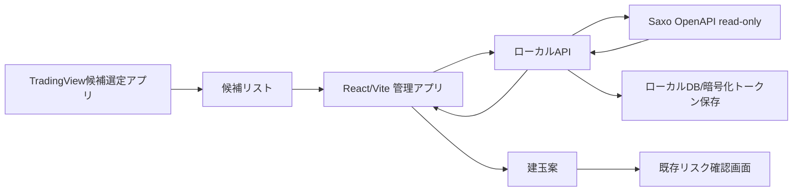

# Saxo Read Only版アップグレード設計引き継ぎ

作成日: 2026-05-28  
対象: 米国株オプション建玉管理・リスク確認アプリ  
現行パイロット: `apps/us-options-risk-planner`  
参照元: `apps/us-options-risk-planner/docs/tradingview-saxo-integration-brief.md`

## 1. 引き継ぎの目的

現行アプリは、サクソバンク証券の画面を見ながら手入力で建玉を管理する「パイロット完成版」として一旦固定する。

次フェーズでは、この完成版を壊さずに、Saxo OpenAPI read-only と TradingView候補選定アプリを連携した上位版を設計・実装する。

この設計書は、次の設計者・開発者が以下を理解して着手できることを目的にする。

- 現行手入力パイロットで完成している範囲
- 残すべき安全制約
- Saxo read-only版で追加する機能範囲
- TradingView候補選定アプリとの統合方針
- データ設計、画面設計、実装フェーズ、完了条件

## 2. 現行パイロット版の扱い

### 位置づけ

現行版は「手入力型パイロット完成版」として扱う。

現在できること:

- DEMO / REAL の分離管理
- 建玉の手入力登録
- 注文前 / 建玉中 / 決済済み / 権利行使済み / 満期終了の状態管理
- 現在建玉と履歴の分離表示
- 株価・為替の公開データ取得
- プレミアム、使用分母、年率、税引後、NISA等比較
- プット売り、カバードコール等のシナリオ確認
- 反対売買判断
- 利確・損切りルール判定
- 口座全体の現金残高・証拠金使用率の手入力管理
- 注文前チェックリスト
- CSV出力
- JSONバックアップ / 復元
- ホイール管理の入口

### 保存方針

この版は、read-only連携の実験台として直接壊さない。

推奨:

1. 現行版のGitタグ、ブランチ、またはコピーを作る
2. read-only版は別アプリまたは別ディレクトリで開始する
3. 既存の手入力画面・計算ロジックは再利用する
4. OAuth、Saxo同期、候補スキャンは新しい境界に分離する

推奨ディレクトリ案:

```txt
apps/us-options-risk-planner/              # 手入力パイロット完成版
apps/us-options-risk-planner-readonly/     # Saxo read-only版候補
```

同じアプリ内で進める場合でも、最低限 `manual` と `readonly` の機能境界を分ける。

## 3. 次フェーズの最終目標

Saxo read-only版の最終目標は、以下の一気通貫フローを実現すること。

1. TradingView候補選定アプリから候補銘柄を取り込む
2. 候補銘柄を管理アプリ内でレビューする
3. Saxo OpenAPI read-onlyで口座、建玉、未約定注文、オプションチェーンを取得する
4. DTE、Delta、Open Interest、Option Volume、Bid/Askスプレッドで候補を評価する
5. 条件に合う候補を「建玉案」に変換する
6. 既存のリスク確認画面で分母、年率、税引後、注文前NGを確認する
7. 最終判断と発注は人間がSaxo画面で行う

重要: このアプリは発注しない。自動売買もしない。

## 4. 非目標

Saxo read-only版であっても、次は実装しない。

- Saxoへの注文作成
- 注文変更
- 注文取消
- SaxoTraderGOの発注ボタン自動クリック
- 条件に合った銘柄の自動発注
- 銘柄推奨や投資助言としてのスコア表示
- OAuthトークンのブラウザlocalStorage保存

## 5. 全体アーキテクチャ

### 基本方針

フロントエンドからSaxo OpenAPIへ直接接続しない。

理由:

- OAuthトークンをブラウザに置かないため
- read-only制約をローカルAPI側で強制するため
- Saxo APIのレスポンスをアプリ用の型へ正規化するため
- 取得時刻、失敗理由、キャッシュを管理するため

### 推奨構成



### ローカルAPIの役割

- Saxo OAuth開始 / コールバック処理
- token refresh
- トークン保存
- Saxo API呼び出し
- 発注しない取得系APIだけを公開
- レスポンス正規化
- エラー・取得時刻・権限不足の明示
- レート制限と一括取得キュー制御

## 6. Saxo OpenAPIで確認済みの前提

2026-05-28時点で公式ドキュメント上、次を確認した。

- Options Chainはオプションボード用途の構造で、subscription作成により初期snapshotを返す
- Positionsは `port/v1/positions` で取得し、Personal Read権限で読める
- Balancesはread-only endpointとして口座残高・証拠金関連の取得に使える
- OAuthはAuthorization Code Grant with PKCEが公式に案内されている

### read-onlyの定義

この設計での `read-only` は「発注・注文変更・注文取消をしない」という意味で使う。

Saxo OpenAPI上、オプションチェーンはHTTPメソッドとしてはsubscription作成の `POST` を使う可能性がある。これは発注ではなくMarket Data購読のためのPOSTなので、以下は許可する。

- OAuth Authorization Code + PKCE
- token refresh
- 口座、建玉、残高、未約定注文の取得
- Reference Data取得
- Options Chain subscription作成とsnapshot取得
- Options Chain subscriptionの削除

一方、以下は禁止する。

- 注文作成API
- 注文変更API
- 注文取消API
- SaxoTraderGO UIの発注操作自動化

画面とローカルAPIでは、`read-only` よりも誤解が少ない文言として `No trading actions` または `発注機能なし` を常に表示する。

ただし、実口座で取得できる項目はMarket Data権限、契約、サブスクリプション、取引所データ提供状況で変わる可能性がある。

返らない項目は空欄にせず、画面上で `Manual check required` または `未取得` と表示する。

## 7. 画面設計

### 7.1 建玉管理

既存の手入力パイロット画面を基本的に維持する。

役割:

- 登録済み建玉の一覧
- 現在建玉と履歴の分離
- 分母比較
- 税引後比較
- シナリオ
- 満期ペイオフ
- 反対売買判断
- リスク警告
- 注文前チェックリスト
- ホイール管理

read-only版で追加する表示:

- データソース: `manual` / `saxo_api` / `imported_csv`
- 候補由来: `tradingview` / `manual` / `imported_csv`
- Saxo最終同期時刻
- Saxo上のPositionId / NetPositionId
- 手入力値とSaxo取得値の差分
- 取得失敗または権限不足の表示

### 7.2 候補リスト

TradingView候補選定アプリから出力されたJSON/CSVを読み込む画面。

表示項目:

- Rank
- Symbol
- Company
- Price
- Volume
- Market Cap
- Sector
- Analyst Rating
- Next Earnings Date
- Earnings Warning
- Score
- Suggested Use
- Memo
- 既存建玉あり/なし
- Redlist対象か
- Saxoチェーン取得状況
- 最終レビュー状態

操作:

- 候補JSON/CSVをインポート
- Redlist表示/非表示
- 決算近い銘柄の注意表示
- 既存建玉あり銘柄の強調
- Watch onlyに保存
- Saxoチェーン確認へ進む

### 7.3 オプションチェーン確認

候補銘柄に対してSaxo read-onlyでオプションチェーンを取得し、候補オプションを絞り込む画面。

入力:

- Symbol
- DTE範囲: 初期値 30-60
- Delta絶対値範囲: 初期値 0.15-0.35
- 最小Open Interest
- 最小Option Volume
- 最大Bid/Askスプレッド率
- 決算近接を含める/除外する

表示項目:

- Symbol
- Underlying Price
- Expiry
- DTE
- Type
- Strike
- Bid
- Ask
- Mid
- Delta
- IV
- Open Interest
- Option Volume
- Spread %
- Data Source
- Fetched At
- Missing Fields
- Warnings

操作:

- 1銘柄取得
- フィルタ適用
- Cash Secured Put候補として建玉案作成
- Covered Call候補として建玉案作成
- Watch only保存

### 7.4 Saxo接続

設定画面または専用カードとして追加する。

表示項目:

- 接続状態
- SIM / LIVE
- AccountKey
- ClientKey
- 取得可能権限
- 最終同期時刻
- Market Data権限の有無
- read-only方針

操作:

- 接続開始
- 接続解除
- 口座スナップショット取得
- 建玉同期
- 未約定注文取得
- オプションチェーン取得テスト

REAL口座接続時は赤系で明示し、常に「発注機能なし」を表示する。

## 8. データ設計案

### CandidateSymbol

```ts
export type CandidateSource = "tradingview" | "manual" | "imported_csv";

export type CandidateSymbol = {
  id: string;
  source: CandidateSource;
  importedAt: string;
  rawSourceRow?: Record<string, string>;
  parseWarnings?: string[];
  rank: number;
  symbol: string;
  company: string;
  priceUSD?: number;
  changePercent?: number;
  volume?: number;
  relativeVolume?: number;
  marketCapUSD?: number;
  per?: number;
  sector?: string;
  analystRating?: string;
  nextEarningsDate?: string;
  earningsWarning?: string;
  score: number;
  suggestedUse: string;
  memo?: string;
  redlist?: boolean;
  alreadyHasPosition?: boolean;
  watchOnly?: boolean;
};
```

TradingView出力の実ファイルは数値が文字列で入る。

例:

- `Price`: `379.38 USD` または `1,065.00 USD`
- `ChangePercent`: `−1.07%` のようにUnicodeマイナスが混ざる
- `Volume`: `13.38 M`
- `MarketCap`: `4.62 T USD`, `958.67 B USD`
- CSVはBOM付きの可能性がある

Phase 1では、以下の正規化関数を先に作る。

- `parseUsdPrice`
- `parsePercent`
- `parseCompactNumber`
- `parseCandidateCsv`
- `normalizeCandidateRow`

正規化できない値は0や空文字へ潰さず、対象フィールドを `undefined` にして `parseWarnings` と `rawSourceRow` に残す。

### OptionCandidate

```ts
export type OptionCandidate = {
  id: string;
  symbol: string;
  underlyingUic?: number;
  optionRootId?: string;
  underlyingPriceUSD: number;
  optionType: "call" | "put";
  expiryDate: string;
  dte: number;
  strikeUSD: number;
  bid?: number;
  ask?: number;
  mid?: number;
  delta?: number;
  impliedVolatility?: number;
  openInterest?: number;
  volume?: number;
  spreadPercent?: number;
  contractSize?: number;
  nonStandardContract?: boolean;
  priceType?: "realtime" | "delayed" | "indicative" | "unknown";
  delayedMinutes?: number;
  dataSource: "saxo_api" | "manual" | "imported_csv";
  fetchedAt: string;
  suggestedStrategy: "covered_call" | "short_put" | "watch_only";
  warnings: string[];
  missingFields: string[];
  rawRef?: string;
};
```

`raw` のブラウザ永続保存は禁止する。Saxoレスポンスの生データには口座・契約・銘柄解決に関する内部IDが含まれる可能性があるため、フロント側には `rawRef` のみを保存する。raw本体を残す場合はローカルAPI側の暗号化DBまたはデバッグログだけに限定する。

既存計算ロジックは標準米国株オプションの100株単位を前提にしている。Saxoから `contractSize` や非標準契約判定に相当する情報を取得できない場合、非標準オプションの可能性がある候補は `Manual check required` とする。

### CandidateScanSettings

```ts
export type CandidateScanSettings = {
  minDte: number;
  maxDte: number;
  minAbsDelta: number;
  maxAbsDelta: number;
  minOpenInterest: number;
  minOptionVolume: number;
  maxSpreadPercent: number;
  includeNearEarnings: boolean;
};
```

### SaxoSyncMeta

```ts
export type SaxoSyncMeta = {
  source: "saxo_api";
  environment: "sim" | "live";
  accountKey?: string;
  clientKey?: string;
  fetchedAt: string;
  staleAfterSeconds: number;
  permissions: Array<"read" | "subscribe">;
  priceType?: "realtime" | "delayed" | "indicative" | "unknown";
  delayedMinutes?: number;
  missingFields: string[];
  rawStoragePolicy: "none" | "local_api_encrypted" | "debug_only";
  rawRef?: string;
};
```

`candidate` はデータソース名としては使わない。候補の由来は `CandidateSymbol.source` に `tradingview` または `imported_csv` として保持し、価格や建玉データの取得元は `dataSource` に `saxo_api` / `manual` / `imported_csv` として保持する。

## 9. Store追加案

既存 `useOptionsStore.ts` に直接肥大化させるより、次フェーズではstore分割を推奨する。

候補:

```txt
src/store/usePositionsStore.ts
src/store/useCandidatesStore.ts
src/store/useSaxoConnectionStore.ts
src/store/useSettingsStore.ts
```

最低限必要な状態:

- `candidateSymbolsByWorkspace`
- `optionCandidatesByWorkspace`
- `candidateScanSettings`
- `saxoConnectionStatus`
- `lastSaxoSyncByWorkspace`

必要な操作:

- `importCandidateSymbols`
- `clearCandidates`
- `markCandidateWatchOnly`
- `upsertOptionCandidates`
- `createSimulationFromOptionCandidate`
- `syncSaxoAccountSnapshot`
- `syncSaxoPositions`
- `syncSaxoOpenOrders`

保存キー案:

```txt
us-options-candidate-symbols-v1
us-options-option-candidates-v1
us-options-candidate-settings-v1
us-options-saxo-sync-meta-v1
```

OAuthトークンはlocalStorageへ保存しない。

## 10. ローカルAPI設計案

### API一覧

```txt
GET  /api/saxo/status
GET  /api/saxo/auth/start
GET  /api/saxo/auth/callback
POST /api/saxo/logout

GET  /api/saxo/account
GET  /api/saxo/positions
GET  /api/saxo/orders
GET  /api/saxo/options-chain?symbol=NVDA&minDte=30&maxDte=60
```

### 実装方針

- フロントはローカルAPIだけを呼ぶ
- ローカルAPIがSaxo APIへ接続する
- token refreshはローカルAPI側で行う
- 注文作成、注文変更、注文取消のエンドポイントは作らない
- Options Chain取得のためのMarket Data subscription作成・削除はローカルAPI内部だけで扱う
- APIレスポンスには必ず `fetchedAt` と `source` を付ける
- 取得失敗時はHTTPエラーだけでなく、画面表示用の理由を返す

### Options Chain内部フロー

`GET /api/saxo/options-chain?symbol=NVDA&minDte=30&maxDte=60` はフロント向けの単純化APIとする。ローカルAPI内部では次の手順を実行する。

1. `symbol` を大文字正規化し、TradingView由来の市場表記を取り除く
2. Saxo Reference Dataで原資産候補を検索する
3. 米国株の原資産 `Uic` と `AssetType` を確定する
4. Contract Option Spaceまたは同等のReference Dataでオプション銘柄空間を取得する
5. `minDte` / `maxDte` からexpiry範囲を作る
6. 初期strike windowを現在価格の上下範囲で作る
7. Options Chain subscriptionを作成する
8. 初期snapshotを `BrokerOptionChainSnapshot` に正規化する
9. 必要ならDelta/OI/Volume/Spread条件で候補へ落とす
10. subscriptionを削除する、または短時間キャッシュとして保持する

Subscription管理ルール:

- 同時subscription数をローカルAPIで制限する
- 1銘柄取得ごとに `subscriptionId`, `createdAt`, `deletedAt`, `status` をログへ残す
- 一括スキャンでは1銘柄ずつ順次処理する
- 取得失敗時も可能な限りsubscription削除を試みる
- 古いsnapshotは `staleAfterSeconds` を超えたら候補作成に使わない

Reference Dataで複数候補が返った場合は、自動で決め切らず、米国株・主要取引所・通貨USDの優先順位で1件を選び、曖昧な場合は `Manual check required` として画面に候補一覧を出す。

### BrokerAdapter

既存の `src/broker/BrokerAdapter.ts` は活かす。

`SaxoBrokerAdapter` はSaxoへ直接行かず、ローカルAPIを呼ぶ。

```ts
export class SaxoBrokerAdapter implements BrokerAdapter {
  async getConnectionStatus() {
    return fetchJson("/api/saxo/status");
  }

  async getAccountSnapshot() {
    return fetchJson("/api/saxo/account");
  }

  async getPositions() {
    return fetchJson("/api/saxo/positions");
  }

  async getOpenOrders() {
    return fetchJson("/api/saxo/orders");
  }

  async getOptionChain(symbol: string) {
    return fetchJson(`/api/saxo/options-chain?symbol=${encodeURIComponent(symbol)}`);
  }
}
```

## 11. 建玉案への変換ルール

### Cash Secured Put候補

条件例:

- Option type: put
- DTE: 30-60
- Delta絶対値: 0.15-0.35
- Bid/Askスプレッドが許容範囲内
- Open InterestとVolumeが最低条件以上
- 決算14日以内ではない、または明示的に許容

変換先:

- `strategyType: "short_put"`
- `status: "planned"`
- `ticker`
- `currentPriceUSD`
- `expiryDate`
- `dte`
- `putLeg.strikeUSD`
- `putLeg.premiumUSD = mid`
- `putIntent = "accept_assignment"`
- `denominatorMode = "cash_secured"`
- `fixtureMeta` ではなく `SaxoSyncMeta` または候補由来metaを付与
- `notes` に候補元、取得日時、フィルタ条件を保存

### Covered Call候補

条件例:

- Option type: call
- 既に100株以上保有
- DTE: 30-60
- Delta: 0.15-0.35
- 権利行使されても売却してよい価格

変換先:

- `strategyType: "covered_call"`
- `status: "planned"`
- `ticker`
- `currentPriceUSD`
- `stockPosition.shares`
- `stockPosition.averageCostUSD`
- `callLeg.strikeUSD`
- `callLeg.premiumUSD = mid`
- `callLeg.isCovered = true`

## 12. リスク警告追加案

既存 `generateRiskWarnings` に、read-only版では以下を追加する。

- 決算14日以内
- Option Volume不足
- Open Interest不足
- Bid/Askスプレッド過大
- Deltaが想定範囲外
- DTEが短すぎる/長すぎる
- 既存建玉と同一銘柄に偏りすぎ
- セクター偏り
- Saxo取得時刻が古い
- Saxo APIで取得できない項目がある
- 手入力値とSaxo取得値の差分が大きい

## 13. 実装フェーズ

### Phase 0: パイロット版の固定

目的:

- 手入力パイロットを壊さない

実装:

- 現行版をタグまたはブランチで固定
- JSONバックアップを取得
- READMEに「手入力パイロット完成版」と明記

完了条件:

- 手入力版をいつでも起動できる
- Read Only版の実験でパイロットが壊れない

### Phase 1: 候補リスト取り込み

目的:

- Saxo APIなしでTradingView候補を画面に取り込む

実装:

- `CandidateSymbol` 型追加
- TradingView JSON/CSV正規化関数追加
- BOM、カンマ付き価格、M/B/T表記、Unicodeマイナス、空欄のparseテスト
- 候補保存store追加
- 候補一覧画面
- JSON/CSVインポート
- 既存建玉との重複表示
- Redlist / 決算近接表示

完了条件:

- `tradingview_candidates.json` を読み込める
- 候補50件を表示できる
- 既存建玉がある銘柄が分かる
- parse不能な値が `parseWarnings` として表示され、0へ潰れない

### Phase 2: Saxo read-onlyローカルAPI

目的:

- OAuthとread-only取得の土台を作る

実装:

- ローカルAPIサーバー
- OAuth Authorization Code + PKCE
- token refresh
- `/api/saxo/status`
- `/api/saxo/account`
- `/api/saxo/positions`
- `/api/saxo/orders`
- トークン安全保存
- Reference Data検索の疎通確認

完了条件:

- 管理アプリから接続状態が見える
- 残高、証拠金、建玉、未約定注文をread-onlyで取得できる
- 注文作成、注文変更、注文取消APIが存在しない
- Options Chainに必要な `read` / `subscribe` 権限不足を画面に出せる

### Phase 3: オプションチェーン取得

目的:

- 候補銘柄に対してSaxo OpenAPIからオプションチェーンを取得する

実装:

- `/api/saxo/options-chain`
- symbolからSaxo原資産Uicへの解決
- option root / option space解決
- Options Chain subscription作成
- 初期snapshot取得
- subscription削除または短時間キャッシュ
- `BrokerOptionChainSnapshot` への正規化
- DTE抽出
- Delta抽出
- OI/Volume/Spread計算
- 取得できない項目の明示

完了条件:

- 1銘柄ずつチェーン取得できる
- AMZN/NVDAなどで実データ形状を検証できる
- OptionCandidateを生成できる
- subscriptionの作成と削除がログで確認できる
- 非標準契約またはcontract size不明の候補が `Manual check required` になる

### Phase 4: 建玉案作成

目的:

- OptionCandidateから既存リスク確認画面へつなげる

実装:

- `createSimulationFromOptionCandidate`
- Covered Call / Cash Secured Putの初期値自動入力
- 既存リスク確認画面へ遷移
- 作成元データと取得時刻を保存

完了条件:

- 候補からワンクリックで注文前建玉案を作れる
- 分母、年率、税引後、注文前NGが既存ロジックで動く

### Phase 5: 一括候補スキャン

目的:

- 50銘柄を安全に順次確認する

実装:

- 一括取得キュー
- 1銘柄ごとの成功/失敗ログ
- レート制限
- subscription同時数制限
- 途中停止
- 取得済みキャッシュ
- 失敗銘柄の手動再取得

完了条件:

- 取得できた銘柄だけ保存される
- 失敗理由が分かる
- 古いチェーンや別銘柄データが混ざらない

## 14. 安全制約

必須:

- 発注APIを実装しない
- 注文作成、変更、取消APIを呼ばない
- SaxoTraderGOの発注ボタンを自動クリックしない
- REAL接続は赤系で明示する
- DEMO/REALを常に画面表示する
- API取得値には取得時刻を付ける
- データ不足は `Manual check required` と表示する
- Options Chain subscriptionは発注ではないが、作成・削除をローカルAPI内部に閉じ込める
- Saxo rawレスポンスをブラウザlocalStorageへ保存しない
- 非標準オプションまたはcontract size不明の候補は自動で建玉案化しない
- 最終判断と発注は人間がSaxo画面で行う
- API仕様は実装前に公式ドキュメントで再確認する

避けること:

- Saxo UIスクレイピングを本番取得の主手段にする
- OAuthトークンをブラウザlocalStorageに保存する
- Saxo rawレスポンスをフロントの永続storeに保存する
- TradingView候補をそのまま注文候補として扱う
- 決算近い銘柄を自動除外だけで処理する
- PERやスコアだけで銘柄を自動選定する

## 15. 実装前工程

実装へ入る前に、以下を順番に完了する。

### Step 1: 現行版固定

成果物:

- 現行手入力版のGitタグまたはブランチ
- 現行localStorage/JSONバックアップ
- README上の「手入力パイロット完成版」明記

判定:

- 現行アプリをいつでも起動できる
- read-only版の作業ディレクトリを分けるか、少なくとも機能境界を分ける判断が完了している

### Step 2: Saxo公式仕様の再確認メモ

成果物:

- OAuth PKCE callback URI、client id、SIM/LIVE環境URLの確認メモ
- Positions、Balances、Ordersで使うendpointと必要権限
- Reference DataでsymbolからUicへ解決するendpoint
- Contract Option SpaceまたはOptions Chain前段で必要なendpoint
- Options Chain subscription作成・削除のendpoint、制限、必要権限

判定:

- `read` と `subscribe` の権限不足時に何を画面表示するか決まっている
- 注文作成、注文変更、注文取消APIを使わないことがendpoint一覧で確認できる

### Step 3: TradingView候補ファイル契約の固定

成果物:

- `tradingview_candidates.json` とCSVのフィールド一覧
- 数値正規化ルール
- parse失敗時の `parseWarnings` 仕様
- 重複symbol、空symbol、BOM、Unicodeマイナス、M/B/T表記のテストケース

判定:

- 候補50件を0埋めなしで正規化できる
- 元データを `rawSourceRow` として追跡できる

### Step 4: ローカルAPI境界設計

成果物:

- ローカルAPIの技術選定
- token保存先
- rawレスポンス保存方針
- エラー応答型
- `fetchedAt`, `staleAfterSeconds`, `missingFields`, `rawRef` の共通レスポンス仕様

判定:

- ブラウザlocalStorageにOAuth tokenとSaxo rawレスポンスを保存しない設計になっている
- フロントがSaxoへ直接接続しない設計になっている

### Step 5: Options Chain POC設計

成果物:

- symbolからUicへの解決手順
- option root / option spaceの解決手順
- subscription lifecycle設計
- AMZN/NVDA等1銘柄での検証手順
- 非標準契約、contract size不明、Market Data不足時の表示仕様

判定:

- 1銘柄のsubscription作成、snapshot正規化、subscription削除をログで追える
- stale snapshotや別銘柄データ混入を防ぐキー設計がある

### Step 6: 実装チケット分割

成果物:

1. Candidate import parser
2. Candidate store
3. Candidate list screen
4. Saxo local API skeleton
5. OAuth PKCE flow
6. Account / positions / orders read endpoints
7. Reference Data symbol resolver
8. Options Chain subscription POC
9. OptionCandidate normalizer
10. OptionCandidate to TradeSimulation converter
11. Risk warning additions
12. Batch scan queue

判定:

- Phase 1はSaxo認証なしで完了できる
- Phase 2以降はSIM環境で小さく検証できる
- 発注機能が入る余地がないタスク分割になっている

## 16. テスト方針

最低限必要なテスト:

- Candidate JSON/CSV import
- CandidateSymbol正規化
- 既存建玉との重複判定
- OptionChainレスポンス正規化
- missing fields表示
- OptionCandidateからTradeSimulationへの変換
- Saxo API失敗時のエラー表示
- DEMO/REAL分離
- 発注系APIが存在しないこと
- JSONバックアップ/復元

E2Eで確認したいこと:

1. TradingView候補JSONを取り込む
2. 候補銘柄を1つ選ぶ
3. Saxoチェーンを取得する
4. Put候補を建玉案に変換する
5. 既存リスク確認画面で注文前NGを確認する
6. 発注はアプリ上でできない

## 17. 次担当者の推奨初手

最初にSaxo API接続へ入らず、候補リスト画面から作る。

理由:

- TradingView出力は既に存在する
- OAuthやMarket Data権限に依存しない
- 画面導線を先に確定できる
- 後からSaxoチェーン取得を差し込める

最小タスク:

1. 現行パイロットをタグまたはコピーで固定する
2. `CandidateSymbol` 型を追加する
3. `tradingview_candidates.json` のインポート画面を追加する
4. 候補テーブルを作る
5. 候補から手入力建玉案を作る導線を作る

## 18. 参照リンク

- Saxo Options Chain Reference: https://www.developer.saxo/openapi/referencedocs/trade/v1/optionschain
- Saxo OAuth PKCE: https://www.developer.saxo/openapi/learn/oauth-authorization-code-grant-pkce
- Saxo Positions Reference: https://www.developer.saxo/openapi/referencedocs/port/v1/positions/get__port
- Saxo Balances Reference: https://www.developer.saxo/openapi/referencedocs/port/v1/balances
- Saxo Orders Reference: https://www.developer.saxo/openapi/referencedocs/port/v1/orders/get__port
